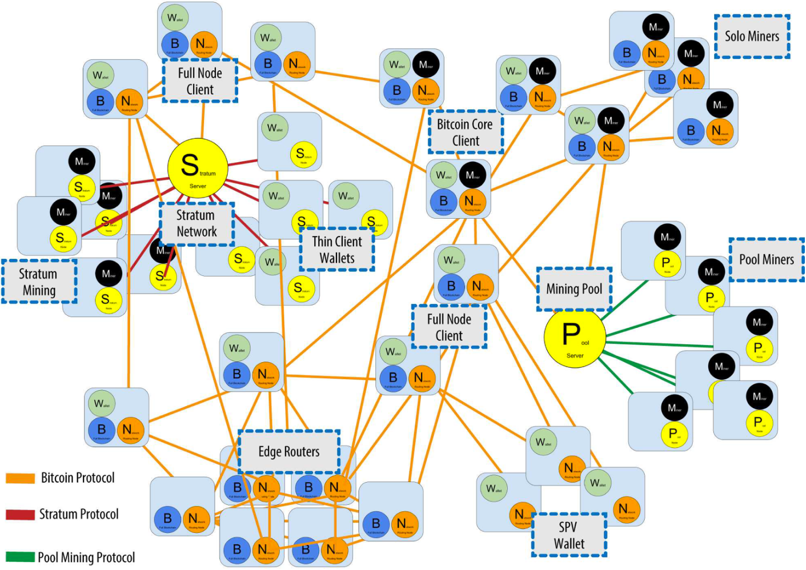

# Bitcoin中的区块是怎么得到的？

# 比特币网络

比特币网络就是一批运行着比特币客户端节点的集合。在比特币网络中，所有的节点都是平等的，结构是扁平化的，没有一个确定的中心（任何节点都可以在某一刻充当中心），任何节点都可以随时加入或者退出。

# 比特币节点

## 挖矿节点（ Mining node）

挖矿这一活动类似于真实世界中的对稀有金属的开采，挖矿的目的不仅仅是为了获取比特币，更是为了增加比特币网络的安全性。此类节点负责把接受到的交易信息进行打包，打包成功后立即广播到整个网络中，同时合并到区块链上。会存在多个节点竞争的情况，一旦某一个节点先打包成功，那么所有其他节点接收到该区块后，立即进入下一个区块的打包。同时把当前进行打包中的交易信息放回mempool中。

## 钱包节点  （SPV node或Light node）

许多客户端（智能手机、平板电脑等）的存储和计算资源是十分有限的，既无法用来进行挖矿，也无法用来保存完整的区块链信息。但是随着，比特币的被越来越多的人接受，在很多场景下均需要使用钱包的功能来进行支付，这就使得此类节点成为必须。它只保存了区块链中所有区块的区块头信息，而不包含任何交易信息，所以其占用的空间仅是完整区块链信息的千分之一。在进行支付时，它需要与相邻的全节点进行频繁交换，来获取可以使用的UTXO。

## 全节点 （Full Node）

包含了完整的区块链备份、挖矿功能、钱包功能的节点。

# 区块生命周期

用户通过钱包节点产生交易信息，例如小张使用比特币钱包用0.0000001个比特币买了一杯咖啡。生成的交易信息在验证合格后被一层层广播到整个网络中，所有具备挖矿能力的节点会把所有的交易信息搜集到候选区块中（candidate block），然后开始计算。直到找到一个满足目标的解，随后把该区块合并到区块链上，同时把该区块广播到整个网络中。其他节点对接受到的区块进行验证，一旦验证通过，则追加到链尾。

## 聚合

矿工或全节点会先从本地保存了合格交易的交易池（transaction pool）中取出部分交易，放到候选区块（candidate block）。

## 计算

对候选区块进行工作量证明运算（Proof-of-Work），通过不断地修改区块头的随机数nonce来反复进行哈希运算，直到得到的哈希值小于设定的目标值，随后将该区块打包起来作为一个有效的区块。

## 广播

将打包好的有效区块广播到网络中去，让其他节点能够接收。

## 入链

当某个节点（全节点或挖矿节点）从网络中接收到区块时，会对该区块进行验证，判断该区块中的**previousblockhash**（前一个区块的哈希值）是否等于当前链上的最后一个节点，如果相等，那么直接把该区块链接到链尾，使得区块高度加1。

（扩展：挖矿究竟是怎么样的行为？白皮书最长链就是累积了最对CPU算力的工作量证明链，表明更多节点的认可？computer power）