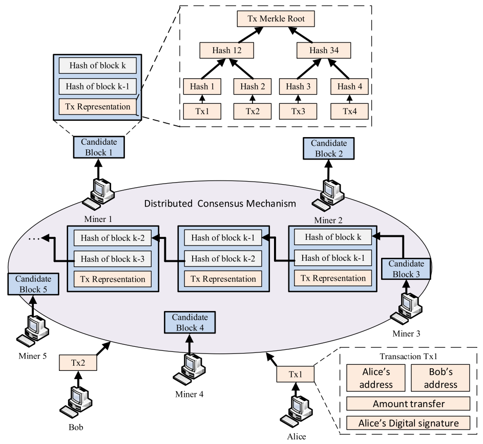
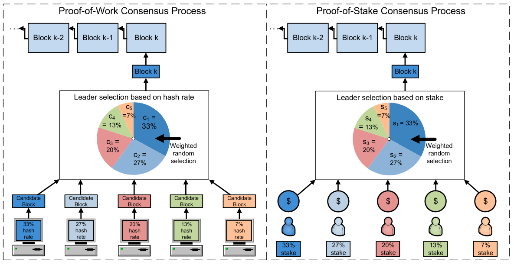

# POW与POS之间有什么区别？

# 什么是共识（CONSENSUS）？

在计算机领域，“达成共识”指的是一个分布式系统中的多个不同节点在“协商”一致后确定共同状态的过程。在传统的分布式系统中总会有一个确定的中心来向其他节点发送同步消息，进而达成共识。然而，在区块链系统中，没有一个确定的中心来向其他节点发送同步消息，而是使用了一种全新的共识机制。

# 什么是PoW?

Proof-of-Work，工作量证明机制是一种共识机制。它主要由矿工节点负责实现，所有的矿工节点之间存在互相竞争。它们需要抢先把自己整理的候选区块打包成可被全网认可的区块，它们中谁最先解决谜题（找到满足目标的哈希值）并广播出来，谁就成为一次整个网络的中心，并获得相应的比特币作为奖励。其他节点在接收到正常区块，并检查合格后会连接到当前区块链的末尾，并且马上创建新的候选区块，进入下一轮的竞争。

## 特点

- 因为需要CPU重复地进行大量的哈希运算，耗电量大，能量转化效率低。
- 接入门槛高，需要配置了ASCI卡的矿机才能有机会挖矿成功
- 由于算力过于集中到矿池当中，出现算力中心化的趋势和危机

# 什么是PoS?

Proof-of-Stake，权益证明机制也是一种共识机制。它需要用户以自己的货币（在以太坊中用以太币）作为抵押来获得成为验证者（validator）的机会。验证者的职责与PoW机制中的矿工类似，负责收集整理交易信息，然后打包成新的区块。

具体来看，以太坊上，任何用户只要抵押至少32个以太币就可以成为验证者，验证者们会根据抵押的以太币个数与总量的占比，进而得到获得打包区块的概率。抵押越多，能够成功打包的概率越大，最终可以获得的奖励也成比例的越多。被随机选中的验证者负责创建区块并发送到网络中，于此同时其他验证者负责检查得到的区块，一旦检查通过，便立即连接到区块链上，同时获得一定的奖励；但倘若检查不通过或者伪造检查结果，不诚实的验证者抵押的以太币就会被没收。

所以，不管是负责打包的验证者还是进负责检查的验证者，一旦出现欺骗行为，那么不仅无法获得奖励，还会失去抵押的以太币。

## 特点：

- 更高的能量转化效率
- 更低的准入门槛，不需要专门的硬件
- 更高程度的去中心化，可以接入更多的节点，避免像POW一样出现算力集中的矿池
- 更快的确认速度，因为不需要重复地进行哈希运算

# 对比

|              | Pow                        | Pos                                        |
| ------------ | -------------------------- | ------------------------------------------ |
| 中心选择方式 | 基于算力，算力越大概率越大 | 基于抵押的资金，出资越多成为中心的概率越大 |
| 能量消耗     | 非常高                     | 低                                         |
| 硬件要求     | 高，需要配置ASIC卡的矿机   | 无，个人电脑亦可                           |
| 区块生成速度 | 10分钟                     | 10几秒                                     |
| 应用         | 比特币网络                 | 以太坊                                     |

# 参考链接：

https://ethereum.org/en/developers/docs/consensus-mechanisms/pos/

https://ethereum.org/en/developers/docs/consensus-mechanisms/

https://ieeexplore.ieee.org/document/8746079

https://en.wikipedia.org/wiki/Proof_of_stake

