[TOC]


# 定义

一个开发框架，将一系列繁琐、重复的流程（测试、编译、部署等）自动化，让开发人员的工作更轻松。

# 安装Truffle

安装的过程可参考这篇文章[Truffle安装过程踩坑记录](http://bailiyingfeng.cn/2022/05/08/truffle-installation-process-pit-stop-record/)，最终安装的版本如下图所示。

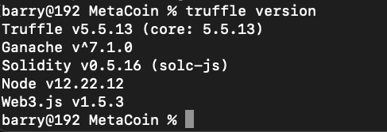

# 创建项目

1.在本地创建目录，并进入

```bash
mkdir MetaCoin
cd MetaCoin
```

2.[Truffle Boxes](https://trufflesuite.com/boxes)中包含了诸多模版，不同的模版包含又不同的常用模块构成，可以让我们快速上手，以metacoin为例。

```sh
truffle unbox metacoin
```

执行命令后得到如下结果

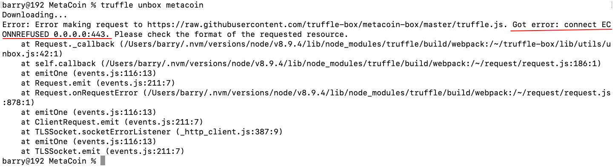

初步判断由于GFW的缘故，根据提示在etc/hosts中添加以下解析

```
## githubusercontent
185.199.108.133 raw.githubusercontent.com
185.199.109.133 raw.githubusercontent.com
185.199.110.133 raw.githubusercontent.com
185.199.111.133 raw.githubusercontent.com
```

再次执行却出现链接超时的情况

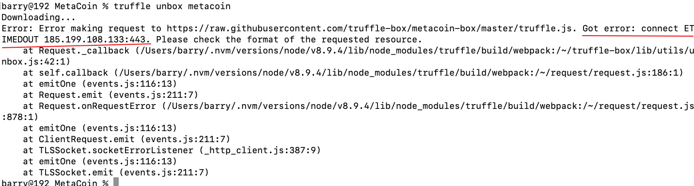

可以确定就是网络问题，开启科学上网工具，添加https的代理

```
export https_proxy=http://127.0.0.1:7890
```

当前shell中的部分环境变量如下：

```
PATH=/Users/barry/.nvm/versions/node/v12.22.12/bin:/opt/homebrew/bin:/opt/homebrew/sbin:/usr/local/bin:/usr/bin:/bin:/usr/sbin:/sbin
NVM_DIR=/Users/barry/.nvm
NVM_CD_FLAGS=-q
NVM_NODEJS_ORG_MIRROR=https://npm.taobao.org/mirrors/node/
NVM_BIN=/Users/barry/.nvm/versions/node/v12.22.12/bin
NVM_INC=/Users/barry/.nvm/versions/node/v12.22.12/include/node
https_proxy=http://127.0.0.1:7890
```

然后再次执行命令

```
truffle unbox metacoin
```

得到下图提示说明成功拉取配置

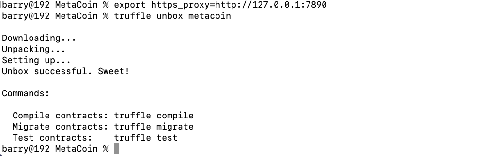

可以看当前结构如下：

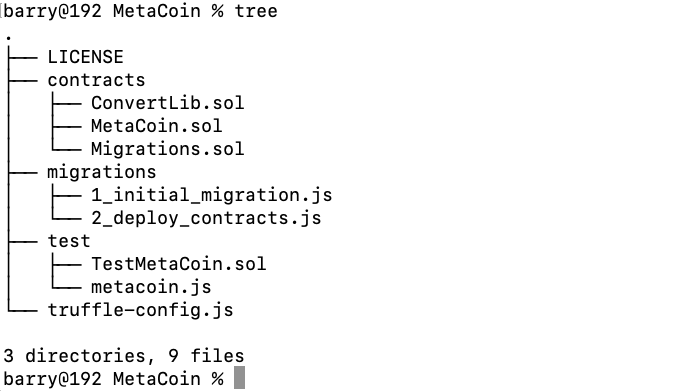

可以看到当前结构如下图所示

- `contracts/`：             保存了由Solidity编写的智能合约
- `migrations/`：            保存了部署脚本
- `test/`:                           保存了测试文件
- `truffle-config.js`    是truffle的配置文件   


# 项目剖析

1. `contracts/MetaCoin.sol`文件是一个创建了MetaCoin的智能合约源码（MetaCoin可以理解为一种类似于以太币的加密货币，1个metacoin等于2个以太币）。内容如下，

   ```solidity
   // SPDX-License-Identifier: MIT
   pragma solidity >=0.4.25 <0.7.0;
   
   import "./ConvertLib.sol";
   
   // This is just a simple example of a coin-like contract.
   // It is not standards compatible and cannot be expected to talk to other
   // coin/token contracts. If you want to create a standards-compliant
   // token, see: https://github.com/ConsenSys/Tokens. Cheers!
   
   contract MetaCoin {
   	mapping (address => uint) balances;
   
   	event Transfer(address indexed _from, address indexed _to, uint256 _value);
   
   	constructor() public {
   		balances[tx.origin] = 10000;
   	}
   
   	function sendCoin(address receiver, uint amount) public returns(bool sufficient) {
   		if (balances[msg.sender] < amount) return false;
   		balances[msg.sender] -= amount;
   		balances[receiver] += amount;
   		emit Transfer(msg.sender, receiver, amount);
   		return true;
   	}
   
   	function getBalanceInEth(address addr) public view returns(uint){
   		return ConvertLib.convert(getBalance(addr),2);
   	}
   
   	function getBalance(address addr) public view returns(uint) {
   		return balances[addr];
   	}
   }
   ```

   可以看到其中定义了map来保存不同账户的余额，还定义了转移metacoin、查询余额的方法。

2. `contracts/Migrations.sol`文件用于管理和更新已经部署的智能合约的状态，每个Truffle项目都有自己的这么一个文件，通常不需编辑。

3. `migrations/1_initial_migration.js`文件是`Migrations`合约用来迁移（部署）脚本。

4. `migrations/2_deploy_contracts.js`文件是MetaCoin合约的迁移脚本。前缀数字表示优先级，数字越低的脚本越先执行。

5. `test/TestMetaCoin.sol`文件是单元测试文件，用来测试MetaCoin合约，看它是否符合预期。

   ```solidity
   pragma solidity >=0.4.25 <0.7.0;
   
   import "truffle/Assert.sol";
   import "truffle/DeployedAddresses.sol";
   import "../contracts/MetaCoin.sol";
   
   contract TestMetaCoin {
   
     function testInitialBalanceUsingDeployedContract() public {
       MetaCoin meta = MetaCoin(DeployedAddresses.MetaCoin());
   
       uint expected = 10000;
   
       Assert.equal(meta.getBalance(tx.origin), expected, "Owner should have 10000 MetaCoin initially");
     }
   
     function testInitialBalanceWithNewMetaCoin() public {
       MetaCoin meta = new MetaCoin();
   
       uint expected = 10000;
   
       Assert.equal(meta.getBalance(tx.origin), expected, "Owner should have 10000 MetaCoin initially");
     }
   
   }
   ```

6. `test/metacoin.js` 文件是用JavaScript编写的测试文件。它执行的测试功能与5中的类似。

   ```javascript
   const MetaCoin = artifacts.require("MetaCoin");
   
   contract('MetaCoin', (accounts) => {
     it('should put 10000 MetaCoin in the first account', async () => {
       const metaCoinInstance = await MetaCoin.deployed();
       const balance = await metaCoinInstance.getBalance.call(accounts[0]);
   
       assert.equal(balance.valueOf(), 10000, "10000 wasn't in the first account");
     });
     it('should call a function that depends on a linked library', async () => {
       const metaCoinInstance = await MetaCoin.deployed();
       const metaCoinBalance = (await metaCoinInstance.getBalance.call(accounts[0])).toNumber();
       const metaCoinEthBalance = (await metaCoinInstance.getBalanceInEth.call(accounts[0])).toNumber();
   
       assert.equal(metaCoinEthBalance, 2 * metaCoinBalance, 'Library function returned unexpected function, linkage may be broken');
     });
     it('should send coin correctly', async () => {
       const metaCoinInstance = await MetaCoin.deployed();
   
       // Setup 2 accounts.
       const accountOne = accounts[0];
       const accountTwo = accounts[1];
   
       // Get initial balances of first and second account.
       const accountOneStartingBalance = (await metaCoinInstance.getBalance.call(accountOne)).toNumber();
       const accountTwoStartingBalance = (await metaCoinInstance.getBalance.call(accountTwo)).toNumber();
   
       // Make transaction from first account to second.
       const amount = 10;
       await metaCoinInstance.sendCoin(accountTwo, amount, { from: accountOne });
   
       // Get balances of first and second account after the transactions.
       const accountOneEndingBalance = (await metaCoinInstance.getBalance.call(accountOne)).toNumber();
       const accountTwoEndingBalance = (await metaCoinInstance.getBalance.call(accountTwo)).toNumber();
   
   
       assert.equal(accountOneEndingBalance, accountOneStartingBalance - amount, "Amount wasn't correctly taken from the sender");
       assert.equal(accountTwoEndingBalance, accountTwoStartingBalance + amount, "Amount wasn't correctly sent to the receiver");
     });
   });
   
   ```

7. `truffle-config.js` 文件是Truffle的配置文件，用来设置网络信息和与项目相关的信息。

# 测试

1.在终端中运行以下命令

```solidity
truffle test ./test/TestMetaCoin.sol
```

得到以下结果，则表示测试用例运行成功。

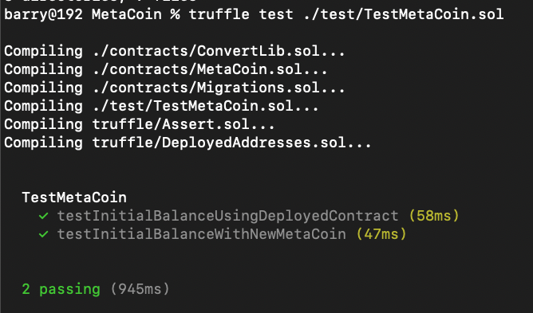

2.运行以下命令执行另一个测试脚本

```javascript
truffle test ./test/metacoin.js
```

得到以下结果，则表示测试用例运行成功。

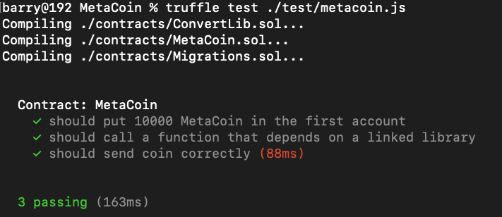

# 编译

运行以下命令编译智能合约

```sh
truffle compile
```

得到以下结果表明编译成功

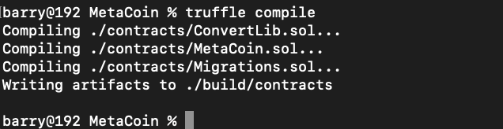

可以看到编译成功后的根目录中多了build目录，其下保存着对应的json文件。

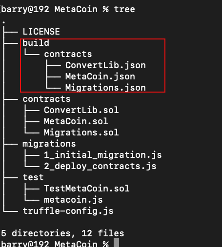


# 部署到区块链

为了部署上述的智能合约，需要连接到一个区块链网络中。Truffle提供了一个内置的可用于测试的个人区块链，它是个人本地系统的区块链，不会涉及到以太坊的主网（mainnet）。

可以通过以下方式来创建本地的个人区块链。

运行以下命令

```sh
truffle develop
```

得到以下结果

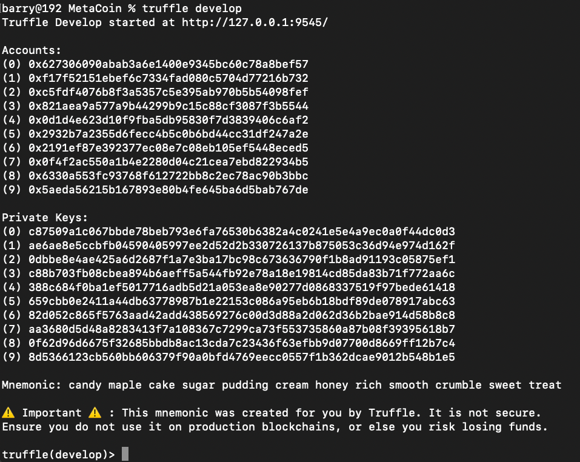

如图所示，个人本地区块链服务已经启动，监听本地9545端口。与此同时生成了10个账户和10个私钥以及保存钱包信息的助记符。

```
Accounts:
(0) 0x627306090abab3a6e1400e9345bc60c78a8bef57
(1) 0xf17f52151ebef6c7334fad080c5704d77216b732
(2) 0xc5fdf4076b8f3a5357c5e395ab970b5b54098fef
(3) 0x821aea9a577a9b44299b9c15c88cf3087f3b5544
(4) 0x0d1d4e623d10f9fba5db95830f7d3839406c6af2
(5) 0x2932b7a2355d6fecc4b5c0b6bd44cc31df247a2e
(6) 0x2191ef87e392377ec08e7c08eb105ef5448eced5
(7) 0x0f4f2ac550a1b4e2280d04c21cea7ebd822934b5
(8) 0x6330a553fc93768f612722bb8c2ec78ac90b3bbc
(9) 0x5aeda56215b167893e80b4fe645ba6d5bab767de

Private Keys:
(0) c87509a1c067bbde78beb793e6fa76530b6382a4c0241e5e4a9ec0a0f44dc0d3
(1) ae6ae8e5ccbfb04590405997ee2d52d2b330726137b875053c36d94e974d162f
(2) 0dbbe8e4ae425a6d2687f1a7e3ba17bc98c673636790f1b8ad91193c05875ef1
(3) c88b703fb08cbea894b6aeff5a544fb92e78a18e19814cd85da83b71f772aa6c
(4) 388c684f0ba1ef5017716adb5d21a053ea8e90277d0868337519f97bede61418
(5) 659cbb0e2411a44db63778987b1e22153c086a95eb6b18bdf89de078917abc63
(6) 82d052c865f5763aad42add438569276c00d3d88a2d062d36b2bae914d58b8c8
(7) aa3680d5d48a8283413f7a108367c7299ca73f553735860a87b08f39395618b7
(8) 0f62d96d6675f32685bbdb8ac13cda7c23436f63efbb9d07700d8669ff12b7c4
(9) 8d5366123cb560bb606379f90a0bfd4769eecc0557f1b362dcae9012b548b1e5

Mnemonic: 
candy maple cake sugar pudding cream honey rich smooth crumble sweet treat
```

从上图中，可以看到终端进入了truffle的交互模式。在交互模式下执行命令时可以省略前面的truffle关键字。

例如执行编译命令`truffle compile`时只需要输入`compile`即可，执行部署命令`truffle migrate`时只需要输入`migrate`即可。

我们通过以下命令把编译好的合约部署到个人本地区块链上。

```sh
migrate
```

执行后得到下图所示结果

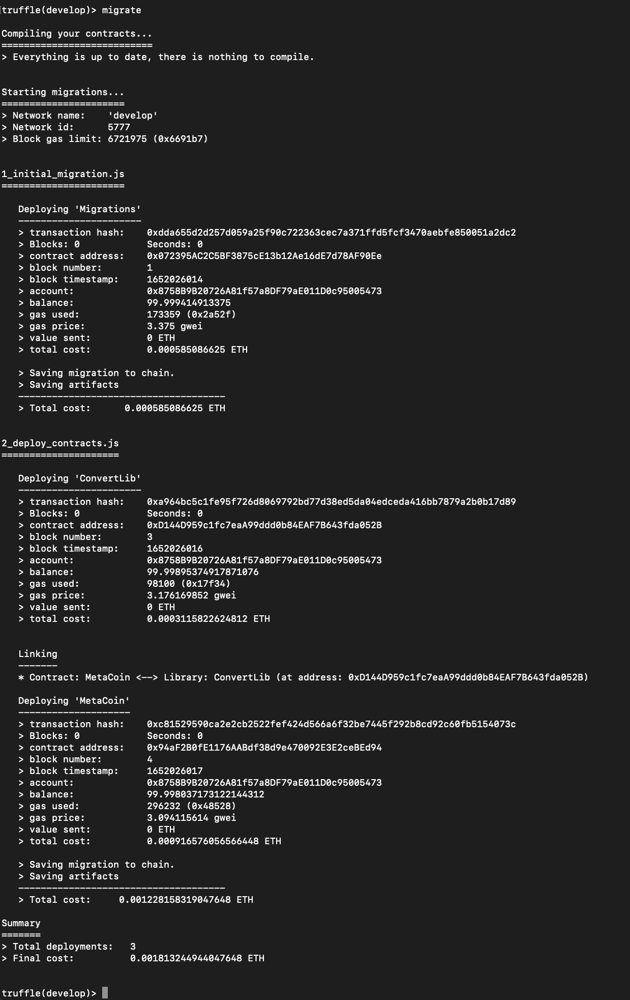

从上图中，可以看到详细的部署信息。


# 交互

首先创建一个已经部署的MetaCoin合约的实例以及账户。

```
truffle(develop)> let instance = await MetaCoin.deployed()
truffle(develop)> let accounts = await web3.eth.getAccounts()
```

随后，检查用来部署该合约的账户的metacoin余额

```
truffle(develop)> let balance = await instance.getBalance(accounts[0])
truffle(develop)> balance.toNumber()
```

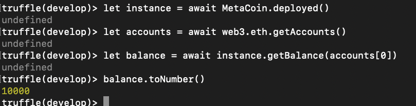

可以看到有10000个metacoin。

观察余额相当于多少以太币，（合约中一个metacoin值两个以太币）

```
truffle(develop)> let ether = await instance.getBalanceInEth(accounts[0])
truffle(develop)> ether.toNumber()
```

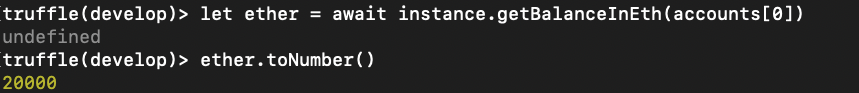

可以看到价值20000个以太币。

随后，将一些500个metacoin从账户0转移到账户1

```
truffle(develop)> instance.sendCoin(accounts[1], 500)
```

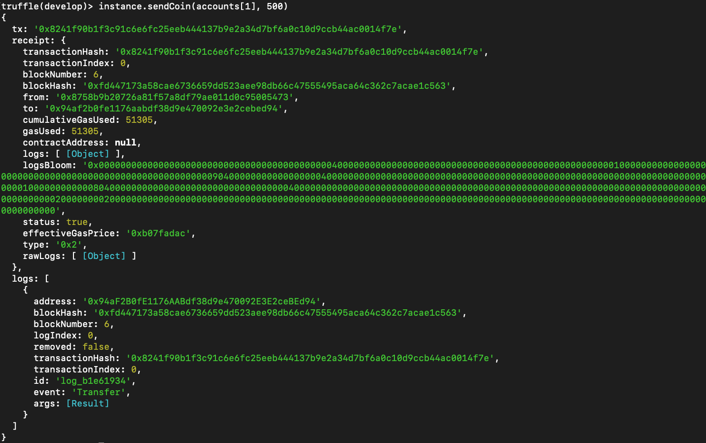

上图为转移过程中的交易信息详情，可以看到发送方、接收方地址、区块高度、区块哈希、消耗gas等信息。

检查上一步交易中，接收方账户余额

```
truffle(develop)> let received = await instance.getBalance(accounts[1])
truffle(develop)> received.toNumber()
```

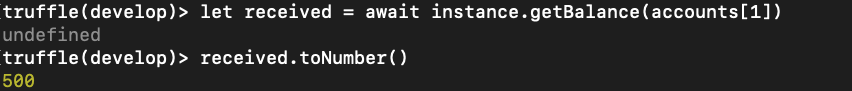


检查上上步中，发送metacoin的账户余额

```
truffle(develop)> let newBalance = await instance.getBalance(accounts[0])
truffle(develop)> newBalance.toNumber()
```

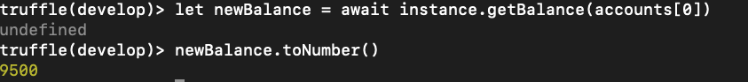


# 总结

在本文中，我们把metabox模版项目下载到本地，随后分析了项目结构和常见文件的作用，随后将智能合约部署到本地启动的区块链上，并执行了一系列常见的命令，通过此文我们能够对truffle的使用有一个初步的了解。要想进一步了解，仍需阅读[官方文档](https://trufflesuite.com/docs/truffle/)，鉴于中国大陆特殊的网络环境，在遇到环境问题时还需具体问题具体分析。


# 参考资料

https://github.com/trufflesuite/truffle

https://github.com/trufflesuite/truffle/issues/4692

https://trufflesuite.com/docs/truffle/

https://trufflesuite.com/docs/truffle/quickstart/

https://www.cnblogs.com/soowin/p/14345232.html

https://ethereum.stackexchange.com/questions/64358/truffle-box-at-url-https-github-com-truffle-box-bare-box-git-doesnt-exist

