# Truffle安装过程踩坑记录

# 背景

为了熟悉以太坊的开发框架，选择安装truffle来实际操练一下，找了一本书《Mastering Ethereum》，出版时间2018年。参考附录关于以太坊诸多框架的介绍中关于Truffle的介绍。先完整阅读了一遍，再根据指示进行安装，安装过程中由于时间间隔、地理环境等因素踩了一些坑，简单记录一下，大约花了1个半小时才完成安装。

# 安装步骤

## 理想的安装过程

简单来说，附录描述的安装步骤如下图所示，仅需最少3步即可。

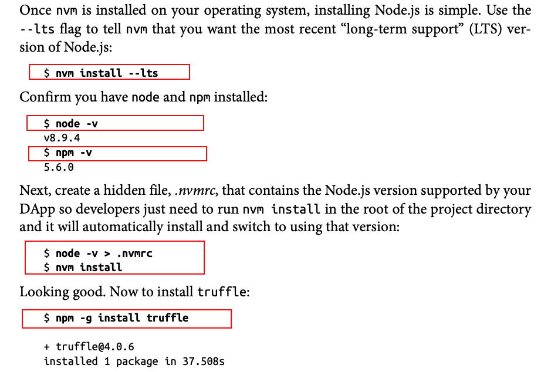

1. 安装nvm
2. 安装node.js和npm
3. 安装truffle

可是实际的安装过程却更复杂，以下将按照实际的安装过程操作来阐述。

## 实际的安装过程

### 安装nvm

去[nvm官方仓库](https://github.com/nvm-sh/nvm/blob/master/README.md#install--update-script)获取以下安装脚本

```shell
curl -o- https://raw.githubusercontent.com/nvm-sh/nvm/v0.39.1/install.sh | bash
```

打开一个terminal，运行以上命令后得到如下提示

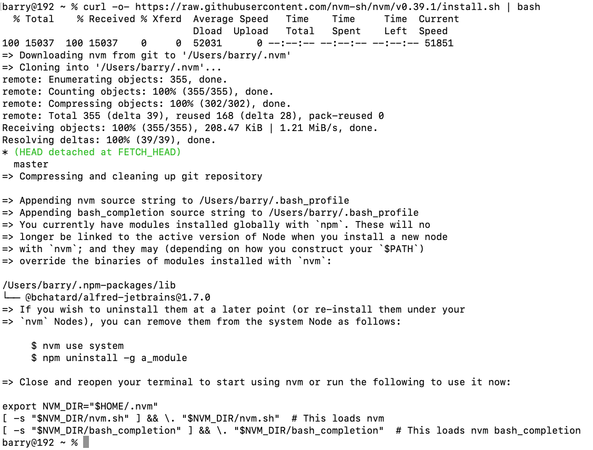

根据提示可看到命令安装成功，使用nvm命令之前需要执行以下语句，添加环境变量

```bash
export NVM_DIR="$HOME/.nvm"
[ -s "$NVM_DIR/nvm.sh" ] && \. "$NVM_DIR/nvm.sh"  # This loads nvm
[ -s "$NVM_DIR/bash_completion" ] && \. "$NVM_DIR/bash_completion"  # This loads nvm bash_completion
```

接着输入`nvm --help`

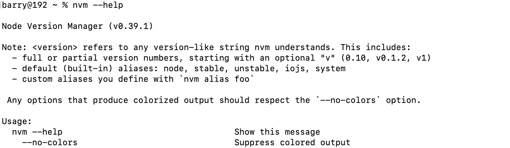

出现上图提示说明nvm已经安装成功。


### 安装node和npm

根据书籍内容输入以下命令来安装最新的LTS（long-term support）版本的node和npm

```bash
nvm install --lts
```

然后去外面运动了50分钟左右，回来看了一眼，出现以下提示······

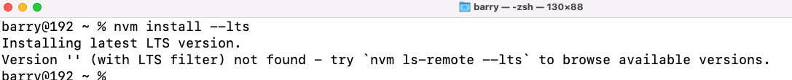

根据提示运行以下命令

```bash
nvm ls-remote --lts
```

过了几分钟，得到以下提示

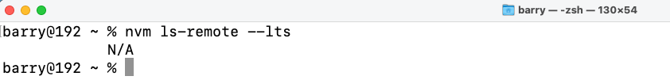

初步判断，应该是中国特色，需要配置中国大陆地区的镜像。修改nvm镜像源，指向淘宝

```
export NVM_NODEJS_ORG_MIRROR=https://npm.taobao.org/mirrors/node/
```

然后重新运行

```bash
nvm install --lts
```

得到下图所示提示

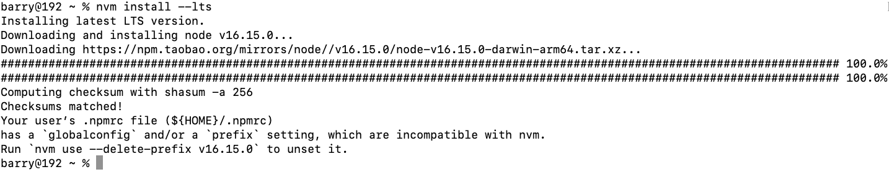

观察提示信息可知道应该安装成功了，但是提示需要删除家目录下.npmrc文件的前缀。（之前下载的一个Alfred workflow需要引起的，为了避免潜在的报错，根据提示删掉）

查看文件内容，如下图所示。

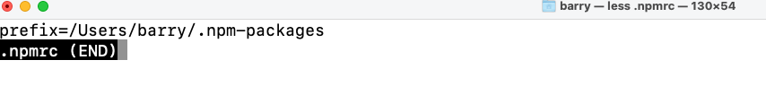

根据提示信息，执行以下命令删掉

```bash
nvm use --delete-prefix v16.15.0
```

随后查看node和npm的版本，如下图所示

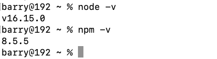

可以看到，node版本是v16.15.0，npm版本是8.5.5，至此node和npm都安装好了


### 安装Truffle

根据内容提示执行以下命令

```sh
npm -g install truffle
```

发现下载很慢，修改源仓库地址为中国大陆镜像源

```
npm config set registry https://registry.npmmirror.com 
```

然后再次执行安装命令，结果如下图所示

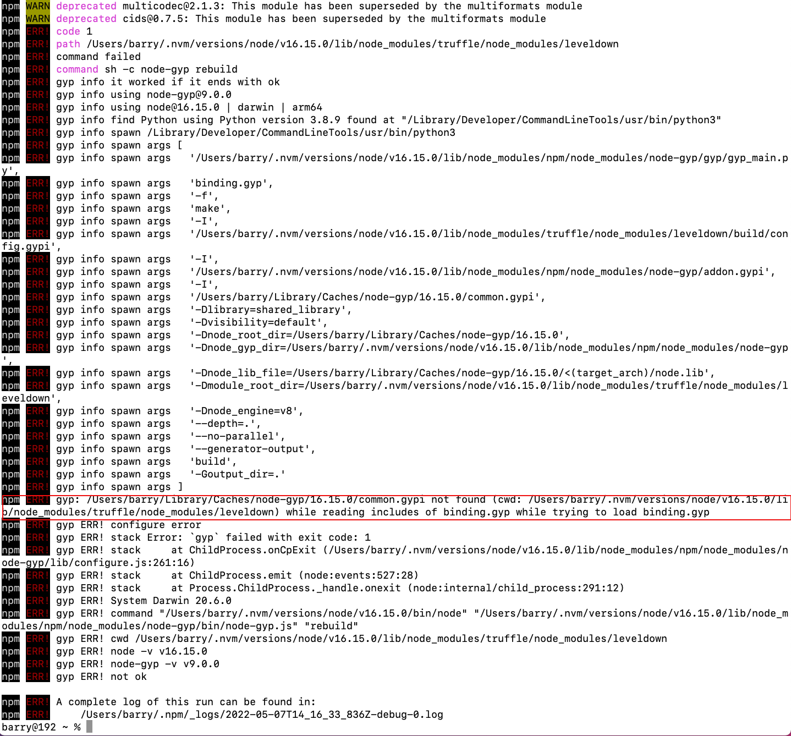

连续3次执行都遇到上图所示报错。在GitHub上truffle的issue中找到解决办法

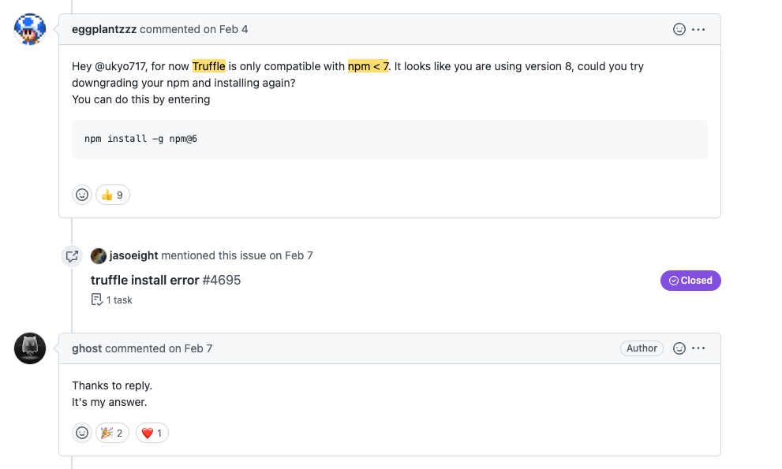

根据上图解决办法可知，问题原因是当前Truffle只兼容npm7以下的版本，所以执行以下命令降低了npm的版本。

```
npm install -g npm@6
```

降低版本后重新配置了npm的镜像源

```
npm config set registry https://registry.npmmirror.com
```

然后在执行安装命令

```
npm -g install truffle
```

结果如下图所示

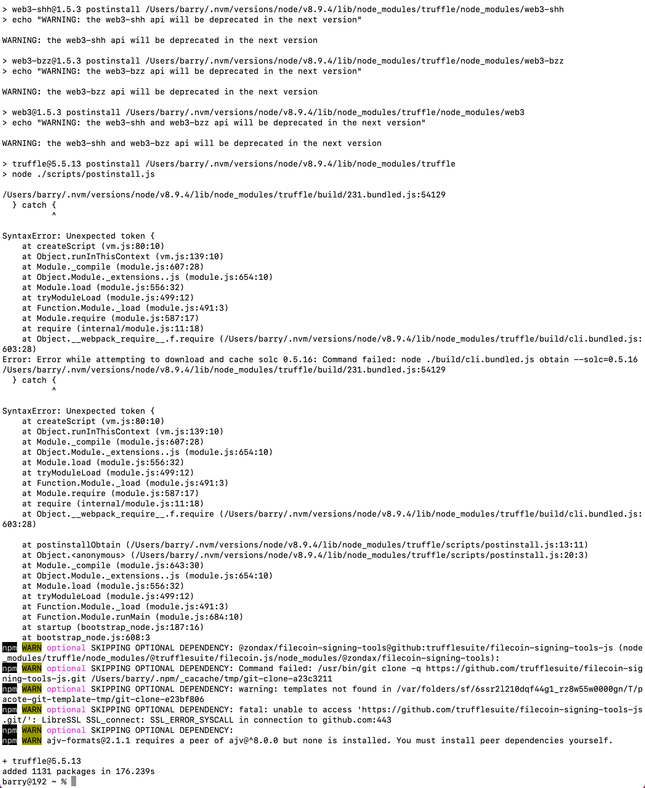

观察到这一条提示

```
Error: Error while attempting to download and cache solc 0.5.16: Command failed: node ./build/cli.bundled.js obtain --solc=0.5.16
```

判断应该也是版本兼容性问题。问了避免再次遇到出乎意料之外的报错提示，选择安装与书籍中版本一致的node、npm、truffle。

依次执行以下命令

```bash
nvm install 8.9.4               //安装8.9.4版本的node，5.6.0的npm
nvm use 8.9.4                   //切换到指定版本的node和npm
npm -g install truffle@4.0.6    //安装指定版本的truffle
```

得到下图所示结果

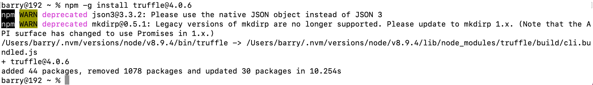

运行命令`truffle version`

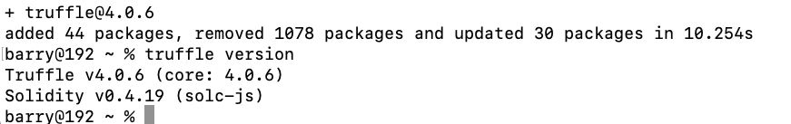

安装成功

# 总结

在阅读技术书籍中需要手动操作来实践的环节时，要考虑中国大陆网络的特殊坏境、版本兼容性问题、内容实效性。最少的试错方式是跟作者的版本保持高度一致，以避免因为后续的更新迭代导致的各种奇怪问题。

# 参考链接

https://github.com/nvm-sh/nvm/blob/master/README.md#install--update-script

https://medium.com/@interjc/nvm-%E4%BD%BF%E7%94%A8%E6%B7%98%E5%AE%9D%E9%95%9C%E5%83%8F-d9d31ac1ee46

https://npmmirror.com/

https://github.com/trufflesuite/truffle/issues/2069

https://github.com/trufflesuite/truffle/issues/4692

https://stackoverflow.com/questions/70927170/tried-npm-install-g-truffle-but-getting-this-gyp-error