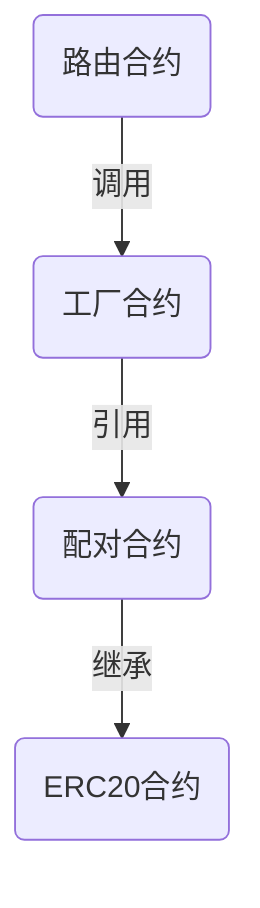
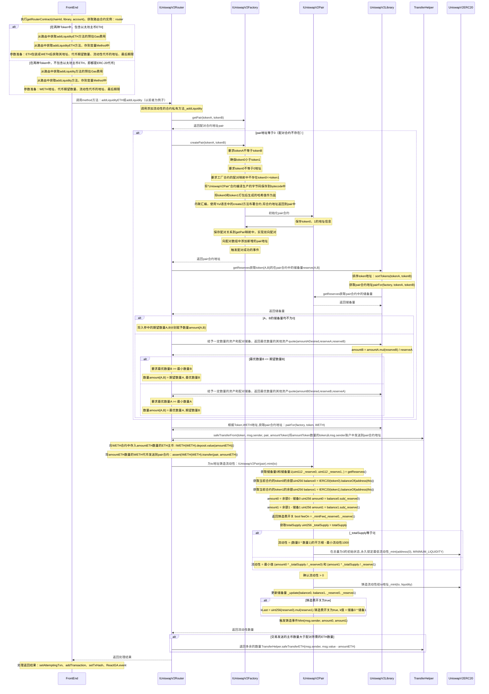

[TOC]

# 简介

Uniswap是一个去中心化的加密货币交易所，可以用来交换以太坊区块链上[ERC20协议的代币](http://bailiyingfeng.cn/wordpress/?p=392)。


# Uniswap的版本演化之路

2018年11月，V1版本诞生，它允许任何**ERC-20代币与以太币ETH进行交易**。

2020年5月，V2版本发布，它可以**直接进行ERC-20代币之间的交易**，而不必先与以太币ETH交易。

2021年5月，V3颁布发布，具有更好的资本效率和准确性，流动性提供者的资本可以集中在**自定义的价格范围**内，增强所需价格的流动性。


# 与中心化交易所的差异

## 中心化交易所

中心化交易所（centralized exchanges，简称CEXs）由某个公司进行完全地控制。即，支持整个交易所运行的服务器由该公司完全掌控。它有如下特点：

- 用户需要进行[KYC](https://en.wikipedia.org/wiki/Know_your_customer)（Know You Customer）认证才能正常使用服务，需要提供更多的个人信息，这增加了隐私被暴露的风险。
- 此外，在进行交易前，用户还需先存入一笔资产，这笔资产由交易所完全控制。
- 用户若要进行买入/卖出操作，必须要提交买入/卖出订单。所有用户提交的订单会被汇总保存到交易所的[订单簿](https://en.wikipedia.org/wiki/Order_book)中。随后，再从其中寻找两条价格互相匹配的买入、卖出记录来开展交易。
- 它的流动性由[做市商](https://en.wikipedia.org/wiki/Market_maker)持续不断地在多个不同价位进行买入/卖出来保证。
- 价格是订单簿中买卖双方最近一次达成交易时的价格。

常见的中心化交易所有：[Coinbase](https://en.wikipedia.org/wiki/Coinbase)、[币安](https://www.binance.com/zh-CN)、[crypto.com](http://crypto.com/)等

## 去中心化交易所

去中心化交易所（decentralized exchanges，简称DEXs）是DeFi生态中的一个应用，关于DeFi的介绍可以参考之前写的[这篇文章](http://bailiyingfeng.cn/wordpress/?p=313)。

- DEXs不会被任何一个中心化的个体控制，因为它的规则全都由智能合约来实现，这些合约被部署到了以太坊这台去中心化的计算机上。
- 不需要开户，也不需要进行KYC，提高个人信息的保密性。
- 用户自己掌控自己的资产，而不需要交给交易所。
- 它的流动性由**流动性池（liquidity pool）**来维持，流动性池是一个汇集了**流动性提供者（liquidity provider，简称LP）**资金的资金池。**交易者（trader）**可直接与流动性池进行交易，LP可从提供的流动性中对每一笔交易获取交易费。
- 价格由**[固定乘积做市商模型](https://medium.com/bollinger-investment-group/constant-function-market-makers-defis-zero-to-one-innovation-968f77022159)（Constant Product Market Maker Model）**来决定。主要使用到**恒定乘积公式（Constant Product Formula）** `x*y=k`。x和y分别代表两个ERC-20代币的数量，k是它们的乘积，需要保持恒定不变。例如，在流动性池子中有10个ETH与10,000个DAI。那么k = 100,000。若我们需换取1个ETH，需要用多少个DAI呢？换取1个ETH后，还剩9个，根据公式需要池子中拥有`100,000/9=11,111`个DAI来维持乘积不变。当前DAI的个数为`10,000`，所以需要补充`11,111-10,000=1111`个DAI。所以价格为`1ETH=1111DAI`。换取两个ETH呢？同理`(100,000/(10-2)-10,000)/2=1250`，即`1ETH=1250DAI`。可以看到，买的ETH越多，需要付出的DAI越多，也不可能完全把所有的ETH卖光，因为需要无限多的DAI，这样的机制保证了池子的流动性。
- 价格滑移（Price Slippage）是指订单执行时的价格与下单时的价格不一致。在Uniswap上同时存在很多用户进行交易，每一笔交易与以太坊交易一一对应，以太坊交易的一大缺点是确认速度较慢（通常需要10几秒）。在此期间可能有其他的交易已经达成，进而导致价格变动，出现价格不一致的现象。针对此现象，用户可以设置一个可容忍的价差，一旦超出范围，则取消交易。


# 部分核心名词解释


| 名词                                     | 解释                                                         |
| ---------------------------------------- | ------------------------------------------------------------ |
| Automated Market Maker（自动做市商）     | 自动做市商是以太坊上的一个智能合约，持有流动性储备。用户可以按照固定公式确定的价格对这些储备进行交易。任何人都可以向这些智能合约贡献流动性，赚取按比例的交易费作为回报。 |
| Concentrated Liquidity（集中流动性）     | 在确定的价格范围内分配的流动资金。                           |
| Constant Product Formula（固定乘积公式） | Uniswap使用的自动做市算法——`x*y=k`。                         |
| ERC20                                    | ERC20代币是以太坊上可替换的代币，Uniswap支持所有标准的ERC20实现。 |
| Factory Contract （工厂合约）            | 专门用来部署ERC20/ERC20交易对的智能合约，可唯一标识每一对交易对。 |
| Core Contract（核心合约）                | 基础核心合约。                                               |
| Pair Contract（配对合约）                | 由工厂合约部署的智能合约，可以在两个ERC20代币之间进行交易。在V3版本中被称为池子（Pools）。 |
| Periphery Contract（边缘合约）           | 具备非核心功能的合约。                                       |
| Liquidity Pool （池子合约）              | 由V3版本的工厂合约部署的合约，将两个ERC20资产配对，引入了多种费用选项。 |
| Liquidity（流动性）                      | 储存在Uniswap合约中的数字资产，能够被交易者交易。            |
| Liquidity Provider （流动性提供者）      | 流动性提供者是将ERC20代币存入特定流动性池的人。流动性提供者承担价格风险，并通过交易费用得到补偿。 |
| Trader （交易者）                        | 交换代币的用户                                               |
| Reserves （储备量）                      | 配对合约中的可用流动性。                                     |
| Slippage （价格滑移）                    | 在提交交易和执行交易之间，交易对的价格波动。                 |


# 核心原理解释

Uniswap V2版本奠定了整个Uniswap的核心基础，理解了V2版本，会让我们更容易理解V3版本以及其他交易所的运作原理。它最主要的运作方式就如[下图所示](https://docs.uniswap.org/protocol/V2/concepts/protocol-overview/how-uniswap-works)。


左边是流动性提供者（LP），他们把一对代币Token A和Token B添加到中间的流动性池子中，池子返回TokenP给LP，代表着它在该流动性池子中占有一定比例的流动性份额，会从池子所提供的交易中获得相应比例的交易费作为收益。

右边是交易者，他们直接同流动性池子进行交易，用Token A换取Token B（或反过来），同时支付0.3%的费用。


# 示例说明

为了更好的理解，我们通过例子来了解一下Uniswap V2的运作原理。

## 交换代币计算

假设现在的流动性池子中有5个Token A和20个Token B（比例为1比4）。此时如果小白要用1个Token A来换取Token B的话，能换多少个呢？答案是3.324996个。为什么？因为Uniswap根据固定乘积公式：

> X * Y = K

来决定能够交换的Token数量究竟是多少。X和Y分别是池子中两种Token的储备量，要求在交换前后X和Y的乘积必须是保持固定不变的。

最初，流动性池子中包含5个Token A和20个Token B，所以X = 5 、Y = 20。当小白用1个Token A来发起交换时，他需要先支付0.3%的费用（即，0.003个Token A），所以真正可用于交换的Token A有0.997个。交换后，X的储备量变成5.997，由于K保持不变，那么Y的储备量应该变成`5 * 20 / 5.997 = 16.675004`个。多余的个数会被交给小白，即`20 - 16.675004 = 3.324996`个。所以交换后池子中将有6个Token A和16.675004个Token B。

你可能会问“池子中究竟是6个Token A还是5.997个Token A呢？不是有0.3%的费用被扣除了吗？如果是6个Token A的话，那么`6 * 16.675004 = 100.05`已经大于K值了呀。“ 我们可以在[官方文档中找到以下说明](https://docs.uniswap.org/protocol/V2/concepts/protocol-overview/how-uniswap-works)

> In practice, Uniswap applies a 0.30% fee to trades, which is added to reserves. As a result, each trade actually increases `k`. This functions as a payout to LPs, which is realized when they burn their pool tokens to withdraw their portion of total reserves.

可以看到，0.3%的费用被加到了储备量中，所以每一次交易实际上会增加K值。这些多余储备量会在LP从流动性池子中撤回TokenA\B对时作为收益按比例发放。

小结一下，最初1个Token A可以换4个Token B（1:4），再到换3.324996个Token B。随着Token A的增多它的价格会降低，随着Token B的减少，它的价格会增高。这背后就是经济学中的供需原理：出售代币会使其价格下降（供过于求），而购买代币会使其价格上升（供不应求）。


## LP添加流动性

最初，流动性池子中没有任何代币。小李向其中提供了5个Token A和20个Token B。池子铸造了10个TokenP（标识流动性池子股份）并发送给小李作为其提供的流动性的所有权证明。那10个TokenP是如何得到的呢？是Token A数量与Token B数量的乘积的平方根	$\sqrt{5*20}=10$。那为什么小李以1:4的比例添加流动性呢？换言之，这个比例是根据什么来决定的？其实是由这两种Token的[市场价格](https://www.investopedia.com/terms/m/market-price.asp#:~:text=What%20Is%20Market%20Price%3F,demanded%20is%20the%20market%20price.)来决定的。如果偏离了这个比例的话，那么套利者会从中套利，套利的操作又会影响到池子中Token的比例，使其不断地靠近市场价格。

下表更直观地显示了各个操作环节的Token流动情况。

|          |        | 初始状态 | 小李添加流动性（5个Token A和20个Token B） |
| -------- | ------ | -------- | ----------------------------------------- |
|          | TokenA | 5        | 0                                         |
| 小李持有 | TokenB | 20       | 0                                         |
|          | TokenP | 0        | 10                                        |
|          |        |          |                                           |
| 池子储备 | TokenA | 0        | 5                                         |
|          | TokenB | 0        | 20                                        |


小风的手里头也存在一些闲置的资产，他也将50个Token A和200个Token B添加到流动性池子中，池子将返回100个TokenP给他（$\sqrt{50 * 200}=100$）。此时TokenP的总供应量就增加到110，其中小李占有9.09091%（1/11），小风占有90.90909%（10/11）。此刻各代币的持有情况如下表所示：


|          |        | 初始状态 | 小李添加流动性（5个Token A和20个Token B） | 小风添加流动性（50个Token A和20个Token B） |
| -------- | ------ | -------- | ----------------------------------------- | ------------------------------------------ |
|          | TokenA | 5        | 0                                         | 0                                          |
| 小李持有 | TokenB | 20       | 0                                         | 0                                          |
|          | TokenP | 0        | 10                                        | 10                                         |
|          |        |          |                                           |                                            |
|          | TokenA | 50       | 50                                        | 0                                          |
| 小风持有 | TokenB | 200      | 200                                       | 0                                          |
|          | TokenP | 0        | 0                                         | 100                                        |
|          |        |          |                                           |                                            |
| 池子储备 | TokenA | 0        | 5                                         | 55                                         |
|          | TokenB | 0        | 20                                        | 220                                        |


倘若小风在添加流动性的时候不按照1:4的比例进行添加会怎么样呢？（他可能基于这样的动机，因为TokenA的市场价格更高，所以少放一些TokenA，多放一些TokenB）例如他添加了25个TokenA\400个TokenB，这样一来$\sqrt{25*400}=100$不也是收到100个TokenP吗？实际上Uniswap考虑到了这样的场景，它会对比例进行自动纠正，即安装1:4的比例来计算用户实际应该获得的TokenP，应该是$\sqrt{25*100}=50$个，并且会对这样的行为做出一定的惩罚，例如剩余的300个Token B虽然也被加到了流动性池子中，但是没有获得相应的TokenP，无法提高其在池子中的占比，也就无法获得更多的费用报酬，相当于300个Token B的流动性被浪费了。


## 用户交换代币

现在池子中一共有55个Token A和220个Token B，小白用10个Token A换取了${220-55*220/(55+10*(1-0.003))}=33.7602$个Token B。在此次交换后池子中一共有65个Token A和${{55*220/(55+10*(1-0.003))}=186.2398}$个Token B。

此刻各个代币的持有情况如下表所示：


|          |        | 初始状态 | 小李添加流动性（5个Token A和20个Token B） | 小风添加流动性（50个Token A和20个Token B） | 小白用10个Token A来换Token B |
| -------- | ------ | -------- | ----------------------------------------- | ------------------------------------------ | ---------------------------- |
|          | TokenA | 5        | 0                                         | 0                                          | 0                            |
| 小李持有 | TokenB | 20       | 0                                         | 0                                          | 0                            |
|          | TokenP | 0        | 10                                        | 10                                         | 10                           |
|          |        |          |                                           |                                            |                              |
|          | TokenA | 50       | 50                                        | 0                                          | 0                            |
| 小风持有 | TokenB | 200      | 200                                       | 0                                          | 0                            |
|          | TokenP | 0        | 0                                         | 100                                        | 100                          |
|          |        |          |                                           |                                            |                              |
| 小白持有 | TokenA | 10       | 10                                        | 10                                         | 0                            |
|          | TokenB | 0        | 0                                         | 0                                          | 33.7602                      |
|          |        |          |                                           |                                            |                              |
| 池子储备 | TokenA | 0        | 5                                         | 55                                         | 65                           |
|          | TokenB | 0        | 20                                        | 220                                        | 186.2398                     |


## LP移除流动性

过了一段时间由于资金周转需要，小李决定从流动性池子中赎回他所有的Token A\B，他发起了移除流动性的请求。该请求会将其持有的TokenP销毁，并根据其占比返还对应数量的TokenA\B。根据比例他将得到5.90909个Token A (65 * 9.090909%) 和 16.93089个 (186.2398 * 9.090909%) Token B。

此时持有情况如下表


|          |        | 初始状态 | 小李添加流动性（5个Token A和20个Token B） | 小风添加流动性（50个Token A和20个Token B） | 小白用10个Token A来换Token B | 小李移除其所有流动性 |
| -------- | ------ | -------- | ----------------------------------------- | ------------------------------------------ | ---------------------------- | -------------------- |
|          | TokenA | 5        | 0                                         | 0                                          | 0                            | 5.90909              |
| 小李持有 | TokenB | 20       | 0                                         | 0                                          | 0                            | 16.93089             |
|          | TokenP | 0        | 10                                        | 10                                         | 10                           | 0                    |
|          |        |          |                                           |                                            |                              |                      |
|          | TokenA | 50       | 50                                        | 0                                          | 0                            | 0                    |
| 小风持有 | TokenB | 200      | 200                                       | 0                                          | 0                            | 0                    |
|          | TokenP | 0        | 0                                         | 100                                        | 100                          | 100                  |
|          |        |          |                                           |                                            |                              |                      |
| 小白持有 | TokenA | 10       | 10                                        | 10                                         | 0                            | 0                    |
|          | TokenB | 0        | 0                                         | 0                                          | 33.7602                      | 33.7602              |
|          |        |          |                                           |                                            |                              |                      |
| 池子储备 | TokenA | 0        | 5                                         | 55                                         | 65                           | 59.090909            |
|          | TokenB | 0        | 20                                        | 220                                        | 186.2398                     | 169.30891            |


随后，小风也做了同样的决定，赎回了所有的Token A\B。根据比例他将得到59.090909个Token A 和 169.30891个Token B。

此时的持有情况如下表：

|          |        | 初始状态 | 小李添加流动性（5个Token A和20个Token B） | 小风添加流动性（50个Token A和20个Token B） | 小白用10个Token A来换Token B | 小李移除其所有流动性 | 小风移除其所有流动性 |
| -------- | ------ | -------- | ----------------------------------------- | ------------------------------------------ | ---------------------------- | -------------------- | -------------------- |
|          | TokenA | 5        | 0                                         | 0                                          | 0                            | 5.90909              | 5.90909              |
| 小李持有 | TokenB | 20       | 0                                         | 0                                          | 0                            | 16.93089             | 16.93089             |
|          | TokenP | 0        | 10                                        | 10                                         | 10                           | 0                    | 0                    |
|          |        |          |                                           |                                            |                              |                      |                      |
|          | TokenA | 50       | 50                                        | 0                                          | 0                            | 0                    | 59.090909            |
| 小风持有 | TokenB | 200      | 200                                       | 0                                          | 0                            | 0                    | 169.30891            |
|          | TokenP | 0        | 0                                         | 100                                        | 100                          | 100                  | 0                    |
|          |        |          |                                           |                                            |                              |                      |                      |
| 小白持有 | TokenA | 10       | 10                                        | 10                                         | 0                            | 0                    | 0                    |
|          | TokenB | 0        | 0                                         | 0                                          | 33.7602                      | 33.7602              | 33.7602              |
|          |        |          |                                           |                                            |                              |                      |                      |
| 池子储备 | TokenA | 0        | 5                                         | 55                                         | 65                           | 59.090909            | 0                    |
|          | TokenB | 0        | 20                                        | 220                                        | 186.2398                     | 169.30891            | 0                    |


## 小结

在本小节中，我们通过一个案例来阐述了最常见的操作：添加流动性、移除流动性，交换代币，并分析了与之相关的一些计算规则。为了更方便的理解，阐述过程做了适当的简化，更详细的说明可参考[白皮书](https://uniswap.org/whitepaper.pdf)。


# 搭建DEx

接下来我们基于Uniswap V2版本源码，一步一步地搭建一个去中心化交易所。

主要用到以下仓库源码：

| 仓库                                                    | 简介                                                         |
| ------------------------------------------------------- | ------------------------------------------------------------ |
| [v2-core](https://github.com/Uniswap/v2-core)           | 包含<br />[UniswapV2Factory](https://ethereum.org/en/developers/tutorials/uniswap-v2-annotated-code/#uniswapv2factory)、[UniswapV2Pair](https://ethereum.org/en/developers/tutorials/uniswap-v2-annotated-code/#uniswapv2pair)、[UniswapV2ERC20](https://ethereum.org/en/developers/tutorials/uniswap-v2-annotated-code/#uniswapv2erc20)等核心合约 |
| [v2-periphery](https://github.com/Uniswap/v2-periphery) | 包含[UniswapV2Router01](https://ethereum.org/en/developers/tutorials/uniswap-v2-annotated-code/#uniswapv2router01)<br />[UniswapV2Router02](https://ethereum.org/en/developers/tutorials/uniswap-v2-annotated-code/#uniswapv2router02)<br />[UniswapV2Migrator](https://ethereum.org/en/developers/tutorials/uniswap-v2-annotated-code/#uniswapv2migrator)<br />等边缘合约 |
| [interface](https://github.com/Uniswap/interface)       | 前端代码，包含了V1、V2、V3版本                               |

## 部署合约代码

打开[Remix](https://remix.ethereum.org/)，准备部署工厂合约[UniswapV2Factory](https://github.com/Uniswap/v2-core/blob/master/contracts/UniswapV2Factory.sol)。

（或者从etherscan以太坊浏览器中获取经过扁平化处理后的线上合约：[工厂合约](https://cn.etherscan.com/address/0x5C69bEe701ef814a2B6a3EDD4B1652CB9cc5aA6f#code)、[路由合约](https://cn.etherscan.com/address/0x7a250d5630b4cf539739df2c5dacb4c659f2488d#code)）

首先，创建工厂合约文件，并且在合约中新增一行代码，目的是为了获取配对合约的哈希值。为什么要获取呢？因为在源码中多次用到这个哈希值来计算配对合约的地址。如下图所示：


可以看到注释的说明，为了避免外部调用，直接进行硬编码，把该哈希值写入此处。

```solidity
bytes32 public constant INIT_CODE_PAIR_HASH = keccak256(abi.encodePacked(type(UniswapV2Pair).creationCode));
```


随后根据如下参数配置进行编译


然后再部署合约，部署地址填写为发起本次部署的账户地址。

部署成功后，复制工厂合约地址。


接下来，以同样的方式编译并部署路由合约[UniswapV2Router02.sol](https://github.com/Uniswap/v2-periphery/blob/master/contracts/UniswapV2Router02.sol)。（或者从etherscan中获取经过扁平化处理的[路由合约](https://cn.etherscan.com/address/0x7a250d5630b4cf539739df2c5dacb4c659f2488d#code)）


如上图所示，填写工厂合约地址，WETH合约地址（Rinkeby网络固定为0xc778417E063141139Fce010982780140Aa0cD5Ab）。

随后点击`INIT_CODE_PAIR_HASH`按钮，获取并复制返回的哈希值


将前缀`0x`去掉后，替换到下图所示位置。


随后点击部署。


## 部署前端

由于[interface](https://github.com/Uniswap/interface)仓库中包含了各个版本的记录，我们找到2020年9月1日commit id为b8c383c的版本，然后执行以下命令：

```
git clone https://github.com/Uniswap/interface
git checkout b8c383c
npm install --global yarn
yarn
yarn start
```

在运行`yarn start`之前需要把路由地址修改为刚刚在测试网络上部署的合约地址`0x264544837B1270FEe533eC1d4974821E263746A2`，来让前端与我们刚刚部署的合约进行交互。


启动成功后如下图所示：


接下来，将前端项目部署到公网上去，使用的是[github page](https://pages.github.com/)。

```
cd interface
rm -rf .git
git init
git remote add origin https://github.com/Barryonion/bailiswap.git
yarn add gh-pages
git add .
git commit -m "first commit"
git branch -M main
git push -u origin main
yarn build
yarn deploy
```

执行完上述命令后即可成功部署。


# 常见操作

在前面的环节中，我们已经在测试网络Rinkeby上部署好了一个Uniswap，接下来我们来直观地执行其最常见的几个操作。


## 发币

在进行常见操作之前，我们可以先发行由我们原创的ERC20代币——BLC(Bai Li Coin)，总共发行10亿个。


部署成功后拷贝地址`0x96784ED1F47e080bf8948E54d5d46325e37A50cA`


## 添加流动性

进入首页：https://barryonion.github.io/bailiswap/index.html#/swap

点击`Pool`，再点击`Add Liquidity`来添加流动性。


随后点击`Select Token`


在弹出的对话框中粘贴我们刚刚发行的`Bai Li Coin`的地址


点击`Add`进行添加，然后选中。

输入要添加的数量（由于之前添加过，所以这里根据之前的比例自动计算出各自所需的个数）


点击`Approve BLC`进行审批，在Metamask中点击确认。


上图表示确认通过，随后点击`Supply`


再点击`Comfirm Supply`，可以看到本次添加流动性，我们可以得到3.125个LP token。


执行成功后，刷新页面，我们可以看到添加的流动性列表


## 交换代币

我们切换到账户Account2，使用Uniswap换取一些BLC。


我们打算用0.01个ETH来换取8.8709个BLC。


点击`Swap Anyway`


根据提示，点击OK。


可以看到交易已经成功执行


我们的ETH余额变成0.289822，BLC余额变成8.8709。


## 移除流动性

我们切换回Account1来移除流动性。（为了进行交换操作刚刚从Account1账户向Account2账户转移了0.3个ETH）。

进入到`Pool`页面，点击`Remove`按钮。


将数量调成100%，选择移除所有流动性，随后点击`Approve`按钮进行审核


审核通过后点击`Remove`


再点击`Confirm`


随后在Metamask中确认交易，根据提示可看到执行成功


返回Pool页面，发现流动性已经移除。


# 源码分析

最后我们来分析一下核心操作所涉及到的源码。


## 核心合约简介

前面提到了：路由合约（UniswapV2Router）、工厂合约（UniswapV2Factory）、配对合约（UniswapV2Pair）、ERC20合约（UniswapV2ERC20），那它们之间的关系是怎么样的呢？




可以看到核心的调用链路是：前端请求路由合约，再由路由合约调用工厂合约来创建配对合约，配对合约继承了ERC20合约。

## 添加流动性

添加流动性涉及到的方法如下：

| 方法声明                                                     | 简介                                                         |
| ------------------------------------------------------------ | ------------------------------------------------------------ |
| addLiquidityETH(<br />address token,<br />uint256 amountTokenDesired,<br />uint256 amountTokenMin,<br />uint256 amountETHMin,<br />address to,<br />uint256 deadline) external payable ensure(deadline) <br />    returns (<br />uint256 amountToken,<br />uint256 amountETH,<br />uint256 liquidity<br /> ) | 添加流动性<br />两种代币之中有一种是ETH<br />入参：<br />token：token地址<br />amountTokenDesired：Token期望数量<br />amountTokenMin：Token最小数量<br />amountETHMin：ETH最小数量<br />to：to地址<br />deadline：最后期限<br />返回值：<br />amountToken   Token数量<br />amountETH   ETH数量<br />liquidity   流动性数量 |
| addLiquidity(<br />address tokenA,<br />address tokenB,<br />uint256 amountADesired,<br />uint256 amountBDesired,<br />uint256 amountAMin,<br />uint256 amountBMin,<br />address to,<br />uint256 deadline) external ensure(deadline) <br />    returns (<br />uint256 amountA,<br />uint256 amountB,<br />uint256 liquidity<br /> ) | 添加流动性<br />两种代币之中不存在ETH<br />入参<br />tokenA： tokenA地址<br />tokenB： tokenB地址<br />amountADesired： 期望数量A<br />amountBDesired ：期望数量B<br />amountAMin： 最小数量A<br />amountBMin： 最小数量B<br />to： to地址<br />deadline： 最后期限<br />返回值：<br />amountA：数量A<br />amountB：数量B<br />liquidity：流动性数量 |
| function _addLiquidity(<br />        address tokenA,<br />        address tokenB,<br />        uint256 amountADesired,<br />        uint256 amountBDesired,<br />        uint256 amountAMin,<br />        uint256 amountBMin<br />    ) private returns (uint256 amountA, uint256 amountB) { | 添加流动性的私有方法，由上面两个方法调用<br />入参：<br />tokenA tokenA地址<br />tokenB tokenB地址<br />amountADesired 期望数量A<br />amountBDesired 期望数量B<br />amountAMin 最小数量A<br />amountBMin 最小数量B<br />返回值：<br />amountA   数量A<br />amountB   数量B |

这些方法大同小异，我们选择其中的`addLiquidityETH`方法来进行深入分析。
首先用户在前端页面点击`Confirm Supply`按钮，确认添加流动性。


按钮将会触发前端代码执行以下逻辑


`addLiquidityETH`的代码执行逻辑如下：


`_addLiquidity`方法的详细计算逻辑如下：


工厂合约中`createPair`的详细计算逻辑如下：


回到`addLiquidityETH`方法，通过Pair合约的`mint`方法来铸造流动性代币，并发到用户地址中。


在`_update`方法中把余额更新到储备量中


### 时序图

整个过程的时序图大致如下




## 交换

接下来，我们看看交换操作，交换操作涉及到如下6个方法：

| 方法名称                                                     | 简介                                                         |
| ------------------------------------------------------------ | ------------------------------------------------------------ |
| function swapExactTokensForTokens(<br />        uint256 amountIn,<br />        uint256 amountOutMin,<br />        address[] calldata path,<br />        address to,<br />        uint256 deadline<br />    ) external ensure(deadline) returns (uint256[] memory amounts) | 根据精确的token交换尽量多的token<br />入参：<br />amountIn:精确输入数额<br/>amountOutMin:最小输出数额<br/>path:路径数组<br/>to:to地址<br/>deadline:最后期限<br/>返回值：<br />amounts[]:数额数组 |
| function swapTokensForExactTokens(<br/>        uint256 amountOut,<br/>        uint256 amountInMax,<br/>        address[] calldata path,<br/>        address to,<br/>        uint256 deadline<br/>    ) external ensure(deadline) returns (uint256[] memory amounts) | 使用尽量少的token交换精确的token<br />入参：<br />amountOut:精确输出数额<br/>amountInMax:最大输入数额<br/>path:路径数组<br/>to:to地址<br/>deadline:最后期限<br/>返回值：<br />amounts[]:数额数组 |
| function swapExactETHForTokens(<br/>        uint256 amountOutMin,<br/>        address[] calldata path,<br/>        address to,<br/>        uint256 deadline<br/>    ) external payable ensure(deadline) returns (uint256[] memory amounts) | 根据精确的ETH交换尽量多的token<br />入参：<br />amountOutMin:最小输出数额<br/>path:路径数组<br/>to:to地址<br/>deadline:最后期限<br/>返回值：<br />amounts[]:数额数组 |
| function swapTokensForExactETH(<br/>        uint256 amountOut,<br/>        uint256 amountInMax,<br/>        address[] calldata path,<br/>        address to,<br/>        uint256 deadline<br/>    ) external ensure(deadline) returns (uint256[] memory amounts) | 使用尽量少的token交换精确的ETH<br />入参：<br />amountOut：精确输出数额<br/>amountInMax：最大输入数额<br/>path：路径数组<br/>to：to地址<br/>deadline：最后期限<br/>返回值：<br />amounts[]：数额数组 |
| function swapExactTokensForETH(<br/>        uint256 amountIn,<br/>        uint256 amountOutMin,<br/>        address[] calldata path,<br/>        address to,<br/>        uint256 deadline<br/>    ) external ensure(deadline) returns (uint256[] memory amounts) | 根据精确的token交换尽量多的ETH<br />入参：<br />amountIn：精确输入数额<br/>amountOutMin：最小输出数额<br/>path：路径数组<br/>to：to地址<br/>deadline：最后期限<br/>返回值：<br />amounts[]：数额数组 |
| function swapETHForExactTokens(<br/>        uint256 amountOut,<br/>        address[] calldata path,<br/>        address to,<br/>        uint256 deadline<br/>    ) external payable ensure(deadline) returns (uint256[] memory amounts) | 使用尽量少的ETH交换精确的token<br />入参：<br />amountOut： 精确输出数额<br/>path：路径数组<br/>to：to地址<br/>deadline：最后期限<br/>返回值：<br />amounts[]： 数额数组 |

我们选择其中的`swapExactETHForTokens`方法来进行深入分析

```solidity
/**
     * @dev 根据精确的ETH交换尽量多的token
     * @param amountOutMin 最小输出数额
     * @param path 路径数组
     * @param to to地址
     * @param deadline 最后期限
     * @return amounts[]  数额数组
     */
    function swapExactETHForTokens(
        uint256 amountOutMin,
        address[] calldata path,
        address to,
        uint256 deadline
    ) external payable ensure(deadline) returns (uint256[] memory amounts) {
        //确认路径第一个地址为WETH
        require(path[0] == WETH, "UniswapV2Router: INVALID_PATH");
        //数额数组 ≈ 遍历路径数组((msg.value * 997 * 储备量Out) / (储备量In * 1000 + msg.value * 997))
        amounts = UniswapV2Library.getAmountsOut(factory, msg.value, path);
        //确认数额数组最后一个元素>=最小输出数额
        require(
            amounts[amounts.length - 1] >= amountOutMin,
            "UniswapV2Router: INSUFFICIENT_OUTPUT_AMOUNT"
        );
        //将数额数组[0]的数额存款ETH到WETH合约
        IWETH(WETH).deposit.value(amounts[0])();
        //断言将数额数组[0]的数额的WETH发送到路径(0,1)的pair合约地址
        assert(
            IWETH(WETH).transfer(
                UniswapV2Library.pairFor(factory, path[0], path[1]),
                amounts[0]
            )
        );
        //私有交换(数额数组,路径数组,to地址)
        _swap(amounts, path, to);
    }
```

`getAmountsOut`方法内的逻辑如下

```solidity
/**
     * @dev 获取输出数额
     * @notice 对任意数量的对执行链接的getAmountOut计算
     * @param factory 工厂合约地址
     * @param amountIn 输入数额
     * @param path 路径数组
     * @return amounts[]  数额数组
     */
    // performs chained getAmountOut calculations on any number of pairs
    function getAmountsOut(
        address factory,
        uint256 amountIn,
        address[] memory path
    ) internal view returns (uint256[] memory amounts) {
        //确认路径数组长度大于2
        require(path.length >= 2, "UniswapV2Library: INVALID_PATH");
        //初始化数额数组
        amounts = new uint256[](path.length);
        //数额数组[0] = 输入数额
        amounts[0] = amountIn;
        //遍历路径数组,path长度-1
        for (uint256 i; i < path.length - 1; i++) {
            //(储备量In,储备量Out) = 获取储备(当前路径地址,下一个路径地址)
            (uint256 reserveIn, uint256 reserveOut) = getReserves(
                factory,
                path[i],
                path[i + 1]
            );
            //下一个数额 = 获取输出数额(当前数额,储备量In,储备量Out)
            amounts[i + 1] = getAmountOut(amounts[i], reserveIn, reserveOut);
        }
    }
    
    
    /**
     * @dev 获取单个输出数额
     * @notice 给定一项资产的输入量和配对的储备，返回另一项资产的最大输出量
     * @param amountIn 输入数额
     * @param reserveIn 储备量In
     * @param reserveOut 储备量Out
     * @return amounts  输出数额
     */
    // given an input amount of an asset and pair reserves, returns the maximum output amount of the other asset
    function getAmountOut(
        uint256 amountIn,
        uint256 reserveIn,
        uint256 reserveOut
    ) internal pure returns (uint256 amountOut) {
        //确认输入数额大于0
        require(amountIn > 0, "UniswapV2Library: INSUFFICIENT_INPUT_AMOUNT");
        //确认储备量In和储备量Out大于0
        require(
            reserveIn > 0 && reserveOut > 0,
            "UniswapV2Library: INSUFFICIENT_LIQUIDITY"
        );
        //税后输入数额 = 输入数额 * 997
        uint256 amountInWithFee = amountIn.mul(997);
        //分子 = 税后输入数额 * 储备量Out
        uint256 numerator = amountInWithFee.mul(reserveOut);
        //分母 = 储备量In * 1000 + 税后输入数额
        uint256 denominator = reserveIn.mul(1000).add(amountInWithFee);
        //输出数额 = 分子 / 分母
        amountOut = numerator / denominator;
    }
```

`_swap`方法的逻辑如下

```solidity
/**
     * @dev 私有交换
     * @notice 要求初始金额已经发送到第一对
     * @param amounts 数额数组
     * @param path 路径数组
     * @param _to to地址
     */
    // requires the initial amount to have already been sent to the first pair
    function _swap(
        uint256[] memory amounts,
        address[] memory path,
        address _to
    ) private {
        //遍历路径数组
        for (uint256 i; i < path.length - 1; i++) {
            //(输入地址,输出地址) = (当前地址,下一个地址)
            (address input, address output) = (path[i], path[i + 1]);
            //token0 = 排序(输入地址,输出地址)
            (address token0, ) = UniswapV2Library.sortTokens(input, output);
            //输出数量 = 数额数组下一个数额
            uint256 amountOut = amounts[i + 1];
            //(输出数额0,输出数额1) = 输入地址==token0 ? (0,输出数额) : (输出数额,0)
            (uint256 amount0Out, uint256 amount1Out) = input == token0
                ? (uint256(0), amountOut)
                : (amountOut, uint256(0));
            //to地址 = i<路径长度-2 ? (输出地址,路径下下个地址)的pair合约地址 : to地址
            address to = i < path.length - 2
                ? UniswapV2Library.pairFor(factory, output, path[i + 2])
                : _to;
            //调用(输入地址,输出地址)的pair合约地址的交换方法(输出数额0,输出数额1,to地址,0x00)
            IUniswapV2Pair(UniswapV2Library.pairFor(factory, input, output))
                .swap(amount0Out, amount1Out, to, new bytes(0));
        }
    }
```

可以看到，在for循环中，调用了pair合约中如下的`swap`方法

```solidity
/**
     * @param amount0Out 输出数额0
     * @param amount1Out 输出数额1
     * @param to    to地址
     * @param data  用于回调的数据
     * @dev 交换方法
     * @notice 应该从执行重要安全检查的合同中调用此低级功能
     */
    // this low-level function should be called from a contract which performs important safety checks
    function swap(
        uint256 amount0Out,
        uint256 amount1Out,
        address to,
        bytes calldata data
    ) external lock {
        //确认amount0Out和amount1Out都大于0
        require(
            amount0Out > 0 || amount1Out > 0,
            "UniswapV2: INSUFFICIENT_OUTPUT_AMOUNT"
        );
        //获取`储备量0`,`储备量1`
        (uint112 _reserve0, uint112 _reserve1, ) = getReserves(); // gas savings
        //确认`输出数量0,1` < `储备量0,1`
        require(
            amount0Out < _reserve0 && amount1Out < _reserve1,
            "UniswapV2: INSUFFICIENT_LIQUIDITY"
        );

        //初始化变量
        uint256 balance0;
        uint256 balance1;
        {
            //标记_token{0,1}的作用域，避免堆栈太深的错误
            // scope for _token{0,1}, avoids stack too deep errors
            address _token0 = token0;
            address _token1 = token1;

            //确认to地址不等于_token0和_token1
            require(to != _token0 && to != _token1, "UniswapV2: INVALID_TO");
            //如果`输出数量0` > 0 安全发送`输出数量0`的token0到to地址
            if (amount0Out > 0) _safeTransfer(_token0, to, amount0Out); // optimistically transfer tokens
            //如果`输出数量1` > 0 安全发送`输出数量1`的token1到to地址
            if (amount1Out > 0) _safeTransfer(_token1, to, amount1Out); // optimistically transfer tokens
            //如果data的长度大于0 调用to地址的接口
            if (data.length > 0)
                IUniswapV2Callee(to).uniswapV2Call(
                    msg.sender,
                    amount0Out,
                    amount1Out,
                    data
                );
            //`余额0,1` = 当前合约在`token0,1`合约内的余额
            balance0 = IERC20(_token0).balanceOf(address(this));
            balance1 = IERC20(_token1).balanceOf(address(this));
        }
        //如果 余额0 > 储备0 - amount0Out 则 amount0In = 余额0 - (储备0 - amount0Out) 否则 amount0In = 0
        uint256 amount0In = balance0 > _reserve0 - amount0Out
            ? balance0 - (_reserve0 - amount0Out)
            : 0;
        //如果 余额1 > 储备1 - amount1Out 则 amount1In = 余额1 - (储备1 - amount1Out) 否则 amount1In = 0
        uint256 amount1In = balance1 > _reserve1 - amount1Out
            ? balance1 - (_reserve1 - amount1Out)
            : 0;
        //确认`输入数量0||1`大于0
        require(
            amount0In > 0 || amount1In > 0,
            "UniswapV2: INSUFFICIENT_INPUT_AMOUNT"
        );
        {
            //标记reserve{0,1}的作用域，避免堆栈太深的错误
            // scope for reserve{0,1}Adjusted, avoids stack too deep errors
            //调整后的余额0 = 余额0 * 1000 - (amount0In * 3)
            uint256 balance0Adjusted = balance0.mul(1000).sub(amount0In.mul(3));
            //调整后的余额1 = 余额1 * 1000 - (amount1In * 3)
            uint256 balance1Adjusted = balance1.mul(1000).sub(amount1In.mul(3));
            //确认balance0Adjusted * balance1Adjusted >= 储备0 * 储备1 * 1000000
            require(
                balance0Adjusted.mul(balance1Adjusted) >=
                    uint256(_reserve0).mul(_reserve1).mul(1000**2),
                "UniswapV2: K"
            );
        }

        //更新储备量
        _update(balance0, balance1, _reserve0, _reserve1);
        //触发交换事件
        emit Swap(msg.sender, amount0In, amount1In, amount0Out, amount1Out, to);
    }
```


## 移除流动性

移除流动性涉及到如下方法：

| 方法声明                                                     | 简介                                                         |
| ------------------------------------------------------------ | ------------------------------------------------------------ |
| function removeLiquidityETH(<br/>        address token,<br/>        uint256 liquidity,<br/>        uint256 amountTokenMin,<br/>        uint256 amountETHMin,<br/>        address to,<br/>        uint256 deadline<br/>    ) public ensure(deadline) returns (uint256 amountToken, uint256 amountETH) | 移除ETH流动性<br />入参：<br />token：token地址<br/>liquidity：流动性数量<br/>amountTokenMin：token最小数量<br/>amountETHMin：ETH最小数量<br/>to：to地址<br/>deadline：最后期限<br/>返回值：<br />amountToken：token数量<br/>amountETH：ETH数量<br /> |
| function removeLiquidityWithPermit(<br/>        address tokenA,<br/>        address tokenB,<br/>        uint256 liquidity,<br/>        uint256 amountAMin,<br/>        uint256 amountBMin,<br/>        address to,<br/>        uint256 deadline,<br/>        bool approveMax,<br/>        uint8 v,<br/>        bytes32 r,<br/>        bytes32 s<br/>    ) external returns (uint256 amountA, uint256 amountB) | 带签名移除流动性<br />入参：<br />tokenA：tokenA地址<br/>tokenB：tokenB地址<br/>liquidity：流动性数量<br/>amountAMin：最小数量A<br/>amountBMin：最小数量B<br/>to：to地址<br/>deadline：最后期限<br/>approveMax：全部批准<br/>v：v<br/>r：r<br/>s：s<br/>返回值：<br />amountA  ：数量A<br/>amountB  ：数量B |
| function removeLiquidityETHWithPermit(<br/>        address token,<br/>        uint256 liquidity,<br/>        uint256 amountTokenMin,<br/>        uint256 amountETHMin,<br/>        address to,<br/>        uint256 deadline,<br/>        bool approveMax,<br/>        uint8 v,<br/>        bytes32 r,<br/>        bytes32 s<br/>    ) external returns (uint256 amountToken, uint256 amountETH) | 带签名移除ETH流动性<br />入参：<br />token：token地址<br/>liquidity：流动性数量<br/>amountTokenMin：token最小数量<br/>amountETHMin：ETH最小数量<br/>to：to地址<br/>deadline：最后期限<br/>approveMax：全部批准<br/>v：v<br/>r：r<br/>s：s<br/>返回值：<br />amountToken：token数量<br/>amountETH： ETH数量 |
| function removeLiquidity(<br/>        address tokenA,<br/>        address tokenB,<br/>        uint256 liquidity,<br/>        uint256 amountAMin,<br/>        uint256 amountBMin,<br/>        address to,<br/>        uint256 deadline<br/>    ) public ensure(deadline) returns (uint256 amountA, uint256 amountB) | 移除流动性<br />入参：<br />tokenA：tokenA地址<br/>tokenB：tokenB地址<br/>liquidity：流动性数量<br/>amountAMin：最小数量A<br/>amountBMin：最小数量B<br/>to：to地址<br/>deadline：最后期限<br/>返回值：<br />amountA：数量A<br/>amountB：数量B |

我们选择对`removeLiquidityETH`方法来进行深入分析

```solidity
/**
     * @dev 移除ETH流动性
     * @param token token地址
     * @param liquidity 流动性数量
     * @param amountTokenMin token最小数量
     * @param amountETHMin ETH最小数量
     * @param to to地址
     * @param deadline 最后期限
     * @return amountToken   token数量
     * @return amountETH   ETH数量
     */
    function removeLiquidityETH(
        address token,
        uint256 liquidity,
        uint256 amountTokenMin,
        uint256 amountETHMin,
        address to,
        uint256 deadline
    ) public ensure(deadline) returns (uint256 amountToken, uint256 amountETH) {
        //(token数量,ETH数量) = 移除流动性(token地址,WETH地址,流动性数量,token最小数量,ETH最小数量,当前合约地址,最后期限)
        (amountToken, amountETH) = removeLiquidity(
            token,
            WETH,
            liquidity,
            amountTokenMin,
            amountETHMin,
            address(this),
            deadline
        );
        //将token数量的token发送到to地址
        TransferHelper.safeTransfer(token, to, amountToken);
        //从WETH取款ETH数量
        IWETH(WETH).withdraw(amountETH);
        //将ETH数量的ETH发送到to地址
        TransferHelper.safeTransferETH(to, amountETH);
    }
```

其内部调用了`removeLiquidity`方法

```solidity
/**
     * @dev 移除流动性
     * @param tokenA tokenA地址
     * @param tokenB tokenB地址
     * @param liquidity 流动性数量
     * @param amountAMin 最小数量A
     * @param amountBMin 最小数量B
     * @param to to地址
     * @param deadline 最后期限
     * @return amountA   数量A
     * @return amountB   数量B
     */
    function removeLiquidity(
        address tokenA,
        address tokenB,
        uint256 liquidity,
        uint256 amountAMin,
        uint256 amountBMin,
        address to,
        uint256 deadline
    ) public ensure(deadline) returns (uint256 amountA, uint256 amountB) {
        //计算TokenA,TokenB的CREATE2地址，而无需进行任何外部调用
        address pair = UniswapV2Library.pairFor(factory, tokenA, tokenB);
        //将流动性数量从用户发送到pair地址(需提前批准)
        IUniswapV2Pair(pair).transferFrom(msg.sender, pair, liquidity); // send liquidity to pair
        //pair合约销毁流动性数量,并将数值0,1的token发送到to地址
        (uint256 amount0, uint256 amount1) = IUniswapV2Pair(pair).burn(to);
        //排序tokenA,tokenB
        (address token0, ) = UniswapV2Library.sortTokens(tokenA, tokenB);
        //按排序后的token顺序返回数值AB
        (amountA, amountB) = tokenA == token0
            ? (amount0, amount1)
            : (amount1, amount0);
        //确保数值AB大于最小值AB
        require(
            amountA >= amountAMin,
            "UniswapV2Router: INSUFFICIENT_A_AMOUNT"
        );
        require(
            amountB >= amountBMin,
            "UniswapV2Router: INSUFFICIENT_B_AMOUNT"
        );
    }
```

上面又调用了pair合约中的`burn`销毁方法

```solidity
/**
     * @param to to地址
     * @return amount0
     * @return amount1
     * @dev 销毁方法
     * @notice 应该从执行重要安全检查的合同中调用此低级功能
     */
    // this low-level function should be called from a contract which performs important safety checks
    function burn(address to)
        external
        lock
        returns (uint256 amount0, uint256 amount1)
    {
        //获取`储备量0`,`储备量1`
        (uint112 _reserve0, uint112 _reserve1, ) = getReserves(); // gas savings
        //带入变量
        address _token0 = token0; // gas savings
        address _token1 = token1; // gas savings
        //获取当前合约在token0合约内的余额
        uint256 balance0 = IERC20(_token0).balanceOf(address(this));
        //获取当前合约在token1合约内的余额
        uint256 balance1 = IERC20(_token1).balanceOf(address(this));
        //从当前合约的balanceOf映射中获取当前合约自身的流动性数量
        uint256 liquidity = balanceOf[address(this)];

        //返回铸造费开关
        bool feeOn = _mintFee(_reserve0, _reserve1);
        //获取totalSupply,必须在此处定义，因为totalSupply可以在mintFee中更新
        uint256 _totalSupply = totalSupply; // gas savings, must be defined here since totalSupply can update in _mintFee
        //amount0 = 流动性数量 * 余额0 / totalSupply   使用余额确保按比例分配
        amount0 = liquidity.mul(balance0) / _totalSupply; // using balances ensures pro-rata distribution
        //amount1 = 流动性数量 * 余额1 / totalSupply   使用余额确保按比例分配
        amount1 = liquidity.mul(balance1) / _totalSupply; // using balances ensures pro-rata distribution
        //确认amount0和amount1都大于0
        require(
            amount0 > 0 && amount1 > 0,
            "UniswapV2: INSUFFICIENT_LIQUIDITY_BURNED"
        );
        //销毁当前合约内的流动性数量
        _burn(address(this), liquidity);
        //将amount0数量的_token0发送给to地址
        _safeTransfer(_token0, to, amount0);
        //将amount1数量的_token1发送给to地址
        _safeTransfer(_token1, to, amount1);
        //更新balance0
        balance0 = IERC20(_token0).balanceOf(address(this));
        //更新balance1
        balance1 = IERC20(_token1).balanceOf(address(this));

        //更新储备量
        _update(balance0, balance1, _reserve0, _reserve1);
        //如果铸造费开关为true, k值 = 储备0 * 储备1
        if (feeOn) kLast = uint256(reserve0).mul(reserve1); // reserve0 and reserve1 are up-to-date
        //触发销毁事件
        emit Burn(msg.sender, amount0, amount1, to);
    }
    
    
    //位于UniswapV2ERC20合约中的销毁方法
    function _burn(address from, uint256 value) internal {
        balanceOf[from] = balanceOf[from].sub(value);
        totalSupply = totalSupply.sub(value);
        emit Transfer(from, address(0), value);
    }
```


# 总结

在这篇文章中，我们先简单介绍了Uniswap是什么，它与中心化交易所有什么区别，随后举了一个实际的例子来阐述了Uniswap的核心原理，然后基于Uniswap V2版本的源码来一步一步搭建了一个去中心化交易所，并在上面演示了添加流动性、交换、移除流动性的操作，最后我们对这些操作的源码进行了分析解读。


# 参考资料

https://www.blockscribers.com/article/uniswap-v1-vs-v2-vs-v3/10/

https://github.com/dalishen99/MintCoin

https://stackoverflow.com/questions/50027134/uml-inheritance-why-is-the-direction-of-arrow-from-the-subclass-to-the-parent

https://www.investopedia.com/terms/l/liquidity.asp#:~:text=Liquidity%20refers%20to%20the%20ease,market%20liquidity%20and%20accounting%20liquidity.

https://www.investopedia.com/terms/m/market-price.asp#:~:text=What%20Is%20Market%20Price%3F,demanded%20is%20the%20market%20price.

https://ethereum.org/en/developers/tutorials/uniswap-v2-annotated-code/

https://medium.com/@chiqing/uniswap-v2-explained-beginner-friendly-b5d2cb64fe0f	

https://www.youtube.com/watch?v=XApzW-g57TI&list=PLV16oVzL15MRR_Fnxe7EFYc3MAykL-ccv&index=13

https://en.wikipedia.org/wiki/Know_your_customer

https://en.wikipedia.org/wiki/Order_book

https://en.wikipedia.org/wiki/Market_maker

https://en.wikipedia.org/wiki/Coinbase

http://bailiyingfeng.cn/wordpress/?p=313

https://medium.com/bollinger-investment-group/constant-function-market-makers-defis-zero-to-one-innovation-968f77022159

https://docs.uniswap.org/protocol/V2/concepts/protocol-overview/how-uniswap-works

https://www.investopedia.com/terms/m/market-price.asp#:~:text=What%20Is%20Market%20Price%3F,demanded%20is%20the%20market%20price

https://uniswap.org/whitepaper.pdf

https://pages.github.com/


