# WordPress站点升级记录

# 背景

在2019年的腾讯云某次优惠活动上，我买了台服务器实例，捣腾了些工具软件——ansible、Jenkins、redis、mysql等等，捣腾docker的时候根据[这个文档](https://hub.docker.com/_/wordpress)，搭了个Wordpress站点，然后开始写些Blog······随着码的东西越来越多，越想码的东西也就越来越多，这个搭着玩的小破站也越来越卡，时不时还出现这个问题······😳

> 连接丢失。保存已被禁用，直到您重新连接。我们正在您的浏览器中备份此文章，以防不测。

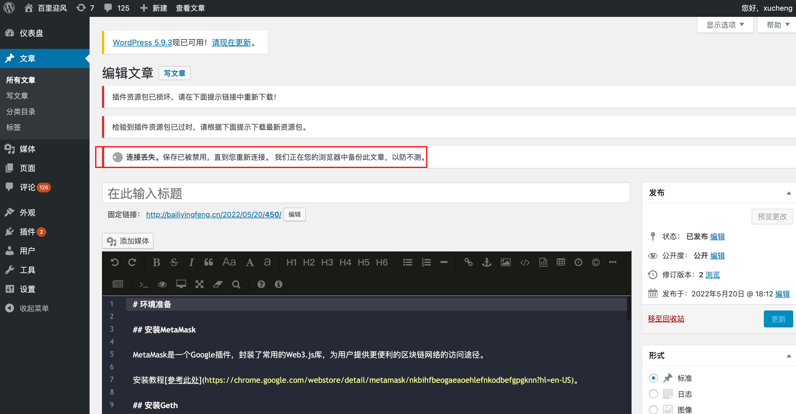

每当文章编辑到一半时，偶尔会弹出这个提示，既无法保存草稿，也无法更新发布。卡住半天，没有任何反应，一旦重新刷新界面所有的变更均已丢失······（😭生无可恋）由于决定长期持续更新部落格（至少一辈子），决定重新搭建一个站点，把所有数据迁移过去。（考虑到这台机器还装着其他玩意儿，所以又整了一台干净的实例），以下文字记录了这一次搭建的过程，首要目的是记录下来，为了后续站点的升级优化做参考，其次是记录过程中踩到的坑以及如何填坑的经验。（有些自己给自己挖坑的操作，太傻X了就不描述了）


# 升级思路

## 一、搭建新站点

首先购买相同配置的一台全新实例。（因为历史原因，以腾讯云为例）

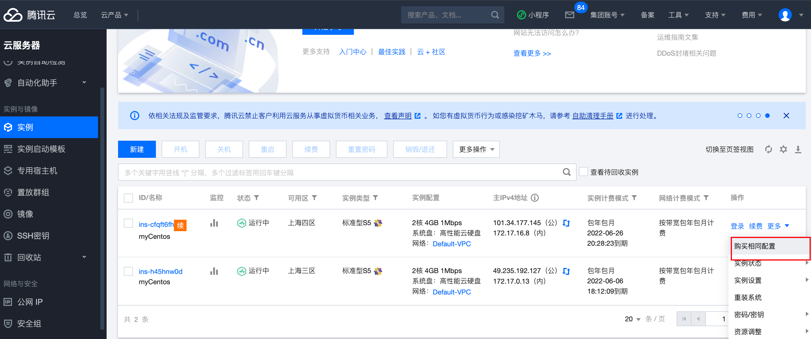

登录实例，参考[这篇文章搭建LNMP环境](https://cloud.tencent.com/document/product/213/38056)，然后参考[这篇文章搭建Wordpress](https://cloud.tencent.com/document/product/213/8044)。不同于参考文档，我安装的是中文最新版wordpress-6.0-zh_CN.tar.gz。

## 二、导出原站点数据

在原站点工具栏中选择导出所有内容。

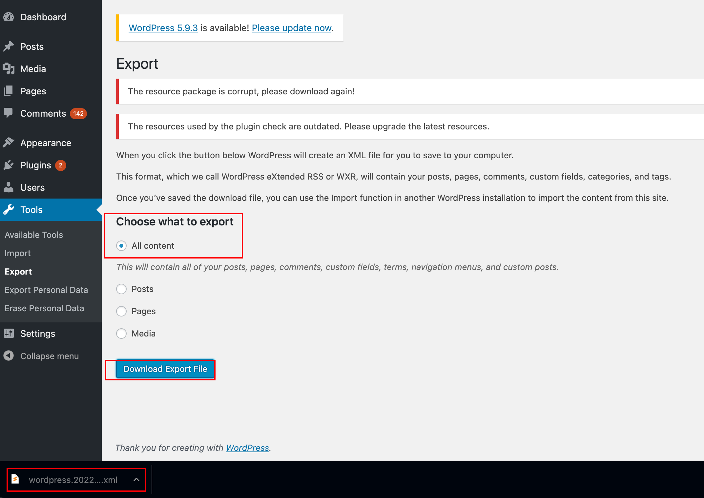

## 三、导入原站点数据

登录新站点，点击安装`WordPress`导入器。

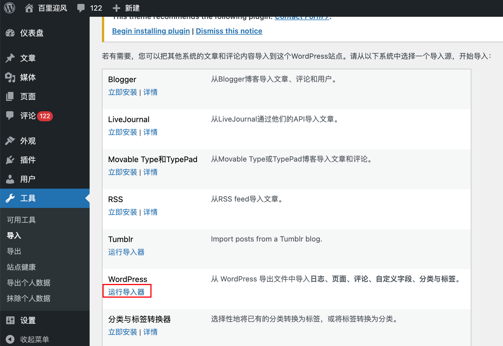

但是会遇到以下问题，需要输入连接信息。

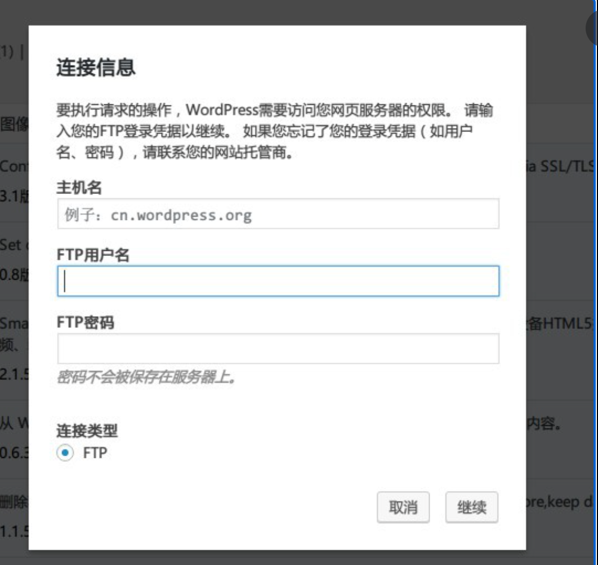

我用以下方式绕过此步骤（也可以用其他方式，请google参考一下）

首先把wordpress的权限设置为777。

```
chmod 777 -R WordPress
```

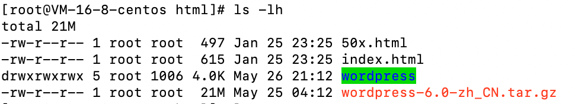

然后，在wp-config.php文件中新增以下信息。

```
define('FS_METHOD','direct');
define('FS_CHMOD_DIR',0777);
define('FS_CHMOD_FILE',0777);
```

最后重启服务

```
systemctl restart php-fpm
```

至此，可以正常地下载插件，完成**WordPress导入器**的下载以后，点击运行。进入页面

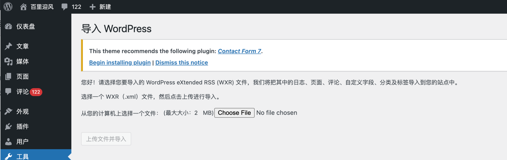

点击`Choose File`选择刚刚导出的文件，然后点击`上传文件并导入`。但是却出现以下报错


Google了一下，首先在`/etc/nginx/nginx.conf`中新增以下配置，把请求体调整为最大20MB。

` client_max_body_size 20m;`

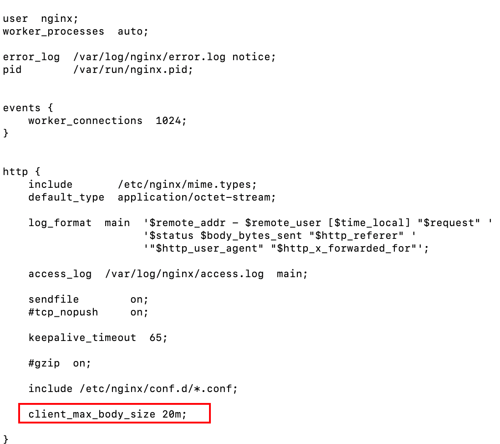


同样，调整文件`/etc/php.ini`配置

```
upload_max_filesize = 20M
post_max_size       = 20M
```

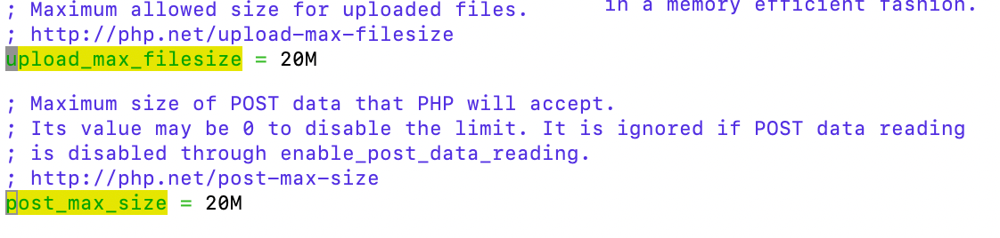

随后重启`nginx`和`php-fpm`

```
systemctl restart nginx
systemctl restart php-fpm
```

但是，再次导入，又遇到以下报错。


进入服务器，编辑`wp-config.php`文件，开启调试模式。

```
define( 'WP_DEBUG', true );
```

再次导入，可以看到以下报错

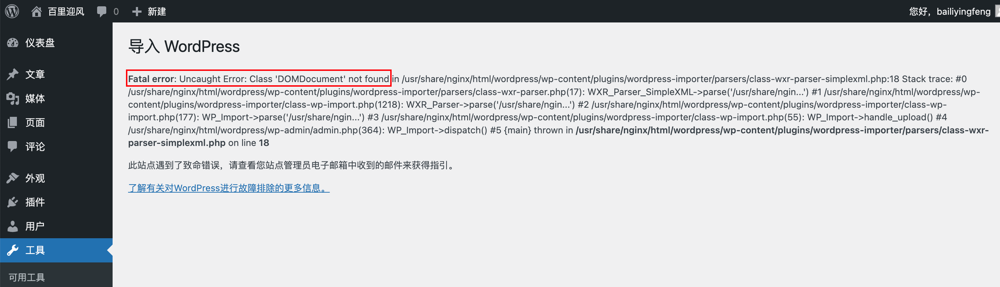

可以看到，缺少`php72w-xml`依赖库，执行以下命令，安装依赖，随后重启服务

```
yum install php72w-xml
systemctl restart php-fpm.service
```

即可成功导入

## 四、细节优化

### 1、拷贝缺失图片

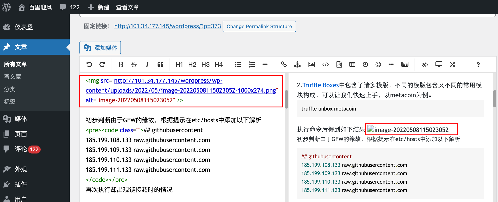

选择将原站服务器上指定目录下的图片拷贝到新服务器上指定目录下，首先在两台服务器上的`~/.ssh/authorized_keys`文件中追加对方主机的公钥（`~/.ssh/id_rsa.pub`，如果没有那么执行ssh-keygen来生成），然后使用以下scp命令进行拷贝，再使用tar命令解压。

```
scp root@172.17.0.13:/root/wordpress/wp-content/uploads.tar root@172.17.16.8:/usr/share/nginx/html/wordpress/wp-content

tar -xf uploads.tar uploads
```

当执行完毕后，部分缺失的图片即可得到展示。

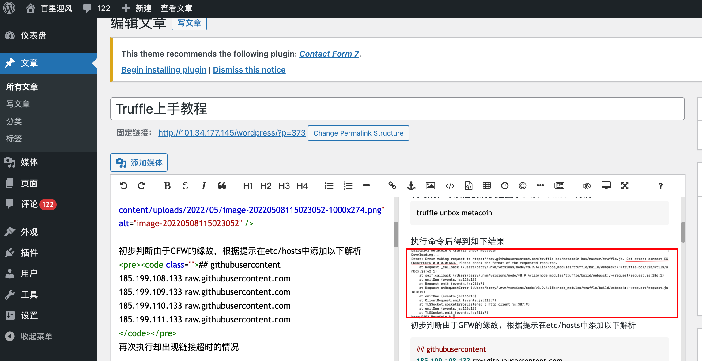

### 2、变更域名

变更域名解析，把域名从原来的IP解析到新IP。在**我的域名**处点击**解析**。

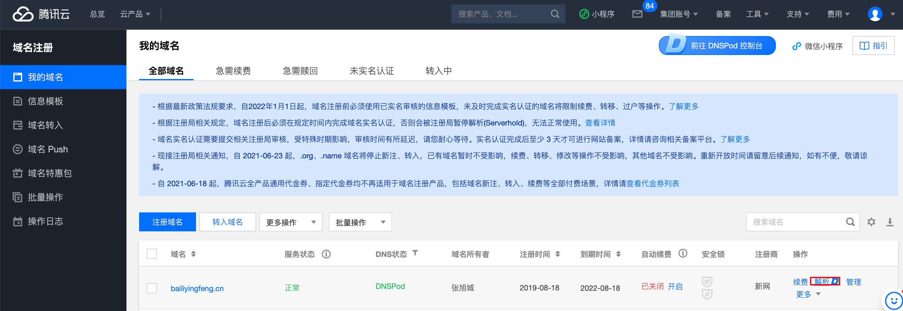

暂停使用原记录，点击**添加记录**，填写**记录值**为`101.34.177.145`

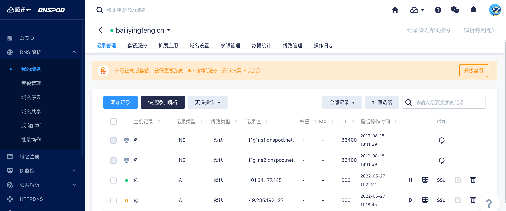

大约30s后域名解析生效。


### 3、配置微信外链

如果要在微信平台访问这个链接，那么需要在wordpress根目录新增以下文件

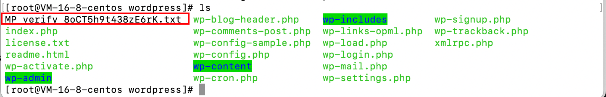

内容如下

```
8oCT5h9t438zE6rK
```

具体内容需要根据微信平台外链管理规范进行设置。


### 4、隐藏URL的IP信息

在页面上点击按钮触发页面跳转时，原来的域名会被解析回IP。


进入控制台，把`WordPress地址（URL）`和`站点地址（URL）`由IP变更为域名即可

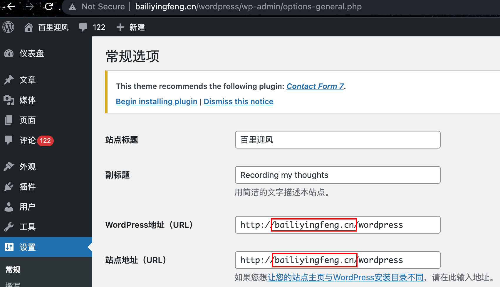


# 总结

本篇文章主要记录WordPress站点的搭建、迁移过程，随后对于迁移过程中遇到的一些意外问题给出了解决的思路。


# 参考资料

https://cloud.tencent.com/document/product/213/8044

https://cloud.tencent.com/document/product/213/38056

https://blog.csdn.net/qq_16095853/article/details/79161228

https://qodeinteractive.com/magazine/413-request-entity-too-large-wordpress-error/#editing-your-wp-config-php-file

https://leezeeyee.com/index.php/2020/04/20/%E8%A7%A3%E5%86%B3%E5%AF%BC%E5%85%A5xml%E5%A4%B1%E8%B4%A5/
https://wordpress.org/support/article/debugging-in-wordpress/

https://blog.csdn.net/fdipzone/article/details/45544497

http://nginx.org/en/docs/beginners_guide.html

https://blog.csdn.net/weixin_43837883/article/details/105361016