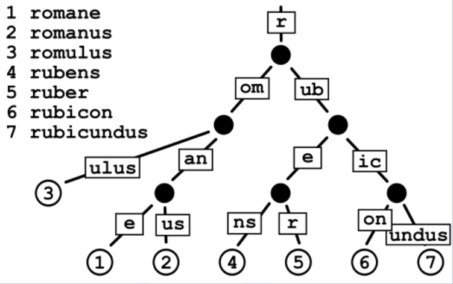
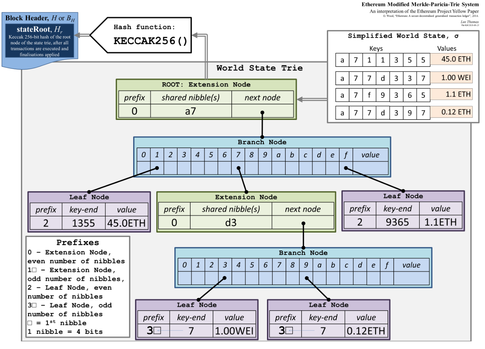

# 什么是MPT?

MPT，即Merkle Patricia Tree，是MerKle Tree和[Patricia Tree](https://en.wikipedia.org/wiki/Radix_tree)的结合体。

## 什么是MT？

MT，即Merkle Tree。关于MerKle Tree，请看[这篇文章](http://bailiyingfeng.cn/2022/05/13/what-are-the-trees-in-ethereum/)。

## 什么是Patricia Tree？

Patricia Tree也称为**路径压缩前缀树**（Prefix Tree）。如下图所示，每个节点代表一串字符，从根节点到叶的路径拼接起来后成为特定字符序列。对于两个拥有相同父节点的节点，其对应的字符序列的前缀也相同。当查询某个单词是否存在时，仅需要根据前缀信息不断向下探索，直到树叶节点即可。

因为采用了共同前缀，所以使用这样的结构保存的数据仅占用很少的内存空间。

## 特殊改动点

下面将以状态树为例来看看以太坊的节点类型：

以太坊MPT除了将上面两种树结合起来使用之外，还引入4种类型的节点，分别是：

- 空节点    （Empty Node），不包含任何信息的节点。
- 叶节点    （Leaf Node），包含账户信息，以太币数量。
- 分支节点（Branch Node），包含17位元素，前16位对应不同的16进制字符，第17位对应一个结束标识符。
- 扩展节点（Extension Node），包含共同前缀、分支节点的哈希值。

图片解释：

图片右上角是以太币账户信息，包含4个账户及相关的以太币。从上到下是整个状态树的结构。

最上面是根节点，它是一个**扩展节点**，包含所有账户共同的前缀`a7`，还包含其子节点的哈希值。

根节点的子节点是一个**分支节点**，它包含17个值。前16个代表不同的十六进制数，最后一个代表终止符。分支节点的1、7、f分别指向三个不同的子节点。

1指向最左边的**叶子节点**，它包含账户后缀1355和账户余额45.0ETH。

f指向最右边的**叶子节点**，它包含账户后缀9365和账户余额1.1ETH。

7指向中间的**分支节点**，其中3指向左边后缀为7的账户，9指向右边后缀为7的账户。

从上往下看，当从根节点遍历到不同的叶节点时，我们会得到不同的账户（PT的特征）。同时，从下往上，每个子节点的哈希值都被保存在其父节点中，直到根节点的哈希值被保存到区块中为止（MT的特征）。

为什么要改造成这样的结构？

- MT是不断地进行哈希运算自底向上构建的，无法提供高效的查询、更新操作。MPT却提供了局部更新的特性，不会因为更新重构大部分树节点。
- MT无法对以太坊账户进行排序，相同的一批账户的不同输入顺序会得到不同的哈希结果，MPT中不同的节点顺序得到的结果是相同的。
- 新区块的交易信息只涉及少量账户，若每次新建区块都创建新的MPT来保存账户状态的话，增加了更多的计算和存储成本，因为状态树的创建会使用到所有的以太坊账户。
- 为了避免地址碰撞，以太坊账户占160位（40个16进制数），以太坊账户作为键值使用的话，出现分布稀疏的现象，所以为了节省空间，提升查询效率，需要把共同前缀合并起来，压缩树的高度。

# 参考资料

[https://en.wikipedia.org/wiki/Radix_tree](https://en.wikipedia.org/wiki/Radix_tree)

[https://en.wikipedia.org/wiki/Finite-state_machine](https://en.wikipedia.org/wiki/Finite-state_machine)

[https://medium.com/@chiqing/merkle-patricia-trie-explained-ae3ac6a7e123](https://medium.com/@chiqing/merkle-patricia-trie-explained-ae3ac6a7e123)

[https://www.youtube.com/watch?v=jZyl-XSbbjI](https://www.youtube.com/watch?v=jZyl-XSbbjI)

[https://ethereum.stackexchange.com/questions/6415/eli5-how-does-a-merkle-patricia-trie-tree-work](https://ethereum.stackexchange.com/questions/6415/eli5-how-does-a-merkle-patricia-trie-tree-work)

