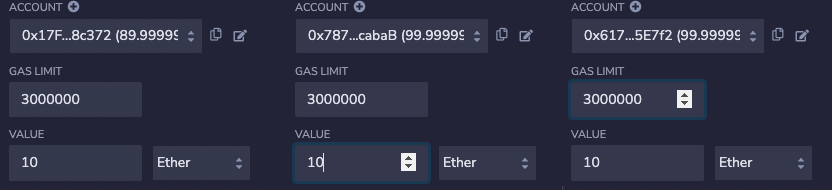

# 举个例子来聊聊如何使用Solidity来编写智能合约？

# 案例

在之前的文章中[Solidity有哪些核心概念？](http://bailiyingfeng.cn/2022/05/06/what-are-the-core-concepts-of-solidity/)简单介绍了一下Solidity的核心概念，现在我们通过一个实例来加深对该语言的认识。

下面以一个简单的银行储蓄业务为例，主要涉及到存款、取款、利息发放、余额查询、权限校验等操作。


## 声明solidity版本

至少要满足的最低版本

```solidity
pragma solidity ^0.6.6;

contract BankContract { }
```


## 定义成员变量、结构体

为每一个不同的账号创建一个client对象，并且把它们保存到数组clients中。使用struct关键字来定义的client_account类型的对象中包含id、地址、账号在合约中的余额信息。

```solidity
pragma solidity ^0.6.6;
contract BankContract {
    struct client_account{
        int client_id;
        address client_address;
        uint client_balance_in_ether;
    }
    client_account[] clients;
}
```

为了在合约中区别不同的账户，需要在每个账户的交易信息触发合约代码的逻辑时，为其分配不同的id进行标识，这里定义了一个int类型的计数器。合约初始化时为0，每当新账户加入，计数器加1。

```solidity
pragma solidity ^0.6.6;
contract BankContract {
    struct client_account{
        int client_id;
        address client_address;
        uint client_balance_in_ether;
    }
    client_account[] clients;
    int clientCounter;
    constructor() public{
        clientCounter = 0;
    }
}
```

此外，需要把某一个地址的账户定义为管理员，来执行发放利息的逻辑，还需要定义一组map映射来保存各个用户对应的最近发放利息的日期。通过该map，我们可以判断是否向此用户发放利息。

```solidity
pragma solidity ^0.6.6;
contract BankContract {
    struct client_account{
        int client_id;
        address client_address;
        uint client_balance_in_ether;
    }
    client_account[] clients;
    int clientCounter;
    address payable manager;
    mapping(address => uint) public interestDate;
    constructor() public{
        clientCounter = 0;
    }
}
```


## 声明函数修饰符

在合约代码中，需要对部分逻辑进行访问控制，只有满足特定条件的账户才能访问，为了实现这样的效果我们需要定义函数修饰符。在下面的代码中，我们定义了两个函数修饰符onlyManager定义了只能由管理员账户才能执行的逻辑，onlyClients定义了只能由普通client账户才能执行的逻辑。

```solidity
pragma solidity ^0.6.6;
contract BankContract {
    struct client_account{
        int client_id;
        address client_address;
        uint client_balance_in_ether;
    }
    client_account[] clients;
    
    int clientCounter;
    address payable manager;
    mapping(address => uint) public interestDate;
    constructor() public{
        clientCounter = 0;
    }
    modifier onlyManager() {
        require(msg.sender == manager, "Only manager can call!");
        _;
    }
    
    modifier onlyClients() {
        bool isClient = false;
        for(uint i=0;i<clients.length;i++){
            if(clients[i].client_address == msg.sender){
                isClient = true;
                break;
            }
        }
        require(isclient, "Only clients can call!");
        _;
    }
}
```


## 声明fallback函数

fallback函数是默认的函数，当触发合约的调用中不包含特定的数据或函数名时，fallback函数被执行。

下面使用receive关键字来定义了fallback函数，用来接收从任何地址发送过来的以太币，并将其作为存款贮备起来。

```solidity
pragma solidity ^0.6.6;
contract BankContract {
    struct client_account{
        int client_id;
        address client_address;
        uint client_balance_in_ether;
    }
    client_account[] clients;
    
    int clientCounter;
    address payable manager;
    mapping(address => uint) public interestDate;
    constructor() public{
        clientCounter = 0;
    }
    modifier onlyManager() {
        require(msg.sender == manager, "Only manager can call!");
        _;
    }
    
    modifier onlyClients() {
        bool isClient = false;
        for(uint i=0;i<clients.length;i++){
            if(clients[i].client_address == msg.sender){
                isClient = true;
                break;
            }
        }
        require(isclient, "Only clients can call!");
        _;
    }
    receive() external payable { }
}
```


## 定义方法

`setManager`方法用来把特定地址的账户设置为管理员。使用关键字payable将地址managerAddress显示地转化并赋予合约中的成员变量manager。

```solidity
function setManager(address managerAddress) public returns(string memory){
     manager = payable(managerAddress);
     return "";
}
```

`joinAsClient`方法用来保存连接的client信息，当某个client触发合约代码时（存款），它的`最后一次利息日`将会被更新为当下，它的账户信息会被添加到`clients`数组中。下图push为数组的添加方法，添加时构造了一个client账户。

```solidity
function joinAsClient() public payable returns(string memory){
     interestDate[msg.sender] = now;
     clients.push(client_account(clientCounter++, msg.sender, address(msg.sender).balance));
     return "";
}
```

`deposit`方法将交易中指定数量的以太币从client账户转移到合约中来，该方法只能由已经连接合约的账户来执行，所以声明时添加了onlyClients修饰符。

```solidity
function deposit() public payable onlyClients{
     payable(address(this)).transfer(msg.value);
}
```

`withdraw`方法与`deposit`方法正好相反，用来将合约中指定数目的以太币转移到client账户中，同样该方法只能由已经连接合约的账户来执行，所以声明时也需要加onlyClients修饰符。

```solidity
function withdraw(uint amount) public payable onlyClients{
     msg.sender.transfer(amount * 1 ether);
}
```

`sendInterest`方法被合约用来向client账户发送以太币利息。这个方法只能由`manager`来执行，所以需要加上onlyManager修饰符。

该方法会先判断client的利息日是否满足时间间隔的限制，若满足则发放以太币，并且更新最后利息日为当下；否则，执行revert，并提示未满足时间间隔。

```solidity
function sendInterest() public payable onlyManager{
     for(uint i=0;i<clients.length;i++){
          address initialAddress = clients[i].client_address;
          uint lastInterestDate = interestDate[initialAddress];
          if(now < lastInterestDate + 10 seconds){
               revert("It's just been less than 10 seconds!");
          }
          payable(initialAddress).transfer(1 ether);
          interestDate[initialAddress] = now;
     }
}
```

`getContractBalance`方法将返回合约当下的余额。

```solidity
function getContractBalance() public view returns(uint){
     return address(this).balance;
}
```


## 完整代码

```solidity
pragma solidity ^0.6.6;

contract BankContract {
    
    struct client_account{
        int client_id;
        address client_address;
        uint client_balance_in_ether;
    }
    
    client_account[] clients;
    
    int clientCounter;
    address payable manager;
    mapping(address => uint) public interestDate;
    
    modifier onlyManager() {
        require(msg.sender == manager, "Only manager can call this!");
        _;
    }
    
    modifier onlyClients() {
        bool isclient = false;
        for(uint i=0;i<clients.length;i++){
            if(clients[i].client_address == msg.sender){
                isclient = true;
                break;
            }
        }
        require(isclient, "Only clients can call this!");
        _;
    }
    
    constructor() public{
        clientCounter = 0;
    }
    
    receive() external payable { }
    
    function setManager(address managerAddress) public returns(string memory){
        manager = payable(managerAddress);
        return "";
    }
   
    function joinAsClient() public payable returns(string memory){
        interestDate[msg.sender] = now;
        clients.push(client_account(clientCounter++, msg.sender, address(msg.sender).balance));
        return "";
    }
    
    function deposit() public payable onlyClients{
        payable(address(this)).transfer(msg.value);
    }
    
    function withdraw(uint amount) public payable onlyClients{
        msg.sender.transfer(amount * 1 ether);
    }
    
    function sendInterest() public payable onlyManager{
        for(uint i=0;i<clients.length;i++){
            address initialAddress = clients[i].client_address;
            uint lastInterestDate = interestDate[initialAddress];
            if(now < lastInterestDate + 10 seconds){
                revert("It's just been less than 10 seconds!");
            }
            payable(initialAddress).transfer(1 ether);
            interestDate[initialAddress] = now;
        }
    }
    
    function getContractBalance() public view returns(uint){
        return address(this).balance;
    }
}
```


# 编译

打开[remix.ethereum.org](http://remix.ethereum.org/)在线IDE，将上述代码拷贝到`BankContract.sol`文件中


点击进入编译标签，选择好指定的编译器版本后点击编译按钮。


# 部署

点击进入部署运行标签，选择部署环境、账户后点击部署按钮。


点击后可看到右下方部署合约的详细情况，可以看到合约的构造函数得到执行，表示合约得到成功部署。


此时点开左侧账户的下拉列表框


可以看到由于使用第一个账户来进行部署，消耗了一些以太币。


# 运行

点击左下角展开已经部署合约的详情，可以看到如下所示


## setManager

首先设置管理员账户，从账户下拉列表中复制第二个账户地址，粘贴到下图右侧文本框，点击左侧按钮发起对`setManager`方法的调用。

```
0xAb8483F64d9C6d1EcF9b849Ae677dD3315835cb2
```


点击按钮后，可以看到执行成功的debug信息如下


由于使用第二个账户0xAb8483F64d9C6d1EcF9b849Ae677dD3315835cb2来发起交易（可以选择任意账户），所以消耗了一些以太币。

## joinAsClient

我们分别选择下拉列表框中的第4、5、6个账户来执行该方法。

```
0x78731D3Ca6b7E34aC0F824c42a7cC18A495cabaB
0x617F2E2fD72FD9D5503197092aC168c91465E7f2
0x17F6AD8Ef982297579C203069C1DbfFE4348c372
```


依次切换到各个账户，然后点击`joinAsClient`按钮执行该方法。

可分别在下拉列表和debug栏看到以下结果，表示`client`成功加入到合约中。


## deposit

接下来分别切换到4、5、6账户，然后在value中填入10，单位选择Ether，把各自的10个以太币储存到合约中。




执行完后4、5、6账户的余额如下


## getContractBalance

接下来检查一下合约账户的余额是否是30个以太币，点击`getContractBalance`按钮。


可以看到返回了以wei单位表示的30个以太币，从debug信息中也可以看到本次执行逻辑没有消耗以太币（没有transaction cost）。因为该方法仅仅执行了查询操作，而没有任何更新状态的语句。


## sendInterest

在检查了合约账户中存在余额之后，可以使用该方法向储蓄了余额的账户发送利息。先切换到设置为manager的第二个账户。

当前三个储蓄账户的余额如下


执行该方法后的余额如下


执行的debug信息如下


可以看到，三个储蓄账户各自都多了一个作为利息的以太币。

但是，如果前后两次方法执行时还没满足指定的时间间隔（当前设置为10秒），那么将会出现以下报错。


倘若，没有manager权限的普通账户执行该方法时，将会出现以下报错。


## withdraw

储蓄账户可以使用该方法从合约中撤回已经储存的以太币，切换到第4个账户（储蓄账户），点击`withdraw`按钮撤回10个以太币。

撤回前账户余额如下


撤回后账户余额如下


debug信息如下


可以看到成功撤回了10个以太币。此时点击`getContractBalance`查看一下合约中的余额


可以看到还剩14个以太币。为什么？

因为成功地执行了两次`sendInterest`方法（第二次，为了展示10s内重新执行的报错场景），所以一共返回了6个以太币，加上账户4撤回了10个以太币，所以仅剩下14个以太币。

倘若其他非储蓄账户执行撤回操作，那么将会出现以下提示


因为withdraw方法被onlyClients修饰，只有储蓄过的client账户才能够撤回资金。


# 总结

本文以一个简单的银行储蓄案例为例子来阐述来如何使用solidity来进行编码，涵盖了其部分基本的核心概念，随后在Remix中编译，部署，运行，并根据实际业务场景来执行相关逻辑。


# 扩展

可以通过以下链接，以游戏互动的方式来进行练习，加深对solidity的理解

https://capturetheether.com/challenges/

https://ethernaut.openzeppelin.com/

https://www.damnvulnerabledefi.xyz/

https://cryptozombies.io/


# 参考资料

https://medium.com/better-programming/overview-of-ethereum-solidity-d7a0ea5fbf00
https://betterprogramming.pub/developing-a-smart-contract-by-using-remix-ide-81ff6f44ba2f
https://www.amazon.com/Solidity-Programming-Essentials-beginners-blockchain/dp/1788831381