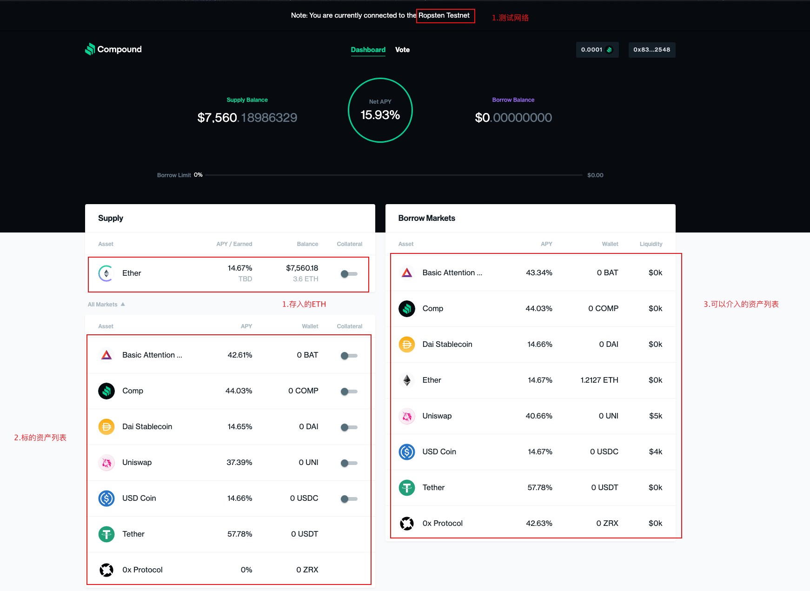
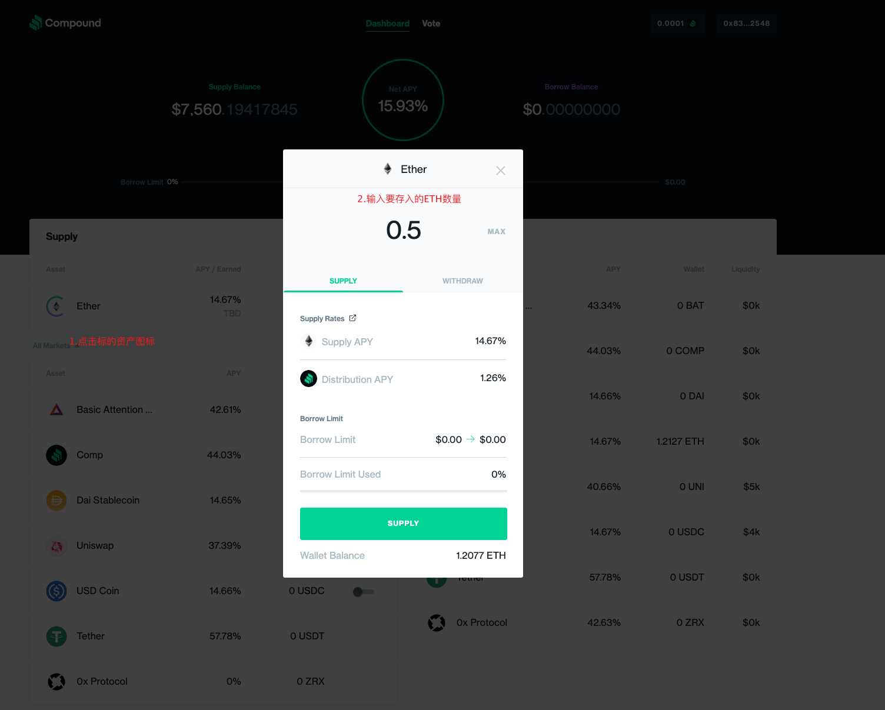
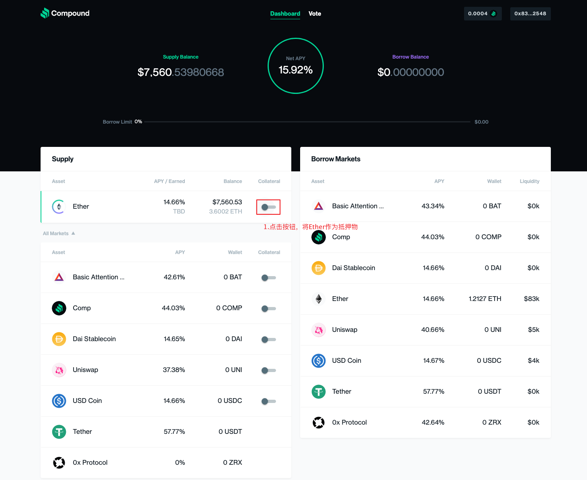
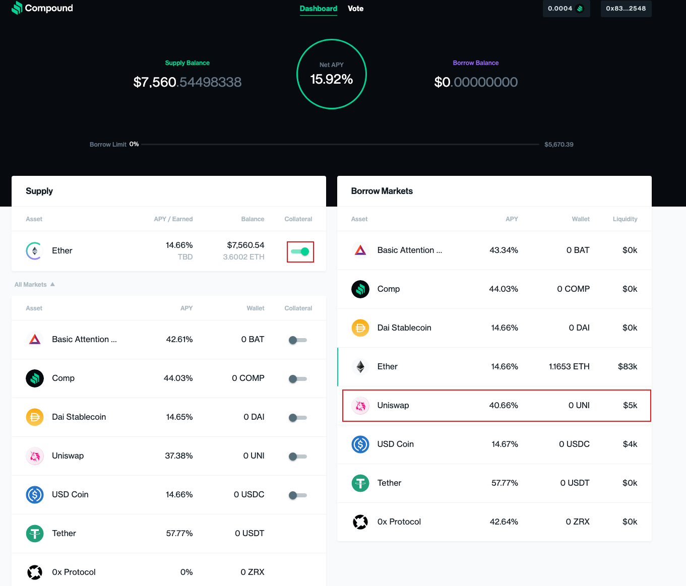
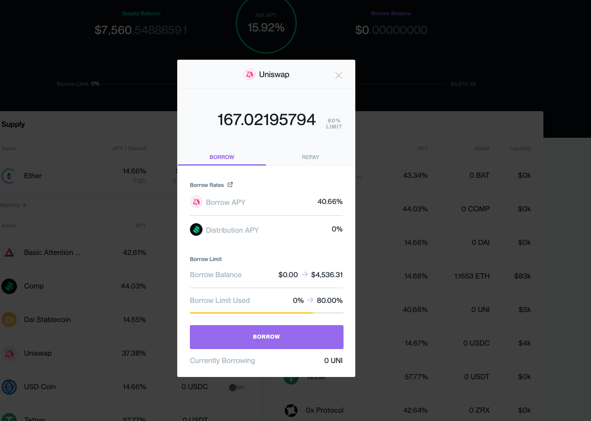
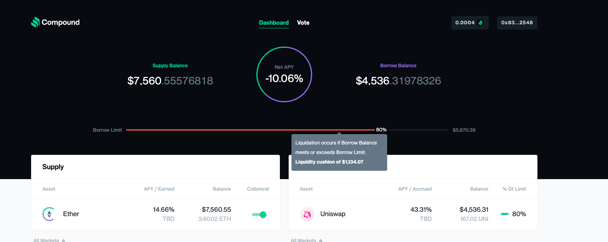

[TOC]

# 什么是Compound？

Compound是以太坊上的一个去中心化协议，它建立了一个通过算法来动态地设置利率的货币市场，利率算法由实时的供需关系来决定。用户既可以存入闲置的资产来赚取利息，又可以将某种资产作为抵押品来借入其他资产。它向所有人开放，任何人都可以向Compound的流动性池中提供资产。更详细的定义可以参看[白皮书](https://compound.finance/documents/Compound.Whitepaper.pdf)。

# 名词解释

| 名称              | 简介                                                         |
| ----------------- | ------------------------------------------------------------ |
| Underlying Token  | 标的资产，例如ETH、USDT、USDC、UNI等等                       |
| cToken            | 生息代币，是用户在Compound上存入资产的凭证。每一种标的资产都有与之对应的cToken。 |
| Exchange Rate     | 汇率，标的资产与cToken的兑换比例。如果cETH的兑换率为0.02，那么1个cETH可以兑换0.02个ETH。汇率是会不断上涨的（为什么？怎么涨？）。所以，cETH的持有时间越长，可以兑换的ETH就越多，这也就是为什么cToken也叫生息代币。汇率的计算公式为： exchangeRate = (totalCash + totalBorrows - totalReserves) / totalSupply |
| Collateral Factor | 抵押因子，介于0到1之间的一个数值，是用户可获得借款的价值与抵押资产的价值之间的比例（即可借额度），一般最高设为0.75。假设用户存入了1个ETH来进行抵押，ETH的价值为1000美元，那么可借额度为`1 * 1000 * 0.75 = 750`美元，即最多可以借出750美元的其他资产 |
| Comptroller       | 审计合约，对核心业务进行校验和审查，例如用户需要保持多少抵押品，用户是否该被清算，是否运行转账、存款、取款、借款、还款等等 |

# 为什么需要Compound?

随着加密货币与数字资产被越来越多的用户认可，整个加密货币市场变得越来越活跃和完善，但是它还存在着一些明显的不足：

- 借款机制极其有限，要到中心化交易所中去进行，这意味着需要KYC，需要缴纳保证金，并且相信交易所不会作恶或被黑客攻击，诸多的中间环节更容易导致不合理的资产定价。
- 基于区块链技术本身的存储成本与风险，没有自然利率来抵消这些损失，这增加了长期持有闲置资产的成本，所以人们更愿意借出资产，获取利息，让资产被更有效地运转起来。

基于这样的背景，诞生了Compound。

# 如何使用Compound?

## 基本操作

进入[首页](https://app.compound.finance/#)

### 存款

在首页我们可以看到下图所示的界面

我们当前所处的网络是Ropsten测试网络。

- 左侧上方是我存入的ETH，一共存入了3.6个ETH。
- 左侧下方是标的资产列表，在该网络下仅有这8种资产可以被存入。
- 右侧是可借资产及其可借额度。

- 点击上图标的资产图标。
- 在弹出的对话框中输入要存入的ETH数量。
- 点击`SUPPLY`按钮存入资产。

### 借款

点击按钮，将Ether作为抵押物。

点击`USE ETH AS COLLATERALx`进行抵押。

可以看到Ether已经抵押成功，接下来点击右侧列表借入`Uniswap`的代币。

我们将所有Ether都抵押出去，借入尽可能多的Uniswap，随后点击`BORROW`按钮。

从上图中，我们看到我介入了价值约4536美金的UNI，其占还有1134美金就达到可借入的最大额度，一旦到了最大额度，将会触发清算逻辑。

（注：由于测试网络功能并不完善，在测试偿还UNI，和撤回抵押物并取回资产时没有效果，所以暂时略过这一部分的截图说明，操作类似。）

# 总结

本篇文章我们简单地了解了什么是Compound？它为什么收到了广泛的使用？它最常见的操作是怎么样的？下篇文章我们将从合约层面来分析一下Compound的具体实现细节。

# 参考资料

[https://compound.finance/documents/Compound.Whitepaper.pdf](https://compound.finance/documents/Compound.Whitepaper.pdf)

[https://www.investopedia.com/terms/t/timevalueofmoney.asp#:~:text=our%20editorial%20policies-,What%20Is%20the%20Time%20Value%20of%20Money%20(TVM)%3F,earnings%20potential%20in%20the%20interim.](https://www.investopedia.com/terms/t/timevalueofmoney.asp#:~:text=our%20editorial%20policies-,What%20Is%20the%20Time%20Value%20of%20Money%20(TVM)%3F,earnings%20potential%20in%20the%20interim.)

https://finematics.com/lending-and-borrowing-in-defi-explained/

https://101blockchains.com/crypto-lending/

https://medium.com/mycrypto/learning-about-supplying-borrowing-with-compound-a2ca4eef7d6c
