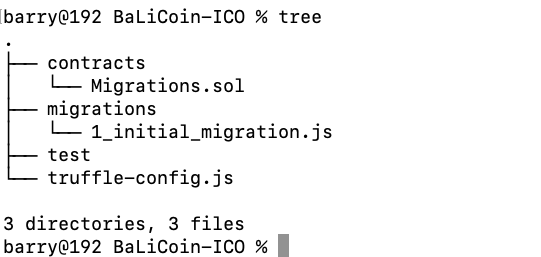
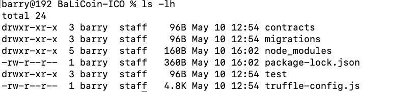
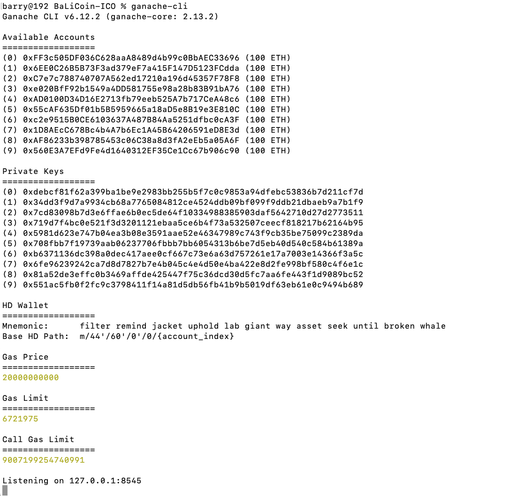
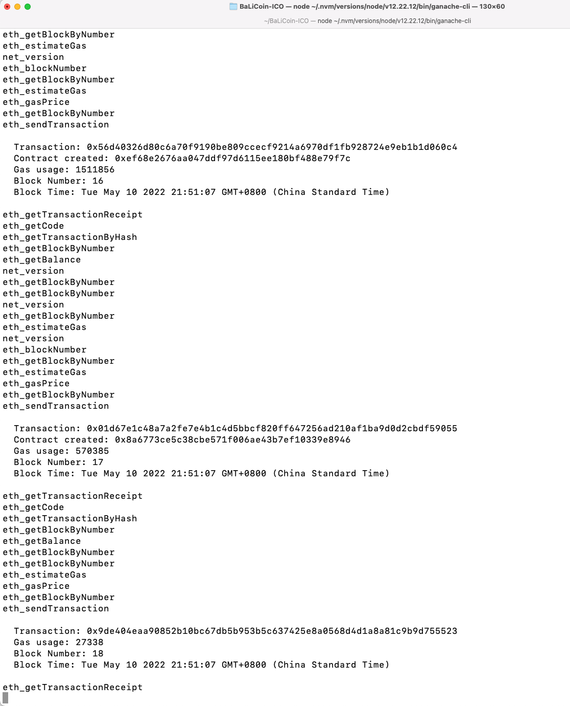
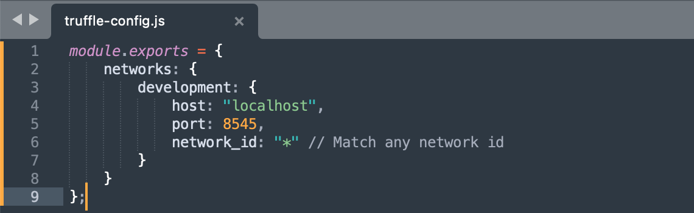
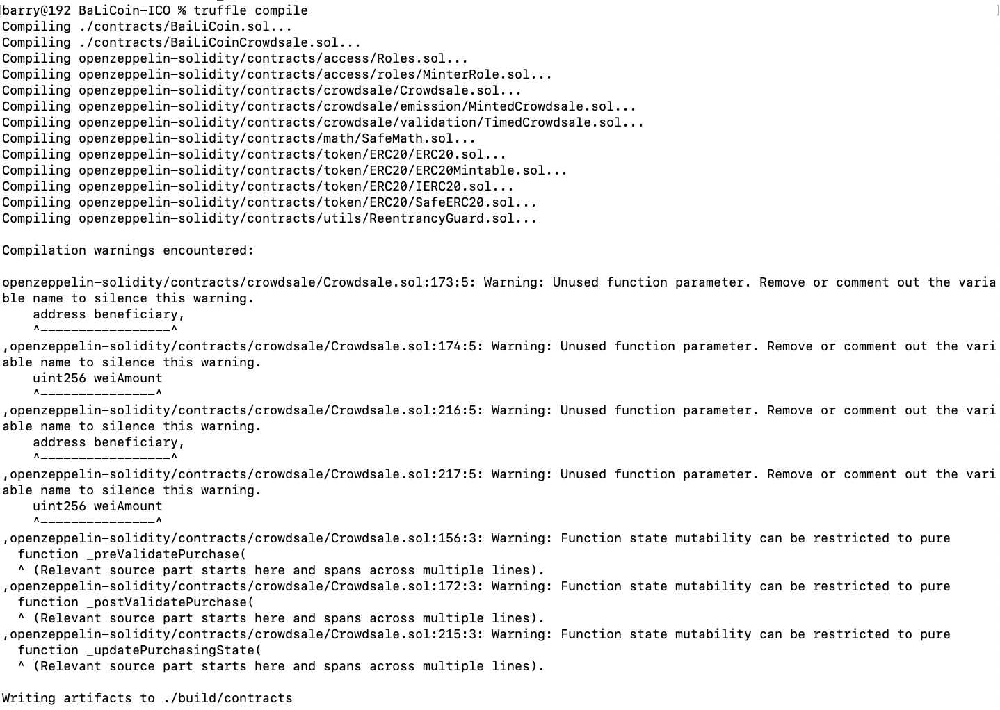
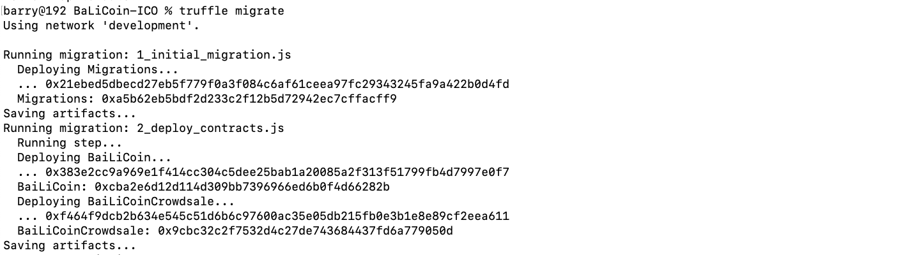

# 什么是OpenZeppelin？

在正式介绍什么是OpenZeppelin之前，需要先了解一些前置知识。

# 什么是token（代币）？和以太币ether有什么区别？


token "这个词来源于古英语 "tācen"，意思是一个标志或符号。它通常指的是由私人发行的、内在价值不高的特殊用途的硬币类物品，如地铁单程代币、洗衣代币和街机游戏代币。
如今，在区块链上管理的 "代币 "正在重新定义这个词，指的是**可以被拥有的、代表资产、货币或访问权的基于区块链的抽象概念**。
"代币 "一词常常会让人联想到它是无足轻重的，因为实物版代币（例如街机游戏代币）的使用受到很大限制。它通常只限于特定的企业、组织或地点，不容易进行交换，通常只有一种功能。有了区块链代币，这些限制被解除了，或者更准确地说，完全可以重新定义。许多区块链代币在全球范围内有多种用途，可以在全球流动市场上相互交易或与其他货币交易。随着对使用和所有权的限制消失，它自身的价值 也不再是微不足道的。

简单对比一下**代币**和**以太**的区别

| 区别     | 代币（token）                                    | 以太币（ether）                  |
| -------- | ------------------------------------------------ | -------------------------------- |
| 层次     | 定义在智能合约层                                 | 定义在以太坊协议层，平台原生操作 |
| 用途     | 数字资产、资源、资产、股权、投票、藏品、身份证明 | 执行交易、兑换代币               |
| 抽象层次 | 高                                               | 低                               |


# 什么是[ERC20协议](https://github.com/ethereum/EIPs/blob/master/EIPS/eip-20.md)？

ERC20（Ethereum Request For Comments 20）是一个可替换的代币（fungible tokens）的标准协议，也就是说实现了这个标准的代币彼此之间是可以互相交换的。之所以如此命名是因为它是Ethereum的Github仓库第20条issue，与EIP-20指的是同一个意思。（EIP：Ethereum Improvement Protocal）。

ERC20定义了一个公共的接口，接口中包含一些方法，每个实现该标准的代币都需要实现该方法（有一些可选方法）。

方法列表如下：

| 方法名称         | 简介                                                         |
| ---------------- | ------------------------------------------------------------ |
| totalSupply      | 返回当前代币的总发行量（以最小单元为单位）                   |
| balanceOf        | 返回给定地址的代币余额                                       |
| transfer         | 给定两个参数：接收方地址、金额，执行方将指定数量的代币转移给接收方 |
| transferFrom     | 给定三个参数：发送方、接收方、金额，将指定数量的代币从发送方转移给接收方。（配合approve使用） |
| approve          | 给定两个参数：接收方地址、金额，授权接受方地址执行转账操作，从发出批准的账户转出，不得超过指定金额 |
| allowance        | 给定两个参数：所有者地址、花费者地址，返回花费者从所有者处提取后花费的剩余金额。 |
| Transfer（事件） | 成功转移（调用transfer或transferFrom）金额（可以为0）后触发的事件。 |
| Approval（事件） | 成功调用approve方法后触发的事件。                            |
| name（可选）     | 返回代币名称（便于人理解的）                                 |
| symbol（可选）   | 返回代币简称（便于人理解的）                                 |
| decimal（可选）  | 返回用于划分代币金额的小数的数量。例如，当小数是2时，那么代币金额就会被除以100来得到其用户表示 |

数据结构如下：

| 结构名称 | 定义                                                         | 简介                                                         |
| -------- | ------------------------------------------------------------ | ------------------------------------------------------------ |
| balances | **mapping**(**address** => **uint256**) balances;            | 映射结构（mapping），key为代币所有者地址，value为余额，被智能合约用来追踪各个账户的代币余额 |
| allowed  | **mapping** (**address** => **mapping** (**address** => **uint256**)) **public** allowed; | 双重映射结构，key为代币所有者地址，value为映射（二层映射），二层映射中的key为代币花费者地址，value为津贴。<br />（注释：这种结构用于委托场景，即，代币所有者将使用代币的权力赋予代币花费者，允许代币花费者从代币所有者的账户中花费具体的津贴） |


# 什么是[ERC721协议](https://github.com/ethereum/EIPs/issues/721)？

前面提到的ERC20只会追踪记录每个账户的最终余额，不会明确地追踪代币的**来源**。

ERC721提出了关于不可伪造的代币（Non-fungible Token）的标准，也被称之为“契约”，反映了“财产所有权”。

简单来说，不可伪造的代币追踪对一个独特事物的所有权。这些事物无论是真实的客观事物（如，房子、车子、艺术品），还是抽象的数字物品（如，数字藏品），只要它能够被唯一地识别（256位的标识符），那么被追踪的事物的性质将没有任何限制。

方法与ERC20的类似

数据结构如下：

| 名称      | 定义                                                         | 简介                                                         |
| --------- | ------------------------------------------------------------ | ------------------------------------------------------------ |
| deedOwner | **mapping** (**uint256** => **address**) **private** deedOwner; | 映射，key为用来标识独一无二的事物的契约id，value为地址，表示谁拥有这个契约。 |


# 什么是[OpenZeppelin](https://docs.openzeppelin.com/contracts/4.x/)?

它是一个由Solidity语言实现的开源的智能合约开发框架，包含了诸多安全且可复用的智能合约代码。该框架主要关注合约的安全性，它的安全性是十分有保障的，因为它使用了行业标准的安全范式与最佳实践，同时借鉴了Zeppelin开发者从审计大量合约中获得的经验。

它目前是最广泛使用的以太坊智能合约解决方案，其中包含了诸多ERC20和ERC71代币实现的合约库、诸多类型的众筹模式、诸多常见的合约行为（例如Ownable、Pausable、Mintable等），并且实现了模块化的设计，易于复用和扩展。

它主要有以下三个特点：

- 实施了ERC20和ERC721等标准
- 灵活的基于角色的权限模式
- 可复用的Solidity组件


# 案例

下面举个例子，来说明如何生成自己的代币，并且开始ICO（Initial Coin Offer）。

## 环境准备

各个库或工具的版本如下所示：

```
- node@10.11.0
- truffle@v4.1.14
- ganache-cli@v6.1.8
- openzeppelin-solidity@2.0.0
```


```sh
mkdir BaLiCoin-ICO && cd BaLiCoin-ICO
truffle init
```

项目的初始结构如下图所示：



执行

```
npm install openzeppelin-solidity@2.0.0
```

将`openzeppelin-solidity`安装到该目录下，此时项目结构如下所示



`node_modules`中包含了依赖的`openzeppelin-solidity`。


## 编写合约

### 代币合约

在contracts目录下创建以下内容的合约文件BaiLiCoin.sol

```
touch contracts/BaiLiCoin.sol
```

```solidity
pragma solidity 0.4.24;

import 'openzeppelin-solidity/contracts/token/ERC20/ERC20Mintable.sol';

contract BaiLiCoin is ERC20Mintable {
    string public name = "BaiLi COIN";
    string public symbol = "BLC";
    uint8 public decimals = 2;
}
```

### 众筹合约

随后在contracts目录下创建以下内容的合约文件`BaiLiCoinCrowdsale.sol`

```
touch contracts/BaiLiCoinCrowdsale.sol
```

```solidity
pragma solidity 0.4.24;

import './BaiLiCoin.sol';
import 'openzeppelin-solidity/contracts/crowdsale/emission/MintedCrowdsale.sol';
import 'openzeppelin-solidity/contracts/crowdsale/validation/TimedCrowdsale.sol';


contract BaiLiCoinCrowdsale is TimedCrowdsale, MintedCrowdsale {
    constructor
        (
            uint256 _openingTime,
            uint256 _closingTime,
            uint256 _rate,
            address _wallet,
            ERC20Mintable _token
        )
        public
        Crowdsale(_rate, _wallet, _token)
        TimedCrowdsale(_openingTime, _closingTime) {

        }
}
```


## 部署合约

安装ganache-cli，随后新开一个terminal运行

```
npm install -g ganache-cli
ganache-cli
```





修改`truffle-config.js`文件内容，将truffle与ganache-cli整合起来



新建文件`migrations/2_deploy_contracts.js`，内容如下

```javascript
const BaiLiCoinCrowdsale = artifacts.require('./BaiLiCoinCrowdsale.sol');
const BaiLiCoin = artifacts.require('./BaiLiCoin.sol');

module.exports = function(deployer, network, accounts) {
    const openingTime = web3.eth.getBlock('latest').timestamp + 2; // two secs in the future
    const closingTime = openingTime + 86400 * 20; // 20 days
    const rate = new web3.BigNumber(1000);
    const wallet = accounts[1];

    return deployer
        .then(() => {
            return deployer.deploy(BaiLiCoin);
        })
        .then(() => {
            return deployer.deploy(
                BaiLiCoinCrowdsale,
                openingTime,
                closingTime,
                rate,
                wallet,
                BaiLiCoin.address
            );
        });
};
```

执行编译命令

```
truffle compile
```



虽然存在一些warnning，但是并不影响！

执行部署命令

```
truffle migrate
```



部署成功


## 执行合约——购买代币

首先进入truffle控制台，开启交互模式，执行以下命令

```
truffle console
```

接下来我们依次执行以下命令，来购买一些代币。

1.将ganache-cli启动时生成的第三个账户用来购买BaiLiCoin。

```shell
truffle(development)> purchaser = web3.eth.accounts[2]
'0xbb6acb2a34521b13287c066da9c3597e8d07c341'
```


2.将BaiLiCoinCrowdsale.deployed()的结果分配给变量crowdsale，最终作为tokenAddress赋予BaiLiCoin的实例

```
truffle(development)> BaiLiCoinCrowdsale.deployed().then(inst => { crowdsale = inst })
undefined
truffle(development)> crowdsale.token().then(addr => { tokenAddress = addr } )
undefined
truffle(development)> tokenAddress
'0xcba2e6d12d114d309bb7396966ed6b0f4d66282b'
truffle(development)> BaiLiCoinInstance = BaiLiCoin.at(tokenAddress)
```

输出信息很多······，省略


3.添加矿工角色，可在众筹期间持续铸造代币。

```
truffle(development)> BaiLiCoinInstance.addMinter(crowdsale.address)
{ tx:
   '0xa636ccfb9742b7991938fcfe64d3ebcb77f72892a491f28d992f0b3882552dcf',
  receipt:
   { transactionHash:
      '0xa636ccfb9742b7991938fcfe64d3ebcb77f72892a491f28d992f0b3882552dcf',
     transactionIndex: 0,
     blockHash:
      '0x1b82d68fb09d58d1c2bc55ba5681382b44fed0581d7b2548af9701b12e112365',
     blockNumber: 4,
     from: '0x2b1866e23c35e037de68fb60bcb9e4bec9fd6807',
     to: '0xcba2e6d12d114d309bb7396966ed6b0f4d66282b',
     gasUsed: 46227,
     cumulativeGasUsed: 46227,
     contractAddress: null,
     logs: [ [Object] ],
     status: '0x1',
     logsBloom:
      '0x00800000000000000000000000000000000000000000000000000000000000000000000000000000000000000000000000000000000000000000400000000000000000000000000000000000000000000000000000040000000000000000040000000010000000000000000000000000000000008000000000000000000000000000000000000000000000000000000000000000000000000000000000000000001000000000000000000000000000000000000000000000000000000000000000000000000000000000000000000000000000000000000000000000000000400000000000000000000000000000000000000000000000000200000000000000' },
  logs:
   [ { logIndex: 0,
       transactionIndex: 0,
       transactionHash:
        '0xa636ccfb9742b7991938fcfe64d3ebcb77f72892a491f28d992f0b3882552dcf',
       blockHash:
        '0x1b82d68fb09d58d1c2bc55ba5681382b44fed0581d7b2548af9701b12e112365',
       blockNumber: 4,
       address: '0xcba2e6d12d114d309bb7396966ed6b0f4d66282b',
       type: 'mined',
       removed: false,
       event: 'MinterAdded',
       args: [Object] } ] }
```


4.购买代币前查询purchaser账户持有的代币余额，结构返回0，表示暂未持有任何代币

```
truffle(development)> BaiLiCoinInstance.balanceOf(purchaser).then(balance => balance.toString(10))
'0'
```


5.购买BaiLiCoin代币

```
truffle(development)> BaiLiCoinCrowdsale.deployed().then(inst => inst.sendTransaction({ from: purchaser, value: web3.toWei(5, "ether")}))
{ tx:
   '0x17ec3ae914dd84f63ab357c4d6b58b2741824ad55f84e1314bb6a4261a6120ba',
  receipt:
   { transactionHash:
      '0x17ec3ae914dd84f63ab357c4d6b58b2741824ad55f84e1314bb6a4261a6120ba',
     transactionIndex: 0,
     blockHash:
      '0x0efc5da22ab388190a543d19a0559c157720cd43d841c0533f027d629fb56c40',
     blockNumber: 5,
     from: '0xbb6acb2a34521b13287c066da9c3597e8d07c341',
     to: '0x9cbc32c2f7532d4c27de743684437fd6a779050d',
     gasUsed: 111016,
     cumulativeGasUsed: 111016,
     contractAddress: null,
     logs: [ [Object], [Object] ],
     status: '0x1',
     logsBloom:
      '0x00000000000000000000000000000000000000000000000000000000000000000000000000000000000000000000000040000000000000000000400000000100000000000000000000000008000000000000000000000000080000000000000000000010020040000000000000000800000000000000000000000010000000800000000000000000000000008000000000002000000000000000000000000000000000000000000000000000000000000000000000000000010000000000000000000002000000000000000000000000000000000000000000000000000020000000000000000000000000000000000000000000000000000200800000000000' },
  logs:
   [ { logIndex: 1,
       transactionIndex: 0,
       transactionHash:
        '0x17ec3ae914dd84f63ab357c4d6b58b2741824ad55f84e1314bb6a4261a6120ba',
       blockHash:
        '0x0efc5da22ab388190a543d19a0559c157720cd43d841c0533f027d629fb56c40',
       blockNumber: 5,
       address: '0x9cbc32c2f7532d4c27de743684437fd6a779050d',
       type: 'mined',
       removed: false,
       event: 'TokensPurchased',
       args: [Object] } ] }
```


6.查询purchaser账户的余额，可以看到存在5000个

```
truffle(development)> BaiLiCoinInstance.balanceOf(purchaser).then(balance => purchaserBLCTokenBalance = balance.toString(10))
'5000000000000000000000'
truffle(development)> web3.fromWei(purchaserBLCTokenBalance, "ether")
'5000'

```


# 总结

本文，先简单介绍了以下，代币在传统和区块链世界中的不同意义，随后介绍了两种最广泛使用的代币协议ERC20和ERC721。最后介绍了什么是OpenZeppelin，并通过一个例子，发行了一种新的代币BaiLiCoin，随后购买了一部分代币。


# 参考链接

https://www.quora.com/What-is-the-difference-between-a-Coin-Ether-a-Token-and-a-Smart-Contract-on-Ethereum

https://medium.com/@ethdapp/build-smart-contracts-with-openzeppelin-and-truffle-67b2851d3b07

https://medium.com/zeppelin-blog/how-to-create-token-and-initial-coin-offering-contracts-using-truffle-openzeppelin-1b7a5dae99b6

https://forum.openzeppelin.com/t/how-to-specify-the-version-of-imported-openzeppelin-contracts/4842/2

https://github.com/ChainSafe/web3.js/issues/2117


