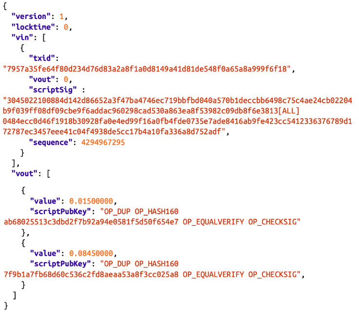
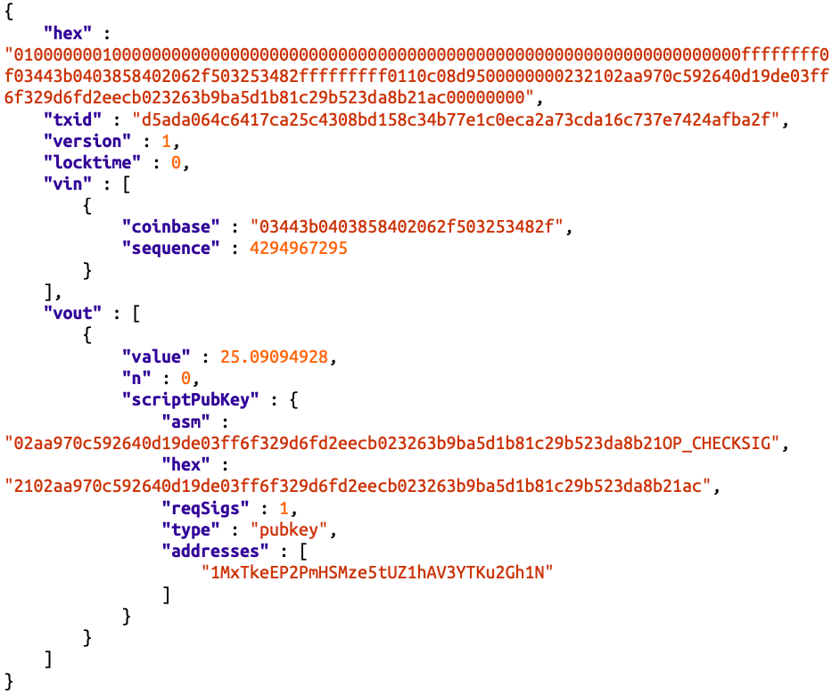
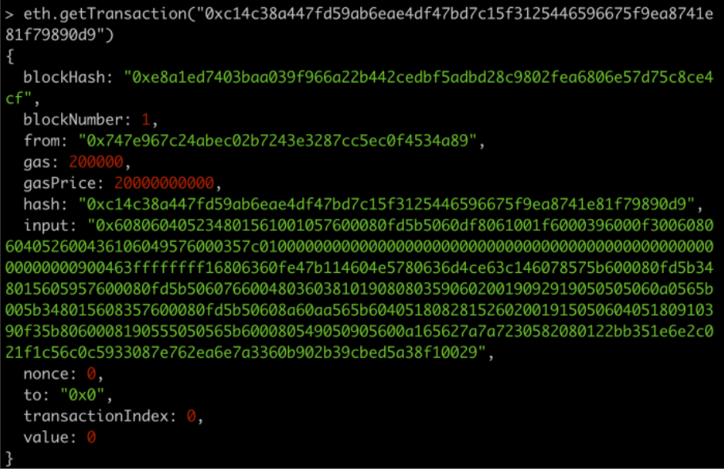

# 什么是区块链？

区块链英文名称叫blockchain，顾名思义，它就是由一个个区块连接起来形成的一条链。（分布式账簿）

# 什么是区块？

所谓区块（block），在计算机领域，指的就是信息块：

> block：a large piece of text processed as a unit
>

## 区块的结构

包含区块头和一批交易信息（区块体）

### 区块头

主要包含区块的元信息，例如，它的上一个区块、困难度、时间戳、随机数、merkle树根等，总计80个byte。

### 区块体

包含了交易（transaction）信息平均每条交易信息至少250个byte，可保存超过500条记录，所以区块体所占空间至少是区块头的1000倍。

### 区块标识

方式一、每一个区块主要由一个**hash值**来唯一标识。该值是由区块头通过两次sha256运算得到，它不作为区块数据结构的一部分在网络中传输，而是通过计算得到。

方式二、还可以通过区块**高度**来标识，（在区块链上）某一个区块对应到唯一个固定不变的高度。但是反过来，一个高度有可能对应多个区块，这在区块竞争时出现（两个矿工几乎同时破解谜题，打包区块，并广播到网络中，出现不同节点接受到不同区块的情况）

### 区块是怎么得到的？

简单来说区块是由矿工（miner）创造的，怎么得到的？······

# 什么是交易（transaction）？

## 简介

在bitcoin平台上交易记录了比特币价值的转移。

在以太坊平台上，交易主要被外部用户用来与以太坊网络进行交互，达到更新以太坊网络状态的目的。

## 结构

### 在bitcoin中，交易的结构是什么样的？

每条交易信息主要包含：输入、输出。

输入：引用上一条交易信息的输出（UTXO）

输出：转移给目标用户的具体的价值

数据结构：

字段描述：

vin是输入，其中txid值是交易id，指向链上某一条与该用户相关的交易。

vout是下标，指向交易的输出，下标以0开始。

scriptSig是unlockscript，用来解锁被指向的UTXO(unspent transaction output)，其值主要是数字签名等与用户持有的私钥可进行匹配的相关信息。

nSequence，原打算用来记录交易池mempool中可修改的交易状态，例如，该值小于232时表明该交易还没有达到最终不可修改的状态，可以不断更新，直到等于232，但是并没有这么使用。实际上，这个值通常都被设置成232，表示没有使用timelock。一旦小于232(通常设置为232-1，0xFFFFFFFE)，则表示使用了timelock。（什么是timelock?）

vout是输出。

value的值是比特币数量，单位是聪（1BTC=10^9聪)。

scriptPubKey是lockscript，它主要用来锁住本身，通常包含公钥的相关信息，只能由持有相关私钥的用户才能够解锁。

另外还存在一种特殊的交易，coinbase transaction，它是每一个块中的第一条交易记录，它包含特殊的input，这种input不会指向任何UTXO，所以它不会花费，它的output包含的比特币是第一个成功打包该区块的miner的奖励。

### 在以太坊中，交易的结构是什么样的？

From，交易发起者的地址，20个字节。

To，交易接收者的地址，20个字节，可为空值、EOA地址、合约地址。

Nonce，动态地进行计算的一个数，用来记录从同一个地址发出的已经确认的消息数量，标识交易的唯一性以避免重复交易，定义交易的优先级。

Gas price，消息发送人愿意支付的油价，单位是wei。

Gas limit，消息发送者针对这条交易消息的处理所愿意购买的油量。

Recipient，消息接收者的地址。

Value，从发送者传给接收者以太币数量（1 ether = 10^18 weis)。

Data/Input，主要用于合约，若是新部署合约，该值为合约的字节码；若是执行已经部署过的合约，那么该值为函数签名与函数参数。

v,r,s，发送者的椭圆曲线算法签名的三个成份，可以用来生成from地址。

## 类型

### 比特币

仅存在一种类型的交易，就是账户之间bitcoin价值的流动。

### 以太坊

三种不同类型的交易

- EOA账户之间ether的流动转移
- 发布合约到以太坊网络
- 执行以太坊网络中某一个合约的方法

# 什么是区块链的节点？

以比特币网络为例，它是一个基于互联网之上的点对点的网络。

其中，每一个点指的就是运行着相应客户端软件的计算机。客户端软件有很多，例如C++版本的Bitcoin Core、Java版本的bitcoinj、Go版本的btcd等。

客户端软件主要包含：路由、保存区块数据库、挖矿、钱包服务这四项功能。

开启了这四种功能的节点被称为fullnode。

开启了路由、数据库功能的节点被成为Full Block Chain Node。

开启了路由、数据库、挖空功能的节点被称为miner矿工。

开启了路由、钱包功能的节点被称为SPV。

# 有什么核心特点？

不可篡改，为什么？

# 为什么需要区块链？

目的与手段

# 总结

区块链技术本质上就是一种不可篡改的分布式数据库技术！（为什么不可篡改？）

参考：

​	https://bityl.co/BxY4

​	https://kctheservant.medium.com/transactions-in-ethereum-e85a73068f74

​	https://amz.run/5Xal

​	https://amz.run/5Xam

