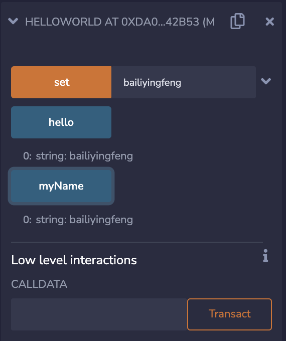

# 什么是智能合约？

# 由来

在传统意义上，合约（contract）是一项合法且可执行的多方协议，它定义且管理着参与方的权利和义务。通常涉及到商品、服务、货币之间的交易。

智能合约（smart contract），这个词最早由密码学家Nick Szabo于20世纪90年代提出，用来表示“一组以数字形式指定的承诺，包括各方履行这些承诺的协议”。此后这个概念逐渐演化，简单来看，在以太坊平台中，智能合约指的是一旦部署就不可再更改的计算机程序。


# 定义

从代码角度来看，智能合约是在以太坊虚拟机（EVM）中部署和执行的自定义逻辑的代码，定义了不同的账户之间的交易规则，提高数字资产交易的效率，可以由专门的编程语言Solidity来编写。它还可以保存数据，这些数据可以用来记录信息、资产以及与传统合约类似的信息。在编码时，它类似于面向对象中类的概念，可以创建实例、调用其他智能合约，并在内部定义一系列变量和函数，具有与其他编程语言类似的语法结构和特性。


# 示例

进入在线IDE，使用Solidity语言进行开发。Solidity是一门专门用来写以太坊合约的高级语言，类似于Java。它在编译后生成字节码文件，由以太坊节点上的EVM负责执行。

## 创建

新建文件HelloWorld.sol，具体内容如下所示

```solidity
pragma solidity >=0.7.0 <0.9.0;

//使用contract关键字来定义合约，contract关键字类似于Java中的Class关键字
contract HelloWorld
{
    //定义了string类型的成员变量myName，public表示该成员变是公开可见的
    string public myName;
    //constructor关键字定义了该合约的构造函数
    constructor() public 
    {
        myName = "World";
    }
    //function关键字定义函数，入参是string类型，memory关键字表示该变量被临时存储到内存，一旦代码结束运行该内存空间将被回收释放
    function set(string memory name) public
    {
        myName = name;
    }
    //view关键字表示该函数不会更新变量状态，returns关键子表示函数会存在返回值
    function hello() view public returns (string memory) 
    {
        return myName;
    }
    
}
```

1.点击左侧工作空间目录，新建文件HelloWorld.sol。

2.将上面代码拷贝到文件中。（删除注释信息）。

3.点击左侧导航栏标签进入编译页面。


## 编译

4.点击蓝色按钮Compile HelloWorld.sol编译源码。

5.点击左侧导航栏，切换到部署页面。


## 部署

6.点击黄色Deploy按钮进行部署，观察右下方部署详情，出现绿色勾号表示部署成功。

7.在‘’Deployed Contracts“下点开已经部署好的合约，查看详情。


## 执行

可以看到，左下角有三个按钮，其中黄色按钮代表执行写操作的方法，蓝色按钮代表执行读操作的方法。

set、hello分别对应代码中的方法，myName对应合约中编译器默认创建的getter方法。

先点击hello按钮，其返回值为“World”。表示构造函数执行成功，把字符串“World”成功地赋值给myName。


再点击myName也是如此，


接下来，在点击set前，先为其右侧文本框赋值“bailiyingfeng”，再依次点击hello和myName按钮，得到下图所示结果



可以看到set函数执行成功，把文本框中的字符串成功地赋值给了myName成员变量。

以上，我们看到了一个智能合约的编写、编译、部署、执行过程。


# 特点

1. 智能合约虽然与EOA(Externally Owned Account，外部用户账号)一样拥有一个地址，但是它没有对应的私钥。
2. 对于外界一视同仁，哪怕是合约创造者也没有特权。
3. 虽然合约之间可以互相调用，但是究其本源，只能由交易来触发。
4. 不会陷入无限循环，因为gas是有限的。
5. 多个智能合约不能并发执行，因为运行智能合约的以太坊平台只是一台单线程计算机。
6. 原子性，由一条交易触发的智能合约要么执行成功，要么全部回滚，不会存在执行一半停住的中间状态。
7. 不变性，智能合约一旦被部署到以太坊平台就不可再变更。
8. 智能合约可以被删除，但前提是智能合约代码中包含SELFDESTRUCT方法。


# 参考链接

https://en.wikipedia.org/wiki/Contract

https://en.wikipedia.org/wiki/Smart_contract

https://medium.com/@rvk_rishikesh/getting-started-with-solidity-using-remix-ide-7da204336515

https://www.amazon.com/Mastering-Bitcoin-Programming-Open-Blockchain/dp/1491954388

https://www.amazon.com/Solidity-Programming-Essentials-beginners-blockchain/dp/1788831381