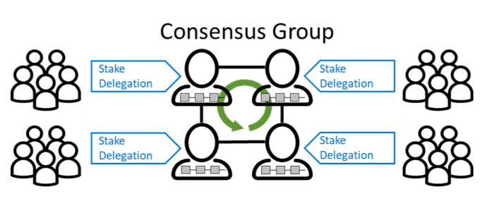
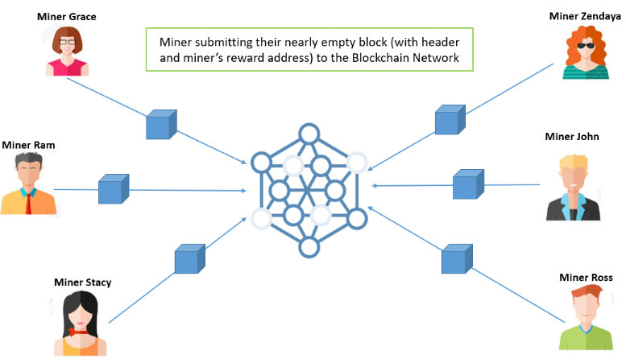

# 区块链中有哪些常见的共识算法？

# 什么是共识？

在计算机领域，“达成共识”指的是一个分布式系统中的多个不同节点在“协商”一致后确定共同状态的过程。在传统的分布式系统中总会有一个确定的中心来向其他节点发送同步消息，进而达成共识。然而，在区块链系统中，没有一个确定的中心来向其他节点发送同步消息，而是使用了一些全新的共识机制。

# 区块链中常见的共识算法

### PoW

Proof-of-Work，工作量证明机制是一种共识机制。它主要由矿工节点负责实现，所有的矿工节点之间存在互相竞争。它们需要抢先把自己整理的候选区块打包成可被全网认可的区块，它们中谁最先解决谜题（找到满足目标的哈希值）并广播出来，谁就成为一次整个网络的中心，并获得相应的比特币作为奖励。其他节点在接收到正常区块，并检查合格后会连接到当前区块链的末尾，并且马上创建新的候选区块，进入下一轮的竞争。

#### 特点

- 因为需要CPU重复地进行大量的哈希运算，耗电量大，能量转化效率低。
- 接入门槛高，需要配置了ASCI卡的矿机才能有机会挖矿成功
- 由于算力过于集中到矿池当中，出现算力中心化的趋势和危机

### PoS

Proof-of-Stake，权益证明机制也是一种共识机制。它需要用户以自己的货币（在以太坊中用以太币）作为抵押来获得成为验证者（validator）的机会。验证者的职责与PoW机制中的矿工类似，负责收集整理交易信息，然后打包成新的区块。

具体来看，以太坊上，任何用户只要抵押至少32个以太币就可以成为验证者，验证者们会根据抵押的以太币个数与总量的占比，进而得到获得打包区块的概率。抵押越多，能够成功打包的概率越大，最终可以获得的奖励也成比例的越多。被随机选中的验证者负责创建区块并发送到网络中，于此同时其他验证者负责检查得到的区块，一旦检查通过，便立即连接到区块链上，同时获得一定的奖励；但倘若检查不通过或者伪造检查结果，不诚实的验证者抵押的以太币就会被没收。

所以，不管是负责打包的验证者还是进负责检查的验证者，一旦出现欺骗行为，那么不仅无法获得奖励，还会失去抵押的以太币。

#### 特点

- 更高的能量转化效率
- 更低的准入门槛，不需要专门的硬件
- 更高程度的去中心化，可以接入更多的节点，避免像POW一样出现算力集中的矿池
- 更快的确认速度，因为不需要重复地进行哈希运算

但是，这种方法也存在缺点，那就是打包的机会会向更富有的用户倾斜。为了提供更公平的方式，引入了DPos。

### DPoS

这一概念的迭代被称为委托权益证明（DPoS），其工作原理与PoS类似，只是多了投票和委托机制，让生产区块的过程更加“民主”。

网络中的不同节点会根据自己的意愿来选择各自的代表（delegate），在这些节点中（大多数协议选中20至100个）选择其中一个来创建区块，剩余的负责校验区块。普通节点将自己的代币抵押到某个币池中，这个币池与某个代表关联，整个过程相当于投票。币池中代币越多，被选中作为创建区块的节点的概率越大。一旦某个代表被选中，那么生成区块获得的奖励及交易费用会根据币池中的代币占比发放给各个节点。这种方式允许更多的节点参与到区块链的建设中来，通过彼此合作来取得收益，而不是由某个单独的节点掌控。

#### 特点

- 更快的打包及确认速度，因为代表数量较少，整个网络取得共识的速度更快
- 更少的电力消耗
- 去中心化程度相对较低，因为代表数量有限

### PoA

PoA（Proof of Activity）是PoW和PoS的结合体，首先使用PoW机制，矿工节点为一个不包含交易信息的候选区块（仅包含区块头和奖励地址信息）进行工作量证明计算，直到打包成功，随机将该区块发送给验证者，然后切换到PoS机制，在诸多网络节点中选出一批验证者节点（与矿工节点不同）。这些验证者抵押的代币越多，它们被选中来验证区块的概率越大，验证者们接受区块后进行验证，当验证通过的验证者大于设定值时，该区块被表示为合法，交易信息也被从交易池中添加到区块中，随后将该区块发送到整个网络。

#### 特点

- 结合了PoW和PoS各自的特点，即维持了PoW中重复的哈希计算，来保护整个网络，又使用股权证明方式降低用户参与门槛
- 挖矿过程中的能量损耗偏高，并且时长偏长
- 需要专门的设备成本

consensus mechanism

# 参考资料

https://www.gemini.com/cryptopedia/proof-of-stake-delegated-pos-dpos#section-history-of-po-s

https://ieeexplore.ieee.org/stamp/stamp.jsp?tp=&arnumber=9444429

https://onlinelibrary.wiley.com/doi/abs/10.1002/itl2.100

https://www.naukri.com/learning/articles/proof-of-activity-in-blockchain/

https://www.naukri.com/learning/articles/delegated-proof-of-stake-dpos

https://ethereum.stackexchange.com/questions/268/ethereum-block-architecture