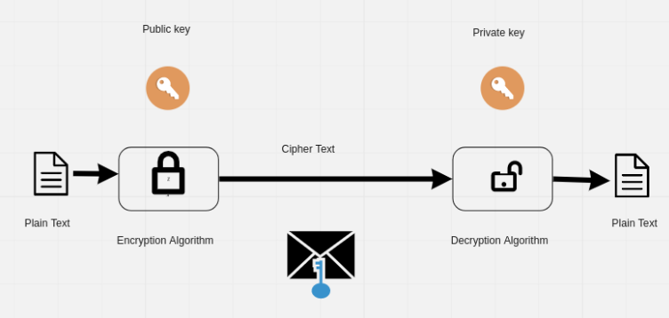
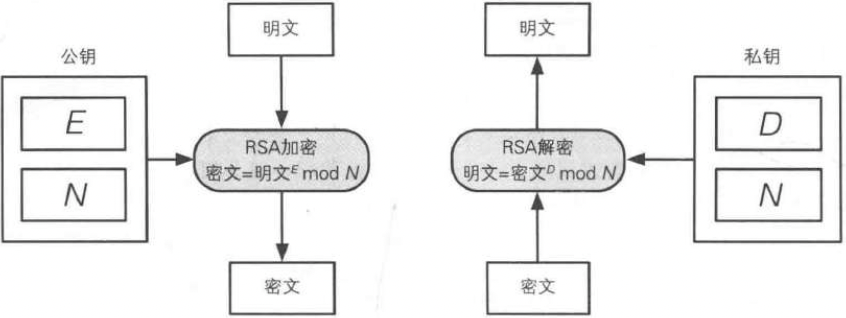
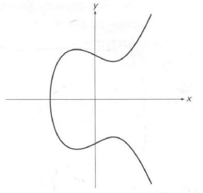
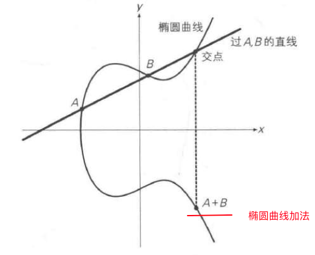
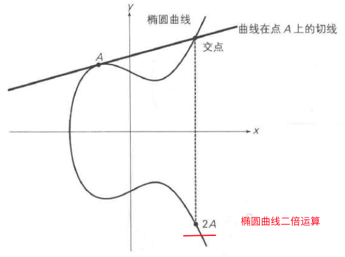
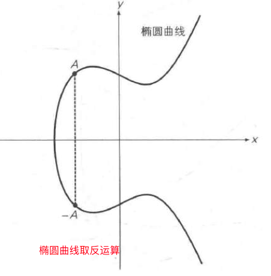
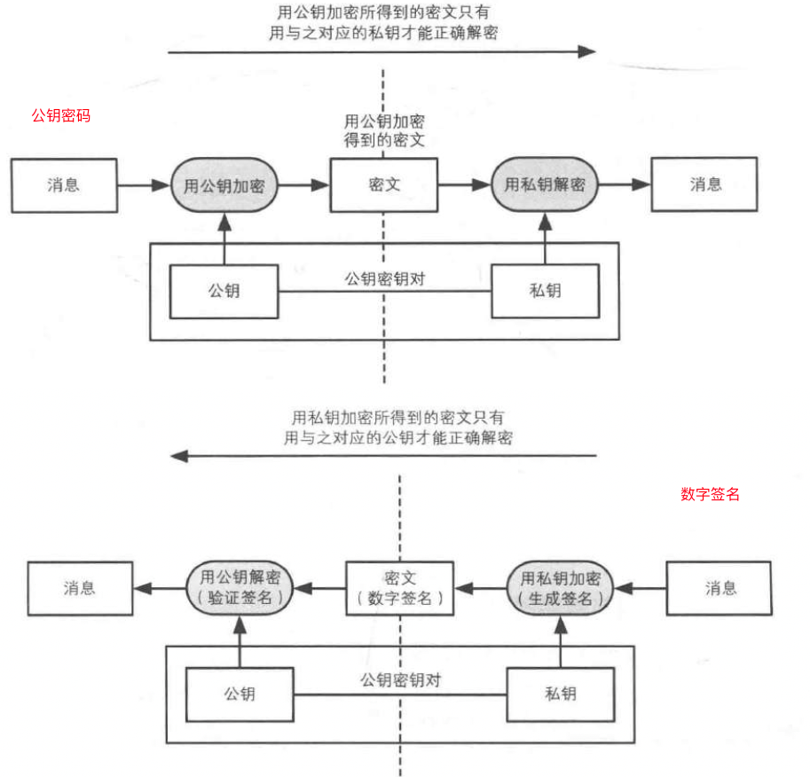

# 区块链中有哪些最常见的密码学算法？

# 什么是密码学（Cryptography）？

在双方的通信过程中，为了防止第三方非法窃取数据信息进而使用一系列加密或解密技术来隐藏或还原真实信息的方法。密码学对应的英文单词（Cryptography）由两个古希腊词汇组成，"Kryptos"表示隐藏，"Graphein"表示书写。在中文世界里，“密码”这个词（如微信登录密码、邮箱登录密码）指的是一种身份验证的凭证，是一种向系统证明登录人有合法权限的手段，这种手段更准确的说法是“口令”（对应英文中的password、passcode、pin）。

# 非对称加密（**Asymmetric-Key Encryption** ）

也称为公钥密码，在非对称加密中，会生成一对密钥，这对密钥是互相对应的。包含加密密钥（公钥，public key）和解密密钥（私钥，private key）。发送者用公钥对明文进行加密得到密文，接收者再用私钥对密文进行解密得到明文。

发送者只需要公钥，接收者只需要私钥，私钥不可以被窃取，公钥可以被窃取。

通信的流程如下：

1. 接收方Bob生成一对密钥，私钥由Bob保管。
2. Bob将自己的公钥发送给Alice，即使公钥被窃听者Eve截获也无妨。
3. Alice在发送消息前用Bob的公钥对消息进行加密，加密后的消息只有Bob的私钥才能解密。
4. Alice将密文发送给Bob。窃听者Eve即使解惑密文也无法解密。
5. Bob收到消息后，用自己的密钥进行解密。

常见的非对称加密的算法是：

- RSA
- Elliptic-curve cryptography (ECC)，椭圆曲线算法

## RSA

RSA的名字取自它的三位发明人姓氏的首字母。三位发明人分别是Ron **R**ivest、Adi **S**hamir和Leonard **A**dleman。

在RSA中，明文、密钥和密文都是数字。

RSA的**加密**公式如下：

**密文 = 明文E mod N** 

RSA的密文是将明文E次方的结果除以N求得的**余数**，E和N的组合就是公钥，一般写成{E，N}。E是Encryption的首字母，N是Number的首字母。

RSA的**解密**公式如下：

**明文 = 密文D mod N**

对密文的D次方进行mod N就可以得到明文。D和N的组合就是私钥，一般写成{D，N}，D是Decryption的首字母。

小结一下：

| 公钥 | {E，N}                            |
| ---- | --------------------------------- |
| 私钥 | **{D，N}**                        |
| 加密 | **密文 = 明文E mod N** |
| 解密 | **明文 = 密文D mod N** |

## ECC椭圆曲线算法

它是通过将椭圆曲线上的特定点进行特殊的乘法运算来实现的，利用了这种乘法运算的逆运算非常困难的特性。之所以叫椭圆曲线，是因为其源自于求椭圆弧长的椭圆积分的反函数。一般情况下，椭圆曲线可以用以下方程式来表示，其中a，b，c，d为系数。

E: y2 = ax3 + bx2 + cx + d

例如，当a = 1，b = 0 ，c = -2，d = 4时，所得到的椭圆曲线为：

E1: y2 = x3 - 2x + 4

形状如下。

在这条曲线上分别定义了：

“椭圆曲线上的加法运算”

“椭圆曲线上的二倍运算”

“椭圆曲线上的正负取反运算”

根据这些定义，得到结论：当给定点G时，用已经知道的数x，求xG的点是容易的。例如x为3，那么3G=G+2G。都可以很容易的利用上面的定义找到3G。但是反过来是很难的，例如已经知道G和5G，求5是很困难的。

在比特币中的用途：

- 在私钥计算公钥中使用，运用了它的单向不可逆特性。
- 在比特币的交易信息中使用，保证只有指定用户能够使用**未花费的比特币**（UTXO，Unspent Transaction Output）。

# 单向散列函数

**单向散列函数（one-way hash function）**有一个输入和一个输出，其中输入称为**消息（message）**，输出称为**散列值**或**哈希值（hash value）**。消息可以是各种形式的，如二进制文件、普通文本、图像文件、声音文件甚至视频文件，无论任何消息，在经过单向散列函数的计算时都会将它作为单纯的比特序列来处理。

特点：

- 固定长度的计算结果，任意长度的消息均可计算出固定长度的散列值。
- 唯一性，消息不同散列值不同，即使是轻微的数据变化，也会导致明显不同的输出。
- 确定性，同一个输入的输出是恒定不变的。
- 快速，计算速度快。
- 单向性，无法通过散列值反算出消息的内容。

区块链中用到的单向散列函数有：

- SHA256 
- RIPEMD-160
- keccak-256 （以太坊）

## SHA-256

SHA-256是由NIST（美国国家标准技术研究所）于2002年发布的，它与SHA-384、SHA-512等统称SHA2（Secure Hash Algorithm 2）。不同的后缀表示它们不同的散列值长度。

实现步骤：

1. 添加填充位
2. 追加长度位
3. 初始化缓冲区
4. 压缩函数

在比特币中的用途：

- 生成merkle tree
- 区块的哈希值
- PoW共识算法的算力证明
- 生成比特币地址

## RIPEMD-160

RIPRMD-160是由Hans Dobbertin、Antoon Bosselaers、Bart Preneel设计的能够产生160位比特散列值的单向散列函数。

在使用比特币公钥来计算地址时，使用了sha256算法和RIPEMD160算法。

## keccak-256 

keccak是一种被选定为SHA-3标准的单向散列函数算法。主要在以太坊中用来生成以太坊地址。

## 常见术语

**单向散列函数**也被称为**消息摘要函数（message digest function）**、**哈希函数**。

**散列值**可以被称为**消息摘要（message digest）**或者**指纹（fingerprint）**。

# 数字签名

在计算机世界中，数字签名是一种与现实世界中盖章、签名类似的技术。使用数字签名可以**识别篡改和伪装**以及**防止否认**。简单来说，数字签名就是**将非对称加密技术反过来用**而实现的。用**私钥**来加密，用**公钥**来验证。

两种用法的对比如下：

可以看到：

|          | 私钥                 | 公钥                 |
| -------- | -------------------- | -------------------- |
| 公钥密码 | 接收者解密时使用     | 发送者加密时使用     |
| 数字签名 | 签名者生成签名时使用 | 验证者验证签名时使用 |
| 持有者   | 个人持有             | 任何人都可持有       |

所有者可以使用私钥来签署信息或文件，而验证者可以使用分配给所有人的公钥来验证其所有权。这个过程类似于离线世界中使用的手写签名，资产的所有者可以使用他们的签名来对该资产进行任何操作，任何人都可以通过与之前使用的签名进行比较来验证该签名。数字签名可以作为一种机制，确保行动的**真实性**、**不可抵赖性**和**完整性**。

数字签名在比特币中的用途是：

- 发送者**使用私钥加密生成的签名**（椭圆曲线签名）来花费**由该私钥对应的公钥**来锁定的**UTXO**（未花费的比特币）。
- 一旦发送者在钱包节点中发起交易，并根据**交易**及其**私钥**生成**数字签名**，所有持有该**公钥**的其他节点均可检验这笔**交易的真实性**。

# 参考资料

https://www.upgrad.com/blog/cryptography-in-blockchain/#:~:text=Blockchains%20make%20use%20of%20two,algorithm%20as%20their%20hash%20function.

https://garywoodfine.com/blockchain-cryptography/

https://iopscience.iop.org/article/10.1088/1742-6596/1168/3/032077/pdf

https://kba.ai/explaining-cryptography-in-blockchain/

https://www.comparitech.com/crypto/cryptography-blockchain/

https://techblog.geekyants.com/all-you-need-to-know-about-cryptography-in-blockchain

https://en.wikipedia.org/wiki/SHA-2

https://infosecwriteups.com/breaking-down-sha-256-algorithm-2ce61d86f7a3

https://www.simplilearn.com/tutorials/cyber-security-tutorial/sha-256-algorithm

https://amz.run/5aar

