# 如何使用Solidity+React开发一个筹款DApp?

# 背景

运行在以太坊平台上的**募捐DAPP**，我们使用它来为需要帮助的宠物们**筹集资金**（以太币）。我们将为每一个宠物创建各自的**以太坊账户**，使得热心的用户们可以为它们所关心的宠物进行**捐赠**，捐赠的资金将会先被保存到**合约账户**之中，再由**创建募捐项目管理员**负责将**募集到的资金**从**合约账户**转移到**各自的账户**之中，最终各个账户可以将以太币转换为法币来使用。


# 设计

## 页面原型如何设计？

主要包含三个页面：首页、详情页、收据页

### 首页

首页展示了所有的募捐活动信息。

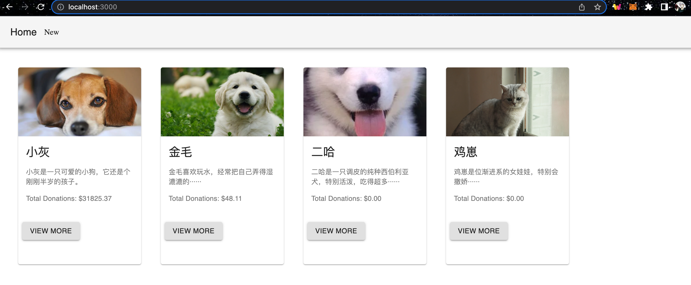

### 详情页

详情页展示了某项募捐活动的详细信息。

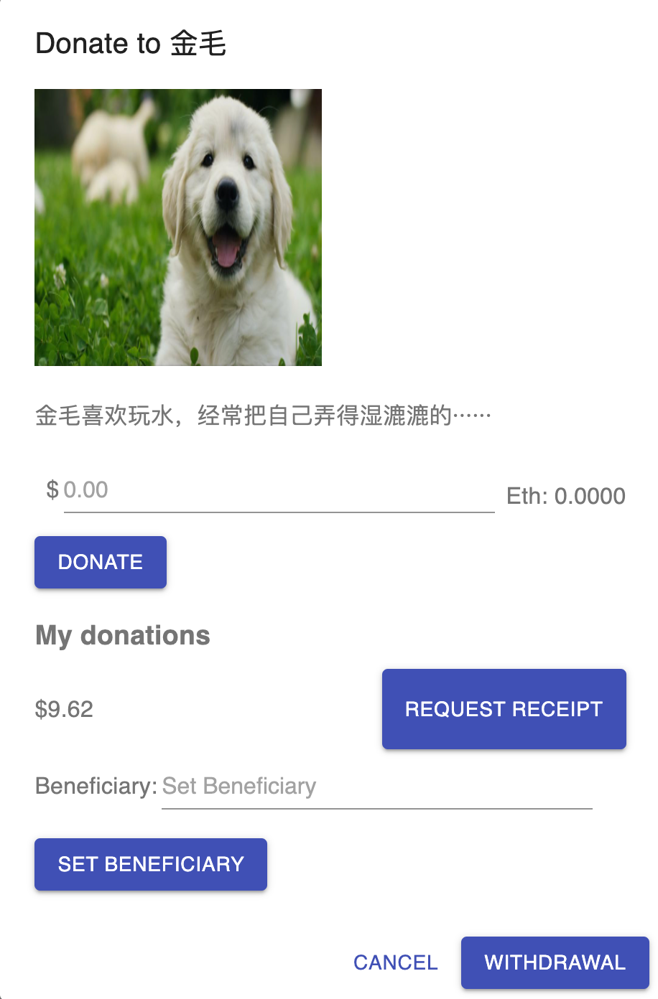

如图所示，主要包含以下信息

- 图片
- 描述
- 捐赠金额
- 我的历史捐赠记录（触发交易的账户）
- 设置受惠人账户地址（owner）
- 将捐赠来的所有以太币转移到受惠人账户（owner）

(ps: owner为此募捐活动的创建者。)


### 收据页

在详情页中，点击`REQUEST RECEIPT`按钮，会跳转到收据页，收据页记录了历史的捐赠记录。

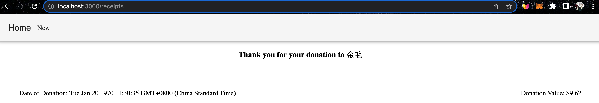

如上图所示，记录了在什么时刻向谁捐赠了多少金额。


## 后端如何设计？

后端使用Solidity来编写，一共包含三个合约，分别是`Fundraiser.sol`、`FundraiserFactory.sol`、`Migration.sol`（默认）

### 募捐活动

`Fundraiser.sol`表示募捐活动。

它包含以下成员变量：

```
		//募捐对象名称
		string public name;
		//url链接地址
    string public url;
    //图片链接地址
    string public imageURL;
    //募捐对象的详细描述
    string public description;
    //募捐对象用来接受以太币的地址
    address payable public beneficiary;
    //募捐总金额
    uint256 public totalDonations;
    //募捐次数
    uint256 public donationsCount;
    //不同的以太坊地址及其捐赠记录被保存到一个映射中
    mapping (address => Donation[]) private _donations;
```

定义了以下事件：

```
    //获得捐赠后触发的事件
    event DonationReceived(address indexed donor , uint256 value);
		//转移资金后触发的事件
    event Withdraw(uint256 amount);
```

定义的数据结构如下：

```
		//记录一笔捐赠信息，包含价值和日期
		struct Donation{
        uint256 value;
        uint256 date;
    }
```

引用的库如下：

```
//引用openzeppelin中的代码，来保证代码的安全性
import "openzeppelin-solidity/contracts/ownership/Ownable.sol";
import "openzeppelin-solidity/contracts/math/SafeMath.sol";

//继承Ownable，引入其中定义的方法修饰符onlyOwner，在定义某些方法时引用，来达到权限保护的目的
contract Fundraiser is Ownable {
		//SafeMath是一个提供了安全的算术运算的库。（如：提供了整数计算的上下界溢出保护）
		using SafeMath for uint256;
		···
}
```

它还包含以下重要方法：

```
		//设置募捐对象账户（仅限募捐对象的创建人执行该方法）
		function setBeneficiary(address payable _beneficiary) public onlyOwner {
        beneficiary = _beneficiary;
    }
    //返回某个账户发起的募捐次数
    function myDonationsCount() public view returns(uint256) {
        return _donations[msg.sender].length;
    }
		//发起捐赠，从交易中取出捐赠金额、从区块中取出时间戳，来构造捐赠记录Donation
		//然后把它添加到与触发该交易的地址相对应的数组中，并累加到捐赠总额与总数中去
		//最后触发事件
    function donate() public payable {
        Donation memory donation = Donation({
            value: msg.value,
            date: block.timestamp
        });
        _donations[msg.sender].push(donation);
        totalDonations = totalDonations.add(msg.value);
        donationsCount++;

        emit DonationReceived(msg.sender, msg.value);
    }
		//查看某个账户的（msg.sender的值由前端传入决定）历史捐赠记录，返回两个数组，分别表示金额和日期。
    function myDonations() public view returns(uint256[] memory values,uint256[] memory dates){
        uint256 counts = myDonationsCount();

        values = new uint256[](counts);
        dates  = new uint256[](counts);

        for(uint256 i = 0 ; i < counts ; i++ ){
            Donation storage donation = _donations[msg.sender][i];
            values[i] = donation.value;
            dates[i]  = donation.date;
        }

        return (values,dates);
    }
		//将合约的余额转移给指定的募捐账户
    function withdraw() public onlyOwner{
        uint256 balance = address(this).balance;
        beneficiary.transfer(balance);
        emit Withdraw(balance);
    }
		//默认方法，累加捐赠的总金额和总数
    function () external payable {
        totalDonations = totalDonations.add(msg.value);
        donationsCount++;
    }
```

### 合约工厂

`FundraiserFactory.sol`是用来创建`Fundraiser`实例的工厂。

它包含以下成员变量和事件

```
    //可创建的fundraiser的最大数量
    uint256 constant maxLimit = 20;
		//fundraisers数组
    Fundraiser[] private _fundraisers;
    //创建fundraiser成功后触发
    event FundraiserCreated(Fundraiser indexed fundraiser,address indexed owner);
```

还包含以下方法

```
    //获取fundraiser的数量
    function fundraisersCount() public view returns(uint256) {
        return _fundraisers.length;
    }
		//创建一个fundraiser，并把它添加到数组中
    function createFundraiser(
        string memory name,
        string memory url,
        string memory imageURL,
        string memory description,
        address payable beneficiary
    ) public {
        Fundraiser fundraiser = new Fundraiser(name,url,imageURL,description,beneficiary,msg.sender);
        _fundraisers.push(fundraiser);
        emit FundraiserCreated(fundraiser,msg.sender);
    }
		//批量创建fundraiser
    function fundraisers(uint256 limit, uint256 offset) public view returns(Fundraiser[] memory coll) {
        require(offset <= fundraisersCount(),"offset out of bounds");
        
        uint256 size = fundraisersCount() - offset;
        size = size < limit ? size : limit;
        size = size < maxLimit ? size : maxLimit;
        coll = new Fundraiser[](size);

        for(uint256 i = 0; i < size; i++) {
            coll[i] = _fundraisers[offset + i];
        }

        return coll;
    }
```


## 前端如何设计？

前端使用React框架，

什么是[React](https://reactjs.org/docs/getting-started.html)？这篇文章以一个demo来介绍来React的最少必要知识。

React是一个Javascript库，可以用来构建基于UI组件的应用程序。[其开发的单页应用程序可以提高访问效率](https://www.robinwieruch.de/web-applications/)。

什么是[Web3](https://web3js.readthedocs.io/en/v1.2.11/getting-started.html)?

Web3是一个Javascript库的集合，它内部封装了以太坊提供的API接口，使得我们可以通过它来与远程或本地的以太坊网络进行交互。

简单来看，用户与由React构建的UI界面进行交互，React再通过Web3与Blockchain交互。


# 核心接口

## 创建新的募捐活动

在New页签，点击SUBMIT按钮

通过Web3提供的接口，调用本地区块链上已经部署好的合约`FundraiserFactory`中的`createFundraiser`方法，来创建一个新的**募捐活动**（Fundraiser）。创建人是account[0]——**0x418724f6ca9326C1Fbd9AefD7c0E40BE95E34633**

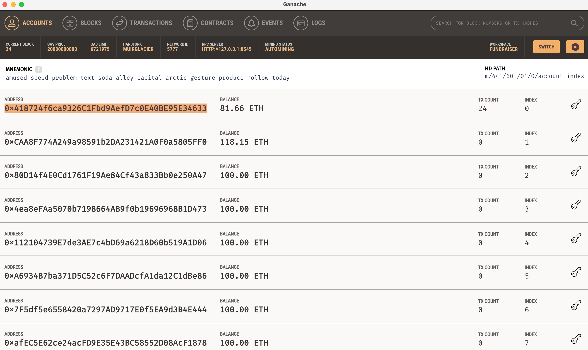

对应的代码如下：

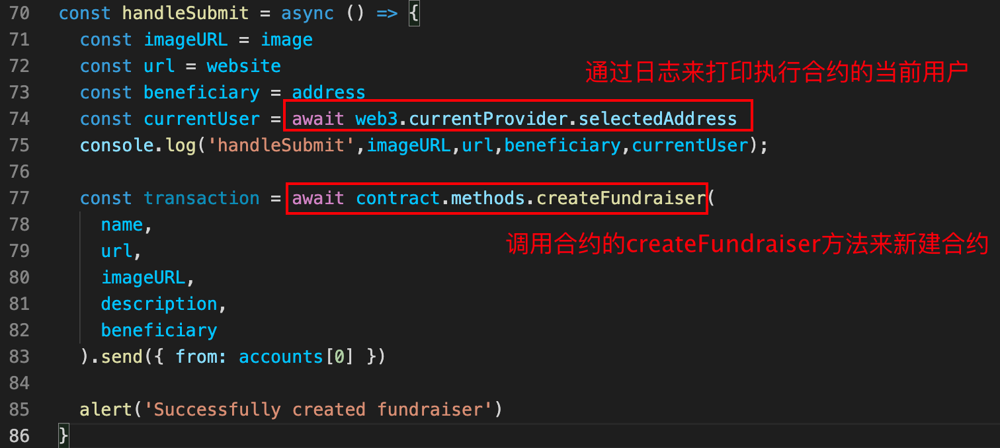


## 查看募捐活动列表

操作：当点击Home页签时会路由到`/`目录

下图为App.js中的路由定义情况

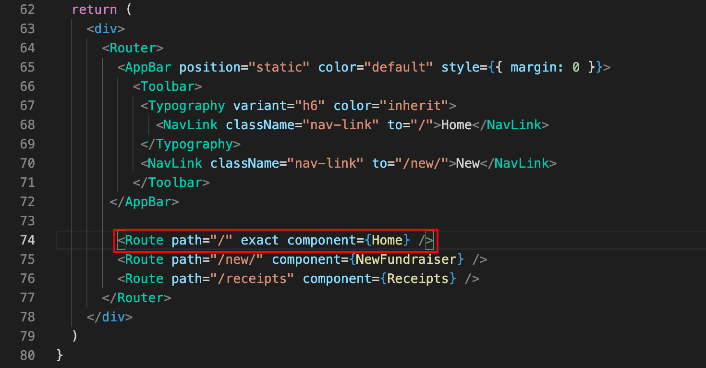

可以看到，我们在上图定义了一个Home组件。

在Home组件中，主要实现了以下逻辑

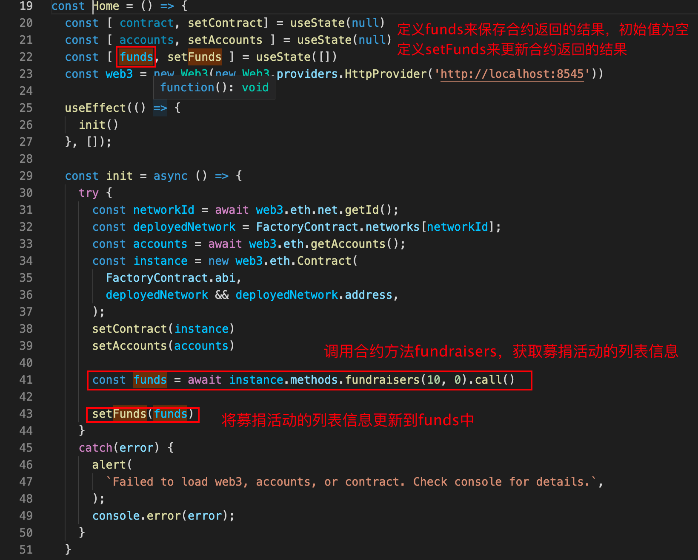

如上图，在init函数中，调用了合约方法fundraisers，返回了一批募捐活动信息，再通过setFunds方法来更新到funds中。

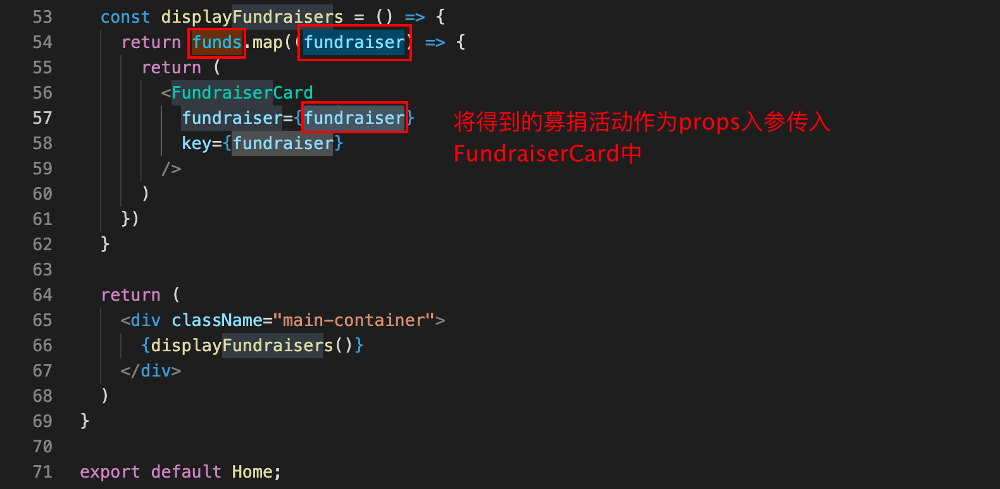

然后，再将得到的募捐活动信息作为props入参传入FundraiserCard中。


## 查看募捐活动详情

操作：点击图片或者`View More`后，会打开对话框，从中我们可以看到募捐活动详情！

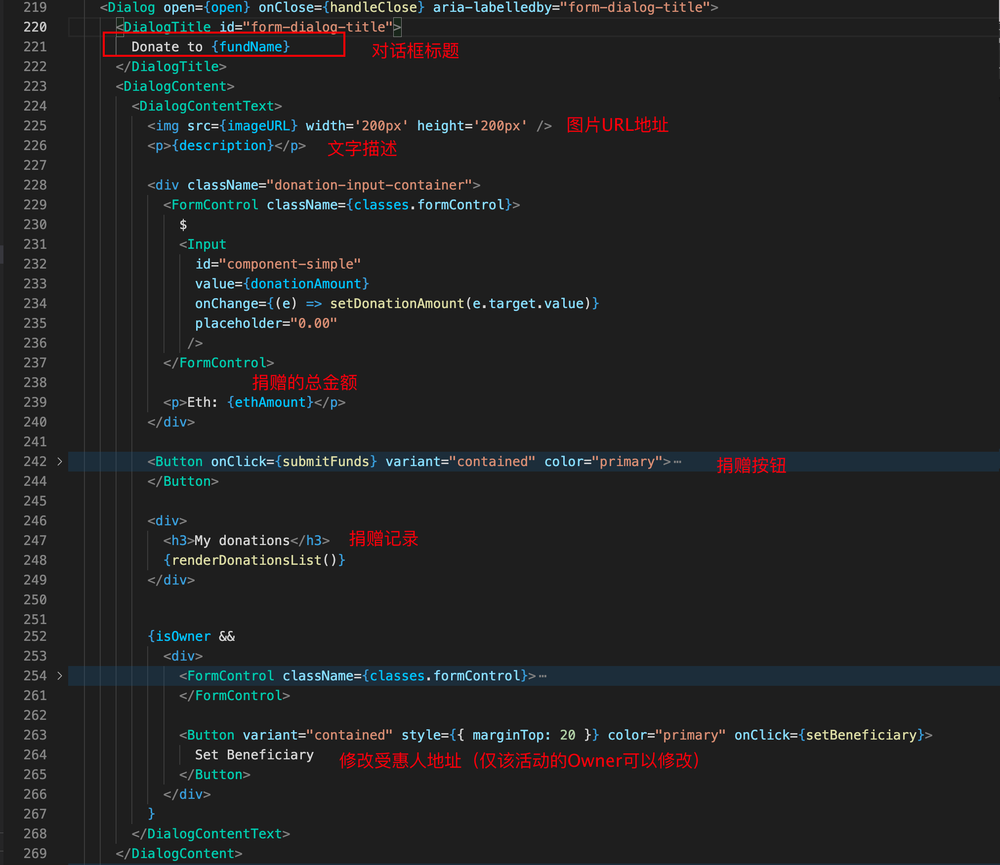


## 捐赠

操作：点击`DONATE`按钮

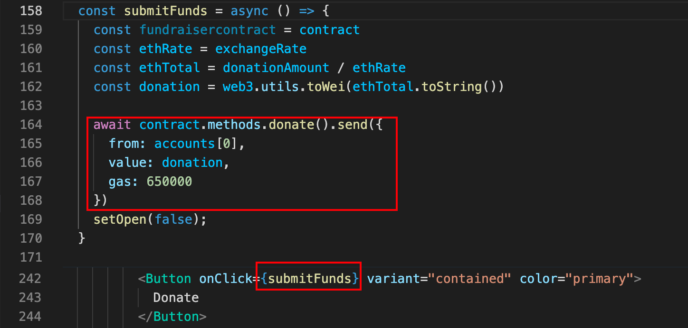

如图所示，点击DONATE按钮会调用`submitFunds`，在该函数中，会调用合约中的donate方法，将金额记录到指定账户下。


## 查看收据

操作：点击`REQUEST RECEIPT`按钮会跳转到收据页面

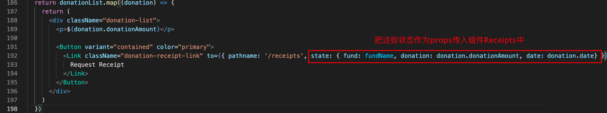

点击按钮后，会将当前的`募捐活动名称`、`金额`、`日期`传给Receipts组件进行处理。

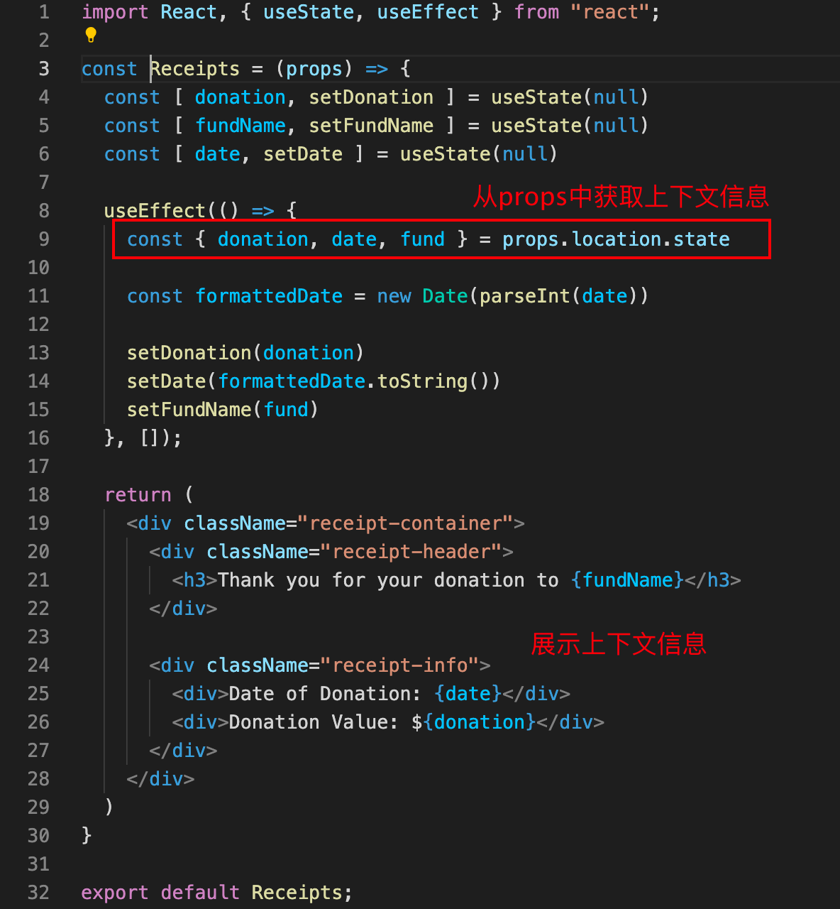


## 设置受惠人

操作：点击`SET BENEFICIARY`按钮

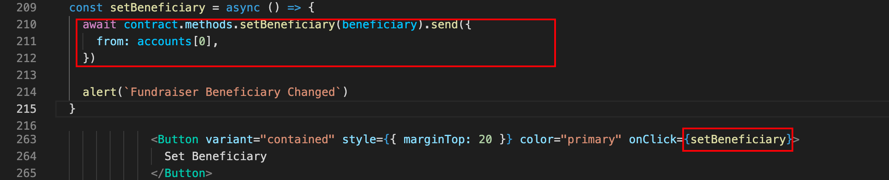

调用合约的setBeneficiary方法


## 将资金从合约账户转移到受惠人账户

操作：点击`WITHDRAWL`按钮

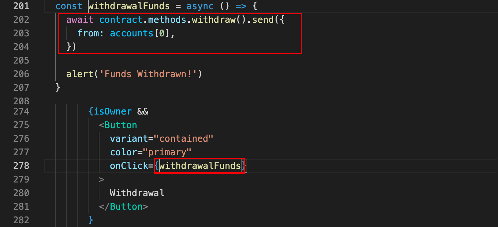

调用合约的`withdraw`方法来转移资金。


github仓库：https://github.com/Barryonion/fundraiser

部署方式：

本地运行ganache，添加当前fundraiser项目作为workspace。

执行，以下命令，将合约发布到本地区块链网络

```
truffle migrate --network develop
```

再执行以下命令运行前端项目

```
cd client && npm run start
```


# 总结

在这篇文章中，我们介绍了如何开发一个DApp来为不同的宠物进行筹款。首先介绍了Dapp的背景和目的，随后简单介绍了其页面、后端、前端设计，最后对核心的接口的源码进行了简短地分析。


# 参考资料

https://ethereum.stackexchange.com/questions/41283/why-does-web3-eth-getaccounts-return-only-1-account

https://www.robinwieruch.de/web-applications/

https://www.amazon.com/Hands-Contract-Development-Solidity-Ethereum/dp/1492045268/