# 如何将智能合约发布到不同的网络？

# 环境准备

## 安装MetaMask

MetaMask是一个Google插件，封装了常用的Web3.js库，为用户提供更便利的区块链网络的访问途径。

安装教程[参考此处](https://chrome.google.com/webstore/detail/metamask/nkbihfbeogaeaoehlefnkodbefgpgknn?hl=en-US)。

## 安装Geth

根据[这篇教程正常安装并启动Geth](https://geth.ethereum.org/docs/getting-started)，使得我们能够访问以太坊的测试网络goerli。

出现以下提示表明Geth在不断同步中导入最新区块，如图所示，正在导入6，909，257的区块。

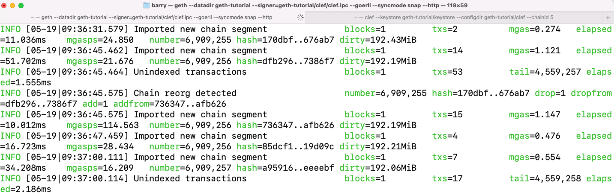

## 安装Truffle

参考[这篇教程](http://bailiyingfeng.cn/2022/05/08/truffle-installation-process-pit-stop-record/)安装5.3.0版本的truffle，安装好后的开发版本应该如下。

```
barry@192 greeter % truffle version
Truffle v5.3.0 (core: 5.3.0)
Solidity - 0.5.8 (solc-js)
Node v12.8.0
Web3.js v1.2.9
```

## 安装Ganach

Ganach是一个开发工具，可以使用它在在本地启动一个全新的区块链网络，便于进行开发、测试。到[官网](https://trufflesuite.com/ganache/)下载安装即可。


# 案例简介

参考书籍[《Hands-On Smart Contract Development with Solidity and Ethereum》](https://www.amazon.com/Hands-Contract-Development-Solidity-Ethereum/dp/1492045268/)中第3、4、5节的内容，以其中greeter项目为例子，实践如何完整地发布一个Dapp到以太坊不同的测试网络。

github仓库地址：https://github.com/Barryonion/greeter

## 后端代码

后端代码结构如下

```
barry@192 greeter % tree
├── contracts
│   ├── Greeter.sol
│   └── Migrations.sol
├── migrations
│   ├── 1_initial_migration.js
│   └── 2_deploy_greeter.js
├── package-lock.json
├── test
│   └── greeter_test.js
└── truffle-config.js
```

这是一个标准的[truffle框架结构](https://trufflesuite.com/docs/truffle/getting-started/compiling-contracts/)。

### 合约代码

`contracts`目录中新建`Greeter.sol`，其[内容如下](https://github.com/Barryonion/greeter/blob/master/contracts/Greeter.sol)。

```solidity
pragma solidity >= 0.4.0 < 0.7.0;

import "openzeppelin-solidity/contracts/ownership/Ownable.sol";

contract Greeter is Ownable {
  string private _greeting = "Hello, World!";

  function greet() external view returns(string memory) {
    return _greeting;
  }

  function setGreeting(string calldata greeting) external onlyOwner {
    _greeting = greeting;
  }
}
```

### 部署代码

`migrations`目录中新建`2_deploy_greeter.js`，其内容如下

```javascript
const GreeterContract = artifacts.require("Greeter");

module.exports = function(deployer) {
    deployer.deploy(GreeterContract);
}
```

### 测试代码

`test`目录中包含测试代码。测试代码内容参考该链接，因为测试代码中除了最终版的测试用例以外，还包含了中间不断优化过程中各个版本的代码测试用例，代码较多所有就不贴到此处了，可以参考GitHub链接[greeter_test.js](https://github.com/Barryonion/greeter/blob/master/test/greeter_test.js)。


### truffle项目配置

`truffle-config.js`文件是这个truffle项目的配置文件。关于配置文件的详细配置可参考[这篇文档](https://trufflesuite.com/docs/truffle/reference/configuration/)。

```json
const HDWallterProvider = require("truffle-hdwallet-provider");

module.exports = {
  contracts_build_directory: "./client/src/contracts",

  networks: {
    development: {
     host: "127.0.0.1",     // Localhost (default: none)
     port: 7545,            // Standard Ethereum port (default: none)
     network_id: "*",       // Any network (default: none)
    },

    goerli: {
      provider: () => {
        const mnemonic = process.env["MNEMONIC"]
        return new HDWallterProvider(mnemonic, "http://127.0.0.1:8545");
      },
      network_id: "*",
    },

    rinkeby: {
      networkCheckTimeout: 10000, 
      provider: () => {
        const mnemonic = process.env["MNEMONIC"]
        const project_id = process.env["INFURA_PROJECT_ID"]
        return new HDWallterProvider(
          mnemonic,
          `https://rinkeby.infura.io/v3/${project_id}`
        );
      },
      network_id: "*"
    }
  },
  // Configure your compilers
  compilers: {
    solc: {
      version: "0.5.8"      // Fetch exact version from solc-bin (default: truffle's version)
    }
  },
};
```

`development`代表本地开发网络，`goerli`、`rinkeby`分别代表两个不同的测试网络。

以上几个部分构成了整个项目的后端代码。

## 前端代码

前端代码位于client目录下，如何运行参考[README](https://github.com/Barryonion/greeter/tree/master/client)即可。


## 小结

以上只是呈现了最终版本的代码经过我实践后的运行效果，建议去阅读书籍，进一步了解代码编写过程中遇到的问题和改善，不断调整，会有更深刻的理解。


# 部署

再介绍了代码后，我们需要把合约部署到不同的网络。

## 本地Ganache

安装并运行起来Ganache，然后点击右侧按钮`NEW WORKSPACE`，添加下图所示配置信息

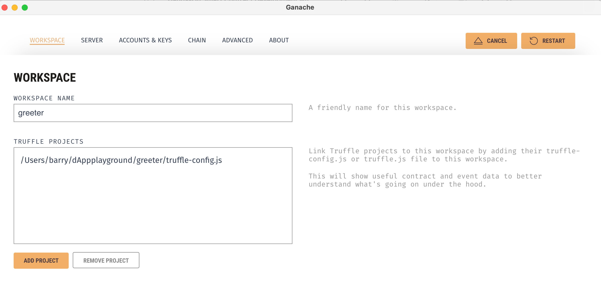

再点击`ADD PROJECT`按钮添加项目。完毕后得到下图所示界面，表明已经在本地成功启动网络。

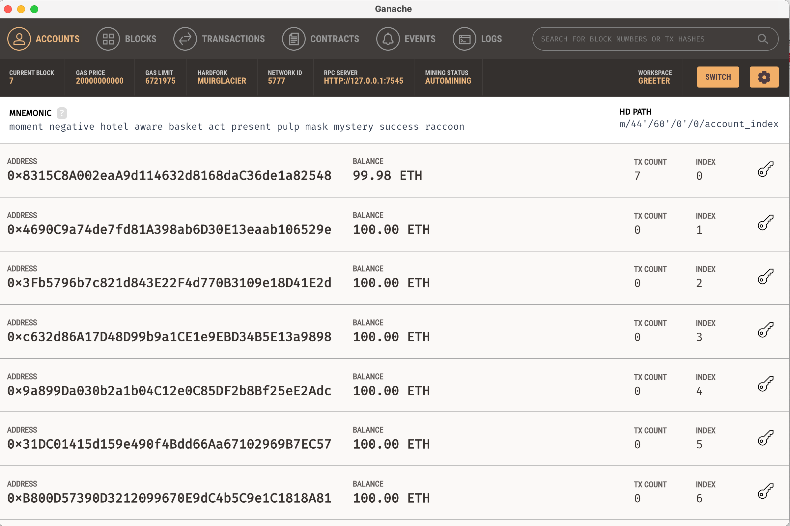

执行命令`truffle migrate --network development`，将合约发布到本地网络，得到如下结果。

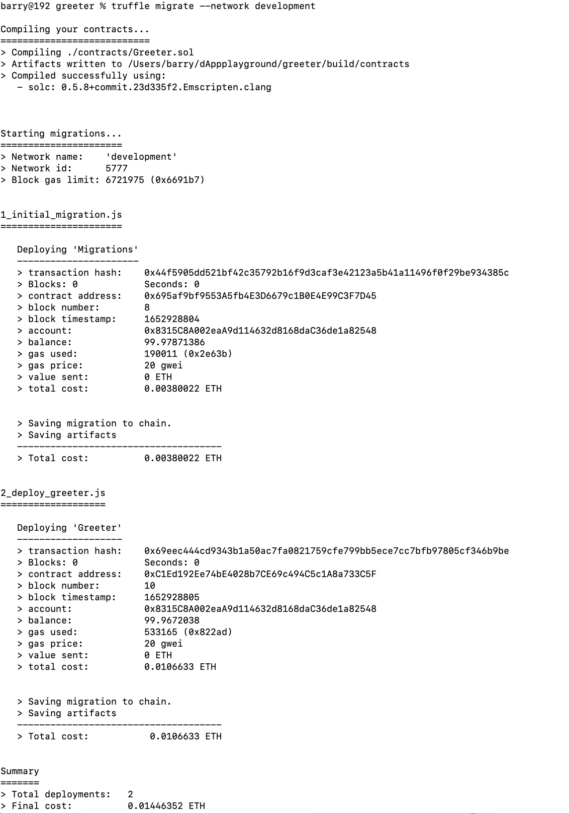

ganache上也记录了区块的交易信息

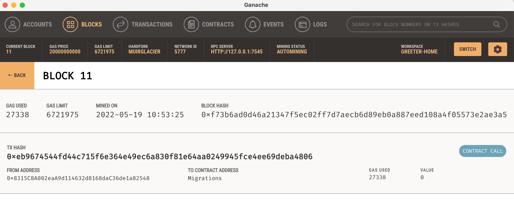

## Goerli网络

类似的，执行`truffle migrate --network goerli`命令，将合约发布到网络，

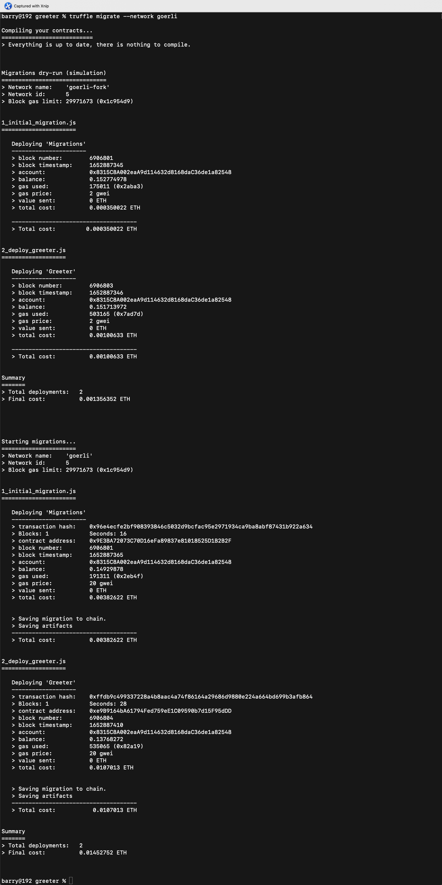

发布的[交易链接在此](https://goerli.etherscan.io/tx/0xffdb9c499337228a4b8aac4a74f86164a29686d9880e224a664bd699b3afb864)。

## Rinkeby网络

类似，执行命令`truffle migrate --network rinkeby`，发布到rinkeby网络，发布成功后的[交易链接在此](https://goerli.etherscan.io/tx/0xffdb9c499337228a4b8aac4a74f86164a29686d9880e224a664bd699b3afb864)。


注释：发布合约到测试网络时，需要申请一些以太币。可以从以下网站申请，具体申请方式参考网站说明。

[https://goerli-faucet.pk910.de/](https://goerli-faucet.pk910.de/)

[https://faucet.goerli.starknet.io/](https://faucet.goerli.starknet.io/)

[https://goerlifaucet.com/](https://goerlifaucet.com/)


# 交互

将合约发布到测试网络后，我们看一下如何与它进行交互

首先，把前端项目运行起来

```
cd client
nohup npm run start & //后台运行
cd - //回到greeter根目录
```


成功运行起来后应该得到如下图所示的界面。

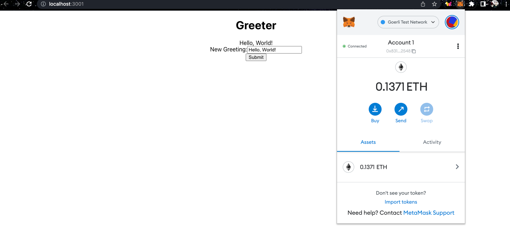

接下来，我们发出一条交易，交易内容为`Hello,Barry`。点击交易按钮，会弹出交易详情，包含预估的汽油费等信息，随后点击确认按钮。

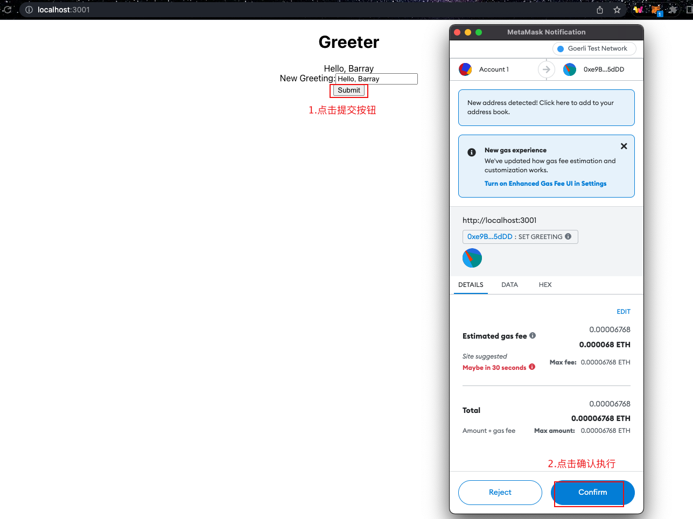

等待一会儿，点击MetaTask的Activity，查看最近发出的`Set Greeting`交易详情


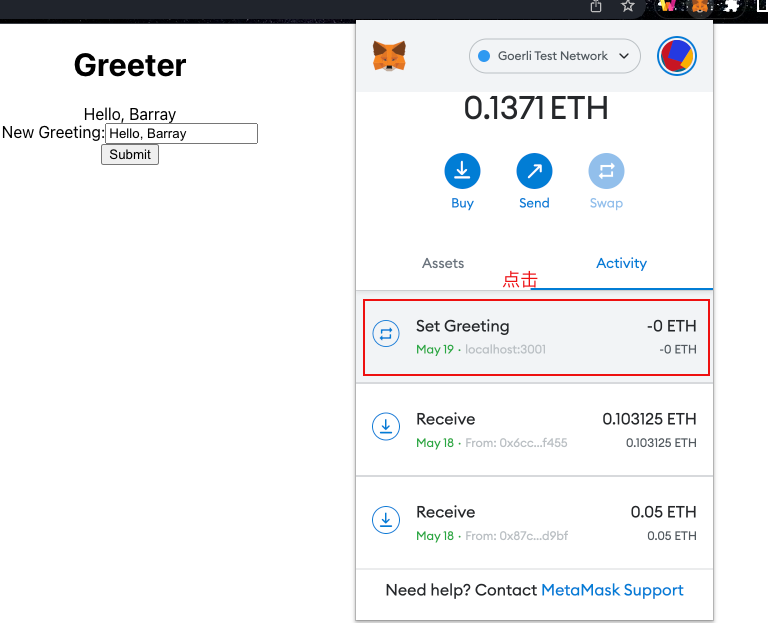

在详情页面，点击右上角`View on block explorer`，进入`block explorer`的交易详情查看页面。

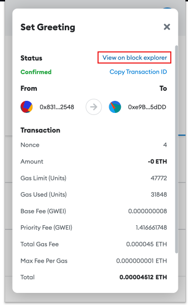

具体的交易详情可通过[此链接](https://goerli.etherscan.io/tx/0xaefbacfd428782ee3e322c5c149cce90b0ec31abe4913d6d1897b67424ba3725)查看。可以看到右下角的交易信息的具体内容。

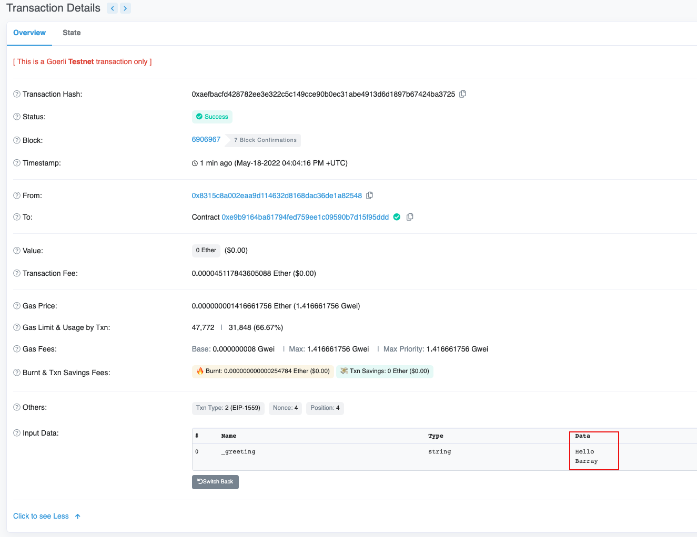


# 总结

本文先简要介绍了开发智能合约的必备工具，随后回顾了如何用truffle来开发一个项目，并且把该项目发布到不同的测试环境。本文内容参考书籍[《Hands-On Smart Contract Development with Solidity and Ethereum》](https://www.amazon.com/Hands-Contract-Development-Solidity-Ethereum/dp/1492045268/)根据实际的网络环境和依赖包的版本演化做了适当的调整。调整如下：

- 以太坊客户端没有使用书籍中介绍的parity，改用geth，parity的github仓库已经归档，官方主推geth。
- 由于网络不通畅，建立rinkeby的网络连接时添加`networkCheckTimeout`参数，[参考stackoverflow帖子](https://ethereum.stackexchange.com/questions/82688/timeout-error-on-deploying-to-rinkeby-from-truffle-migrate?newreg=9b4ef0d0fd954f95878f28c0f1f9cbbd)。
- 升级了原书作者使用的truffle版本，从5.0.3升级到5.3.0，为了解决这个[部署失败的问题](https://ethereum.stackexchange.com/questions/94418/deployment-failed-migrations-only-replay-protected-eip-155-transactions)。


# 参考资料：

[https://geth.ethereum.org/docs/getting-started](https://geth.ethereum.org/docs/getting-started)

[https://www.amazon.com/Hands-Contract-Development-Solidity-Ethereum/dp/1492045268/](https://www.amazon.com/Hands-Contract-Development-Solidity-Ethereum/dp/1492045268/)

[http://bailiyingfeng.cn/2022/05/08/truffle-installation-process-pit-stop-record/](http://bailiyingfeng.cn/2022/05/08/truffle-installation-process-pit-stop-record/)

[https://ethereum.stackexchange.com/questions/82688/timeout-error-on-deploying-to-rinkeby-from-truffle-migrate?newreg=9b4ef0d0fd954f95878f28c0f1f9cbbd](https://ethereum.stackexchange.com/questions/82688/timeout-error-on-deploying-to-rinkeby-from-truffle-migrate?newreg=9b4ef0d0fd954f95878f28c0f1f9cbbd)

https://ethereum.stackexchange.com/questions/94418/deployment-failed-migrations-only-replay-protected-eip-155-transactions

[https://goerli-faucet.pk910.de/](https://goerli-faucet.pk910.de/)

[https://faucet.goerli.starknet.io/](https://faucet.goerli.starknet.io/)

[https://goerlifaucet.com/](https://goerlifaucet.com/)