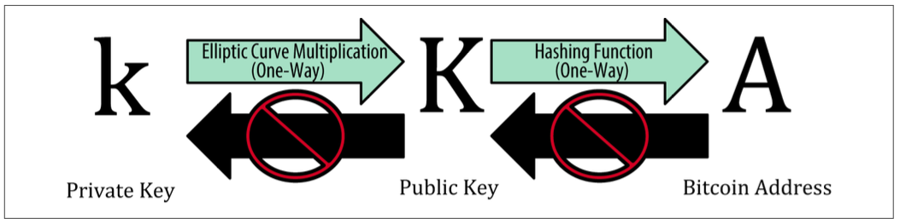
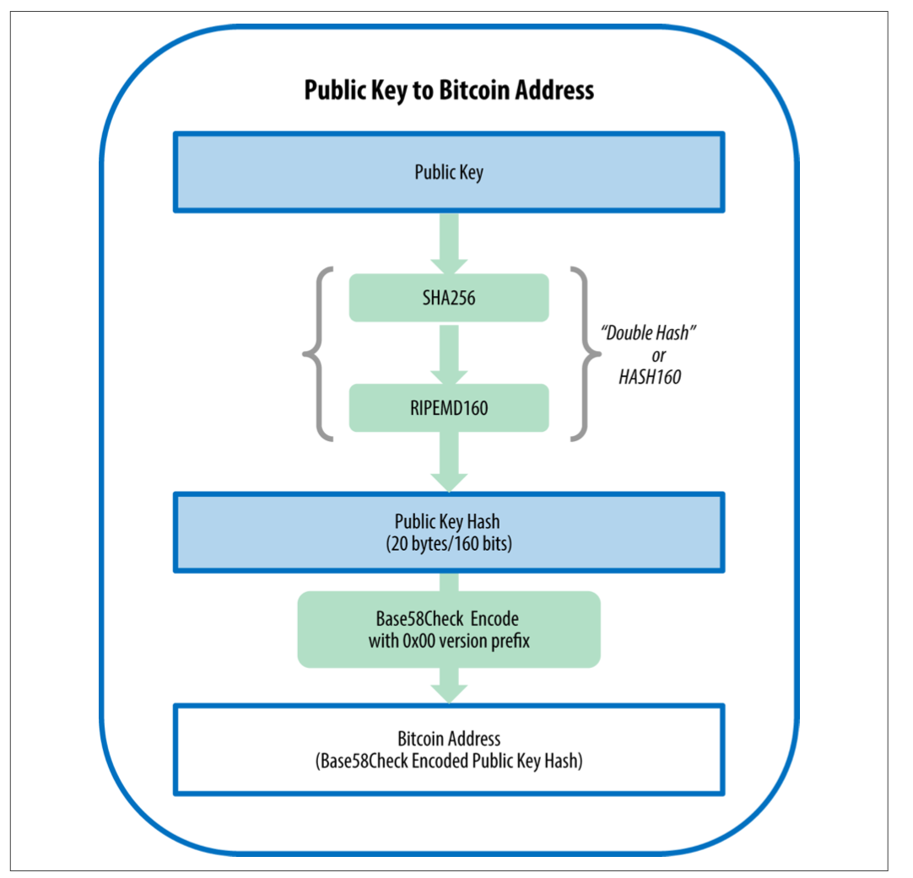
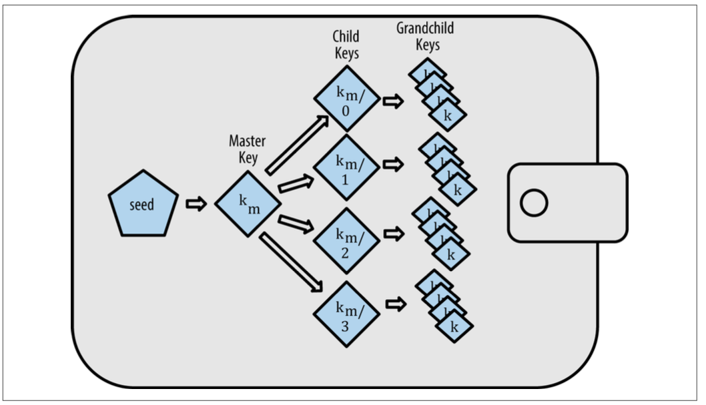
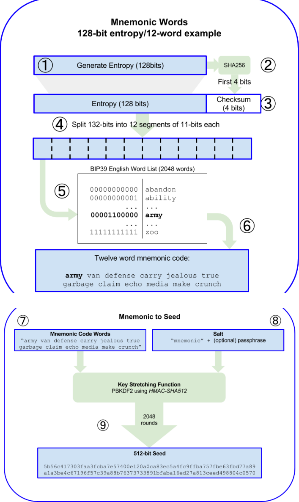
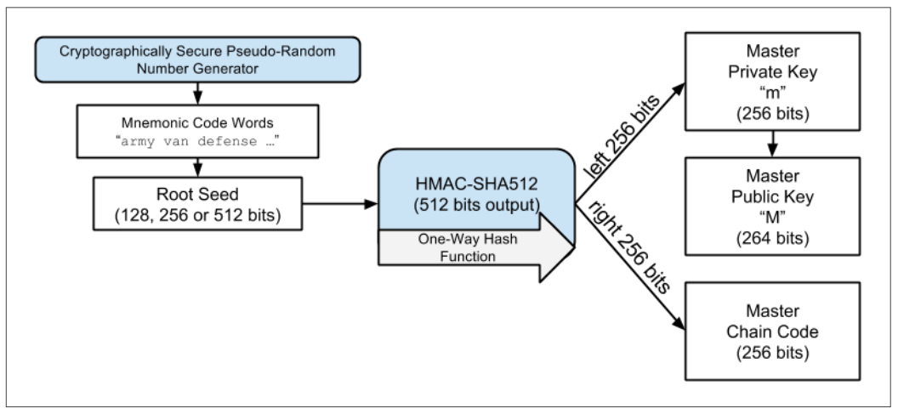
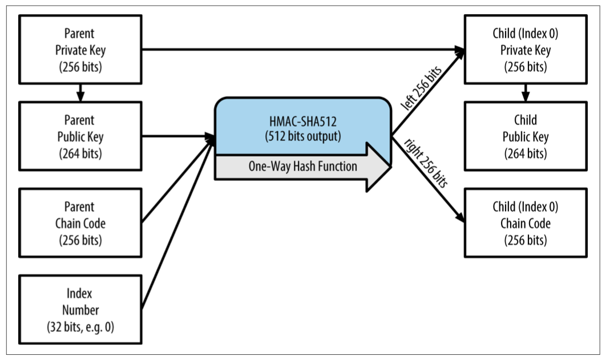
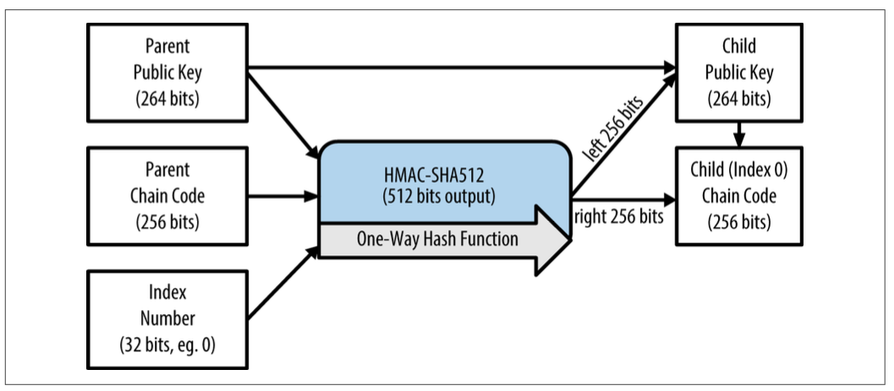

# 比特币用户的地址是如何生成的？


# 比特币钱包

比特币钱包中并不包含比特币，包含的是用户的密钥，而用户的比特币则保存在区块链这个全网公开的分布式账本上。

比特币钱包可以发起交易，创建交易信息。在进行交易时，使用了数字签名技术（使用钱包中管理的私钥），让全网的其他节点都能够知道这笔交易的支付方和接收方，进而认可这一笔交易信息。

在交易过程中的交易地址（发送方），是由私钥生成的。

- 首先，根据用户私钥使用椭圆曲线算法（单向哈希函数）得到公钥；
- 其次，根据公钥使用单向哈希函数得到地址；
- 最后，对地址进行Base58Check编码转化成字符串




## 私钥

一个256位的随机数，标识一个用户，直接控制着区块链上与该用户相关的所有的资金。所以必须要保管好！

## 公钥

根据私钥通过椭圆曲线算法生成的256位的随机数，无法根据公钥反过来计算出私钥。

## 地址

先经过Sha256和RIPEMD160算法对公钥进行计算，再由Base58Check编码得到。通常由数字和字符组成，用于在交易时接收比特币，以1开头。例如：

```
1J7mdg5rbQyUHENYdx39WVWK7fsLpEoXZy
```




## 密钥管理

一个钱包通常管理多个密钥、地址，即使对于同一个用户，每次交易时使用的地址也都是不同的，如果对于每一个地址都要按照上述的方式生成的话，那么钱包中会充满了一批随机的，彼此之间无任何关系的密钥，这让管理起来十分不便。

所以衍生出了如下的密钥管理方式：



上图中的钱包叫HD钱包（HD，hierarchical deterministic）。它可以通过一个种子（seed）来生成一批密钥。如果涉及到切换钱包客户端，只需要把种子迁移到新的客户端即可。


### 如何生成种子？


种子是一串随机的二进制数（128位、256位或512位）。它是通过如下步骤得到的：

1. 获取以一个128至256位的随机数，以128位为例。
2. 使用SHA256对随机数进行哈希运算，取结果的前4位作为校验和（checksum）。
3. 把校验和添加到随机数的末尾。（共132位）
4. 把得到的序列按照每11位一组，从左至右进行划分。（12个词）
5. 将得到的每一个11位的数值映射到预先准备好的字典（字典共有2048个不同的单词）中。
6. 得到助记符。
7. 使用PBKDF2h函数来生成种子，它需要两个入参，使用助记符作为第一个入参。
8. 使用盐（salt）作为第二个入参，盐由固定的“mnemonic”加上一个可选的由用户输入的密码构成。
9. 在PBKDF2h中执行了2048次HMAC-SHA512函数，生成了一个512位的随机数作为种子。




### 如何生成地址？

HD钱包中的所有地址都是根据种子来生成的，只要获得种子即可还原整个钱包。这让对于密钥的备份、恢复、导出、倒入工作变得格外的简单。



如图所示，种子在被HMAC-SHA512函数运算后得到一个512位的输出，取输出中的左边256位作为第一级的私钥（Master Private Key），根据它可以生成公钥和地址，右边256位作为Master Chain Code，它主要被父密钥用来创建子密钥。

如下图所示



根据生成的父公钥、Chain code、索引值，可以创建子密钥和child chain code，据此可不断递归地创建更多密钥。

甚至，更进一步，可以直接根据父公钥来创建子公钥，避免了父私钥被暴露出来的风险。




至此，我们可以看到HD钱包最大的两个优点：

- 树形结构，由树根可不断地扩展、延伸，各个分支之间的关系可以按组织结构关系进行管理。
- 用户可以在不需要访问私钥的情况下创建公钥。


# 参考资料：


https://www.amazon.com/Mastering-Bitcoin-Programming-Open-Blockchain/dp/1491954388/

